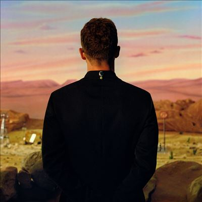

import { Slider, Button } from "@carbon/react";
import { ArrowUpRight } from "@carbon/icons-react";

import SliderJS1 from "../review/slider1";
import SliderJS2 from "../review/slider2";
import SliderJS3 from "../review/slider3";
import SliderJS4 from "../review/slider4";
import AdvJS2 from "../review/adv2";
import AdvJS3 from "../review/adv3";

import { Link } from "gatsby";

import Review1 from "../review/justin4.mdx";

Album Review

<h1 className="h1--no--margin">{props.pageContext.frontmatter.title}</h1>

<Row  className="image-card-group">
	<Column colMd={3} colLg={4} noGutterMdLeft="">
			 <ImageCard>

</ImageCard>
	</Column>
	<Column colMd={4} colLg={8} noGutterMdLeft="">
		

			Justin Timberlakeのなんと6年ぶりの6作目。その不在感を埋めてくれる77分強18曲の大作となっている。
			 前作同様、お馴染みTimbalandを筆頭にした制作陣によるTrackは、Up〰Medium〰Slowがバランスよく配されており、Popかつダンサブルでノリの良い曲が多い。手堅いアレンジにひとひねり加えたTrackや先鋭的な曲もあって、聴きどころも多数。
			また、途中、NigeriaのFireboy DMLを迎えた⑦などはアフロビートを取り入れている。
			 40代となり若干の落ち着きは感じさせるものの、Lyricのほうは前作よりやんちゃな印象を受ける。
		

		

		  <Button className="button-right-mergin"  href="https://amzn.to/3RX5dcL" renderIcon={ArrowUpRight} size='sm' kind='primary'>
		    amazon.com
		  </Button>
		  <Button className="button-right-mergin"  href="https://amzn.to/4eQ5o3s" renderIcon={ArrowUpRight} size='sm' kind='secondary'>
		    amazon.co.jp
		  </Button>
		  <Button className="button-right-mergin"  href="https://apple.co/3zw8s4B" renderIcon={ArrowUpRight} size='sm' kind='tertiary'>
		    apple music
		  </Button>
			<AdvJS2/>
		

	</Column>
</Row>
<Row >
	<Column colMd={4} colLg={4} noGutterMdLeft="">
		

		  <h3>Score card</h3>
			<SliderJS1 value="5" />
		  <SliderJS2 value="1" />
			<SliderJS3 value="1" />
		  <SliderJS4 value="9" />
		

	</Column>
	<Column colMd={8} colLg={8} noGutterMdLeft="">
		

			<h3>Producers</h3>
			

				Justin Timberlake and Danja(1,7,16)
				 Justin Timberlake, Angel Lopez and Federico Vindver(2,3)
				 Justin Timberlake, Ryan Tedder, Federico Vindver, Danja and Andrew DeRoberts(4)
				 Justin Timberlake, Timbaland, Angel Lopez and Federico Vindver(5,8,9,14,17)
				 Justin Timberlake, Louis Bell and Cirkut(6,11,15,18)
				 Justin Timberlake, Danja and Rob Knox(10,12,13)
			

			<h3>Guests</h3>
			

				Fireboy DML, Tobe Nwigwe, *Nsync
			

		

	</Column>
</Row>

<h3>Tracks</h3>

| No. | Title                  | Composers                                                                                                           | Performer                           | Time  |
| --- | ---------------------- | ------------------------------------------------------------------------------------------------------------------- | ----------------------------------- | ----- |
| 1   | Memphis                | Kenyon Dixon / Nate Hills / Justin Timberlake                                                                       | Justin Timberlake                   | 04:29 |
| 2   | F\*\*kin' Up the Disco | Calvin Harris / Angel Lopez / Justin Timberlake / Federico Vindver                                                  | Justin Timberlake                   | 04:22 |
| 3   | No Angels              | Calvin Harris / Angel Lopez / Justin Timberlake / Federico Vindver                                                  | Justin Timberlake                   | 03:28 |
| 4   | Play                   | Andrew DeRoberts / Nate Hills / Michael Pollack / Zach Skelton / Ryan Tedder / Justin Timberlake / Federico Vindver | Justin Timberlake                   | 02:51 |
| 5   | Technicolor            | Kenyon Dixon / Larrance Dopson / Angel Lopez / Timothy Mosley / Rio Root / Justin Timberlake / Federico Vindver     | Justin Timberlake                   | 07:17 |
| 6   | Drown                  | Amy Allen / Louis Bell / Kenyon Dixon / Justin Timberlake / Henry Walter                                            | Justin Timberlake                   | 04:20 |
| 7   | Liar                   | Adedamola Adefolahan / Amy Allen / Atia Boggs / Kenyon Dixon / Nate Hills / Justin Timberlake                       | Justin Timberlake feat. Fireboy DML | 03:26 |
| 8   | Infinity Sex           | James Fauntleroy / Calvin Harris / Angel Lopez / Timothy Mosley / Justin Timberlake / Federico Vindver              | Justin Timberlake                   | 03:49 |
| 9   | Love & War             | Kenyon Dixon / Larrance Dopson / Angel Lopez / Timothy Mosley / Justin Timberlake / Federico Vindver                | Justin Timberlake                   | 03:34 |
| 10  | Sanctified             | Kenyon Dixon / Nate Hills / Elliott Ives / Tobe Nwigwe / Robin Tadross / Justin Timberlake                          | Justin Timberlake feat. Tobe Nwigwe | 05:11 |
| 11  | My Favorite Drug       | Amy Allen / Louis Bell / Dougie F / Theron Thomas / Justin Timberlake / Henry Walter                                | Justin Timberlake                   | 05:01 |
| 12  | Flame                  | Kenyon Dixon / Nate Hills / Elliott Ives / Robin Tadross / Justin Timberlake                                        | Justin Timberlake                   | 05:41 |
| 13  | Imagination            | Amy Allen / Louis Bell / Larrance Dopson / Theron Thomas / Justin Timberlake / Henry Walter                         | Justin Timberlake                   | 03:16 |
| 14  | What Lovers Do         | Kenyon Dixon / Larrance Dopson / Angel Lopez / Timothy Mosley / Justin Timberlake / Federico Vindver                | Justin Timberlake                   | 03:42 |
| 15  | Selfish                | Amy Allen / Louis Bell / Theron Thomas / Justin Timberlake / Henry Walter                                           | Justin Timberlake                   | 03:49 |
| 16  | Alone                  | Kenyon Dixon / Nate Hills / Justin Timberlake                                                                       | Justin Timberlake                   | 03:36 |
| 17  | Paradise               | Kenyon Dixon / Angel Lopez / Timothy Mosley / Justin Timberlake / Federico Vindver                                  | Justin Timberlake feat. \*Nsync     | 04:26 |
| 18  | Conditions             | Amy Allen / Louis Bell / Theron Thomas / Justin Timberlake / Henry Walter                                           | Justin Timberlake                   | 04:36 |

<h3>Other Reviews</h3>

<Row>
  <Column colMd={3} colLg={3} noGutterMdLeft>
    <Review1 />
  </Column>
</Row>

<AdvJS3 />
