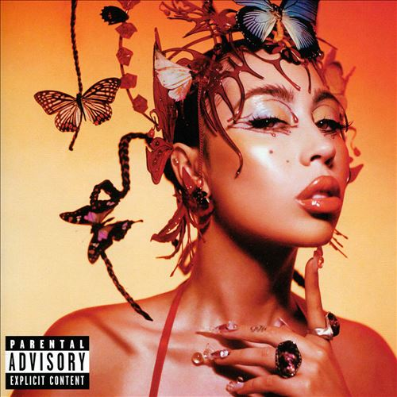

import { Slider, Button } from "@carbon/react";
import { ArrowUpRight } from "@carbon/icons-react";

import SliderJS1 from "../review/slider1";
import SliderJS2 from "../review/slider2";
import SliderJS3 from "../review/slider3";
import SliderJS4 from "../review/slider4";
import AdvJS2 from "../review/adv2";
import AdvJS3 from "../review/adv3";

import { Link } from "gatsby";

import Review1 from "../review/kaliuchis1.mdx";

Album Review

<h1 className="h1--no--margin">{props.pageContext.frontmatter.title}</h1>

<Row  className="image-card-group">
	<Column colMd={3} colLg={4} noGutterMdLeft="">
       <ImageCard>

</ImageCard>
	</Column>
	<Column colMd={4} colLg={8} noGutterMdLeft="">
		

			Kali Uchisの3年ぶり3作目。前作はスペイン語によるものだったが、今回はほぼ英語へと戻している。
			 Trackは、ミドル〰スローなR&Bであり、ゆったりとした甘く気怠く、センシャルな曲が続く。もろにLatin志向な曲は無いが、ところどころLatinの空気感を感じさせる曲が多い。
			 Guest陣は、男性Vo2人と女性Vo1人と抑えめで、Summer Walkerも華を添える程度。その分、まだまだ若々しいKali UchisのVocalがフィーチャーされており、特に高音が可愛らしい。
			 最後は趣向を変えて、Sounwaveらによる、Popで軽快な⑮で締めくくられている。
		

		

		  <Button className="button-right-mergin"  href="https://amzn.to/3PyiTKz" renderIcon={ArrowUpRight} size='sm' kind='primary'>
  	    amazon.com
  	  </Button>
  	  <Button className="button-right-mergin"  href="https://amzn.to/3RaC4v7" renderIcon={ArrowUpRight} size='sm' kind='secondary'>
  	    amazon.co.jp
  	  </Button>
			<Button className="button-right-mergin"  href="https://apple.co/44Oa4jU" renderIcon={ArrowUpRight} size='sm' kind='tertiary'>
  	    apple music
  	  </Button>
			<AdvJS2/>
		

	</Column>
</Row>
<Row >
	<Column colMd={4} colLg={4} noGutterMdLeft="">
		

		  <h3>Score card</h3>
			<SliderJS1 value="5" />
		  <SliderJS2 value="1" />
			<SliderJS3 value="1" />
		  <SliderJS4 value="9" />
		

	</Column>
	<Column colMd={8} colLg={8} noGutterMdLeft="">
		

			<h3>Producers</h3>
			

				Kali Uchis(1)
				 Josh Crocker(2,4)
				 J.L.Bs., Vicky Nguyen and Omar Velasco(3)
				 Al Shux and GRADES(5)
				 Jahaan Sweet and P2J(6)
				 Manuel Lara and Albert Hype(7,8)
				 odney "Darkchild" Jerkins and Marvin "ToneWorld" Hemmings(9)
				 Dylan Wiggins and Kali Uchis(10)
				 Clairmont The Second(11)
				 Josh Crocker, Kali Uchis Yussef Dayes(12)
				 Wondagurl, Aaron Paris and Chris Larocca and Wah Wah James(13)
				 Kenny Blanco and Cashmere Cat(14)
				 Sounwave, DJ Kahlil and Mndsgn(15)
			

			<h3>Guests</h3>
			

				Omar Apollo, Don Toliver, Summer Walker
			

		

	</Column>
</Row>

<h3>Tracks</h3>

| No. | Title                    | Composers                                                                                             | Performer                      | Time  |
| --- | ------------------------ | ----------------------------------------------------------------------------------------------------- | ------------------------------ | ----- |
| 1   | In My Garden…            | Karly Loaiza                                                                                          | Kali Uchis                     | 00:27 |
| 2   | I Wish You Roses         | Josh Crocker / Karly Loaiza / Dylan Wiggins                                                           | Kali Uchis                     | 03:45 |
| 3   | Worth the Wait           | Karly Loaiza / Vicky Nguyen / Jason Pounds / Omar Velasco                                             | Kali Uchis feat. Omar Apollo   | 02:33 |
| 4   | Love Between…            | Josh Crocker / Karly Loaiza / Leon Moore                                                              | Kali Uchis                     | 02:33 |
| 5   | All Mine                 | Karly Loaiza / Alexander Shuckburgh / Daniel Traynor                                                  | Kali Uchis feat. Don Toliver   | 03:28 |
| 6   | Fantasy                  | Karly Loaiza / Jahaan Sweet / Don Toliver                                                             | Kali Uchis                     | 03:00 |
| 7   | Como Te Quiero Yo        | Cristina Chiluiza / Brandon Cores / Manuel Lara / Karly Loaiza / Alberto Carlos Melendez              | Kali Uchis                     | 02:14 |
| 8   | Hasta Cuando             | Cristina Chiluiza / Brandon Cores / Manuel Lara / Karly Loaiza / Alberto Carlos Melendez              | Kali Uchis                     | 02:09 |
| 9   | Endlessly                | Marvin "Tony" Hemmings / Karly Loaiza / Rodney "Darkchild" Jerkins                                    | Kali Uchis                     | 02:35 |
| 10  | Moral Conscience         | Karly Loaiza / Dylan Wiggins                                                                          | Kali Uchis                     | 03:32 |
| 11  | Not Too Late (Interlude) | Clairmont II Humphrey / Karly Loaiza                                                                  | Kali Uchis                     | 02:35 |
| 12  | Blue                     | Josh Crocker / Karly Loaiza                                                                           | Kali Uchis                     | 03:09 |
| 13  | Deserve Me               | Aaron Cheung / James Colwell / Chris Larocca / Karly Loaiza / Taylor Parks / Summer Walker / WondGurl | Kali Uchis feat. Summer Walker | 04:25 |
| 14  | Moonlight                | Magnus August Høiberg / Benjamin Levin / Karly Loaiza                                                 | Kali Uchis                     | 03:11 |
| 15  | Happy Now                | Ringgo Ancheta / Sam Barsh / Khalil Hazzard / Karly Loaiza / Daniel Seeff / Mark Spears               | Kali Uchis                     | 03:50 |

<h3>Other Reviews</h3>

<Row>
  <Column colMd={3} colLg={3} noGutterMdLeft>
    <Review1 />
  </Column>
</Row>

<AdvJS3 />
