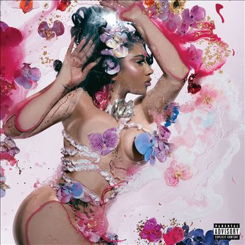

import { Slider, Button } from "@carbon/react";
import { ArrowUpRight } from "@carbon/icons-react";

import SliderJS1 from "../review/slider1";
import SliderJS2 from "../review/slider2";
import SliderJS3 from "../review/slider3";
import SliderJS4 from "../review/slider4";
import AdvJS2 from "../review/adv2";
import AdvJS3 from "../review/adv3";

import { Link } from "gatsby";

import Review1 from "../review/kaliuchis4.mdx";
import Review2 from "../review/kaliuchis2.mdx";
import Review3 from "../review/kaliuchis1.mdx";

Album Review

<h1 className="h1--no--margin">{props.pageContext.frontmatter.title}</h1>

<Link to="/best50/2024/">2018 Black Music Best No.20</Link>

<Row  className="image-card-group">
	<Column colMd={3} colLg={4} noGutterMdLeft="">
       <ImageCard>

</ImageCard>
	</Column>
	<Column colMd={4} colLg={8} noGutterMdLeft="">
		

			Kali Uchisの1年ぶり4作目。デビュー以来今まで、英語作品とスペイン語作品を交互にリリースしてきていて、当作はスペイン語であり、中南米のマーケットへの目配せもぬかりない。
			 当然ながら、ゲストの起用も含めて、ラテン色が強く、それもレゲトン、ダンスホールなど、幅広い範囲に及んでいるが、意外とベースにあるのはR&B、ハウスであり、これらがうまく溶け込んでいる。
			 Popで気持ちの良いTrackが多く、Kali Uchisの時には巻き舌も披露する可憐なVocalにマッチしている。昭和ラテン歌謡みたいな⑥がかえって、異色な存在になっている。
		

		

		  <Button className="button-right-mergin"  href="https://amzn.to/45pihx6" renderIcon={ArrowUpRight} size='sm' kind='primary'>
  	    amazon.com
  	  </Button>
  	  <Button className="button-right-mergin"  href="https://amzn.to/3xv0NCK" renderIcon={ArrowUpRight} size='sm' kind='secondary'>
  	    amazon.co.jp
  	  </Button>
			<Button className="button-right-mergin"  href="https://apple.co/3xlQ2Tj" renderIcon={ArrowUpRight} size='sm' kind='tertiary'>
  	    apple music
  	  </Button>
			 
			<a href="https://click.linksynergy.com/link?id=MzkEpFBSn/U&offerid=314039.288014381020&type=2&murl=https%3A%2F%2Fwww.hmv.co.jp%2Fproduct%2Fdetail%2F14381020%2F%3Futm_source%3Daaa500000s0%26utm_medium%3Daffiliate">Kali Uchis/Orqumdeas</a>
			<AdvJS2/>
		

	</Column>
</Row>
<Row >
	<Column colMd={4} colLg={4} noGutterMdLeft="">
		

		  <h3>Score card</h3>
			<SliderJS1 value="5" />
		  <SliderJS2 value="1" />
			<SliderJS3 value="1" />
		  <SliderJS4 value="9" />
		

	</Column>
	<Column colMd={8} colLg={8} noGutterMdLeft="">
		

			<h3>Producers</h3>
			

				Carter Lang and Sounwave(1)
				 P2J, Sounwave and Sammy Soso(2,5)
				 Dylan Wiggins and Carter Lang(3)
				 Carter Lang, Westen Weiss and Sir Nolan(4)
				 Josh Crocker and Manuel Lara(6)
				 P2J and Sounwave(7)
				 Yakob Pasqué(8)
				 Manuel Lara and Yakob Pasqué(9)
				 Mazzarri and FABV(10)
				 Albert Hype and Manuel Lara(11)
				 Tainy, Kali Uchis, Ovy On The Drums, EL Guincho, Jam City, Geeneus and Christian Christian Andrés Salazar(12)
				 Josh Crocker(13)
				 Cromo X(14)
			

			<h3>Guests</h3>
			

				Peso Pluma, El Alfa, JT Karol G, Rauw Alejandro
			

		

	</Column>
</Row>

<h3>Tracks</h3>

| No. | Title                   | Composers                                                                                                                                         | Performer                       | Time  |
| --- | ----------------------- | ------------------------------------------------------------------------------------------------------------------------------------------------- | ------------------------------- | ----- |
| 1   | ¿Cómo Así?              | Carter Lang / Karly Loaiza / Sounwave                                                                                                             | Kali Uchis                      | 02:49 |
| 2   | Me Pongo Loca           | Samuel Awuku / Richard Isong / Karly Loaiza / Sounwave                                                                                            | Kali Uchis                      | 02:57 |
| 3   | Igual Que Un Ángel      | Manuel Lorente Freire / Carter Lang / Karly Loaiza / Dylan Wiggins                                                                                | Kali Uchis feat: Peso Pluma     | 04:20 |
| 4   | Pensamientos Intrusivos | Nolan Lambroza / Carter Lang / Karly Loaiza / Westen Weiss                                                                                        | Kali Uchis                      | 03:12 |
| 5   | Diosa                   | Samuel Awuku / Richard Isong / Karly Loaiza / Sounwave                                                                                            | Kali Uchis                      | 02:36 |
| 6   | Te Mata                 | Josh Crocker / Manuel Lara / Karly Loaiza                                                                                                         | Kali Uchis                      | 03:52 |
| 7   | Perdiste                | Richard Isong / Karly Loaiza                                                                                                                      | Kali Uchis                      | 02:24 |
| 8   | Young Rich & In Love    | Karly Loaiza / Irvin Mejia / Jakob Rabitsch                                                                                                       | Kali Uchis                      | 03:18 |
| 9   | Tu Corazón Es Mío…      | Manuel Lara / Karly Loaiza / Irvin Mejia / Jakob Rabitsch                                                                                         | Kali Uchis                      | 02:45 |
| 10  | Muñekita                | Enmanuel Herrera / JT / Karly Loaiza / Hector Andre Mazzarri / Francisco Reynaldo Briceno Villa                                                   | Kali Uchis feat: El Alfa / JT   | 03:39 |
| 11  | Labios Mordidos         | Brandon Cores / Manuel Lara / Karly Loaiza / Alberto Carlos Melendez / Carolina Giraldo Navarro                                                   | Kali Uchis feat: Karol G        | 03:15 |
| 12  | No Hay Ley Parte 2      | Rauw Alejandro / Cristina Chiluiza / Pablo Diaz-Reixa / Jack Latham / Karly Loaiza / Marcos Masis / Servando Primera / Christian Andres Salazar   | Kali Uchis feat: Rauw Alejandro | 03:08 |
| 13  | Heladito                | Karly Loaiza                                                                                                                                      | Kali Uchis                      | 02:24 |
| 14  | Dame Beso // Muévete    | Giancarlos Gil / Karly Loaiza / Polo Parra / Martin Rodriguez Vicente                                                                             | Kali Uchis                      | 03:35 |

<h3>Other Reviews</h3>

<Row>
  <Column colMd={3} colLg={3} noGutterMdLeft>
    <Review1 />
  </Column>
  <Column colMd={3} colLg={3} noGutterMdLeft>
    <Review2 />
  </Column>
	<Column colMd={3} colLg={3} noGutterMdLeft>
    <Review3 />
  </Column>
</Row>

<AdvJS3 />
