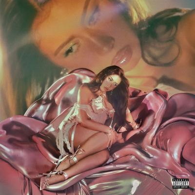

import { Slider, Button } from "@carbon/react";
import { ArrowUpRight } from "@carbon/icons-react";

import SliderJS1 from "../review/slider1";
import SliderJS2 from "../review/slider2";
import SliderJS3 from "../review/slider3";
import SliderJS4 from "../review/slider4";
import AdvJS2 from "../review/adv2";
import AdvJS3 from "../review/adv3";

import { Link } from "gatsby";

import Review1 from "../review/kaliuchis3.mdx";
import Review2 from "../review/kaliuchis2.mdx";
import Review3 from "../review/kaliuchis1.mdx";

Album Review

<h1 className="h1--no--margin">{props.pageContext.frontmatter.title}</h1>

  <Link to="/best50/2025/">2025 Black Music Best No.46</Link>

<Row  className="image-card-group">
	<Column colMd={3} colLg={4} noGutterMdLeft="">
       <ImageCard>

</ImageCard>
	</Column>
	<Column colMd={4} colLg={8} noGutterMdLeft="">
		

			Kali Uchisの1年ぶり5作目。今回のLyricは英語で、3年連続でのアルバムリリースとなるが、これまでとちがって、ドリーミーでスイートで穏やかな作品になっている。
			 出産と母の死という大きな出来事を続けて経験したことが、Lyricにも投影されており、また、作詞作曲も自身によるもので、制作にもかかわっており、しかもゲストは無しとゴージャスに仕上げたパーソナルな作品とも言えそう。その分、同じような曲調が並ぶのは致し方ないところか。
			 Trackは懐かしい感じのソウルでアトモスフェリックなスロー曲で占められており、とろけるようなVocalと一体化している。アルバムタイトルにあるように、ちょっとした手紙仕立てになっていて、CDには小さな封筒にKali Uchisからのメッセージがしたためられていた。
		

		

		  <Button className="button-right-mergin"  href="https://amzn.to/4frQqkM" renderIcon={ArrowUpRight} size='sm' kind='primary'>
  	    amazon.com
  	  </Button>
  	  <Button className="button-right-mergin"  href="https://amzn.to/46MuQFv" renderIcon={ArrowUpRight} size='sm' kind='secondary'>
  	    amazon.co.jp
  	  </Button>
			<Button className="button-right-mergin"  href="https://apple.co/3JqDuzC" renderIcon={ArrowUpRight} size='sm' kind='tertiary'>
  	    apple music
  	  </Button>
			 
			<AdvJS2/>
		

	</Column>
</Row>
<Row >
	<Column colMd={4} colLg={4} noGutterMdLeft="">
		

		  <h3>Score card</h3>
			<SliderJS1 value="5" />
		  <SliderJS2 value="2" />
			<SliderJS3 value="1" />
		  <SliderJS4 value="9" />
		

	</Column>
	<Column colMd={8} colLg={8} noGutterMdLeft="">
		

			<h3>Producers</h3>
			

				Jeff Hazin, Nick Ferrano and Kali Uchis(1,5,7)
				 The Outfit and Kali Uchis(2)
				 Josh Crocker and Kali Uchis(3,10)
				 Dan Darmawan(4)
				 Vegyn and Kali Uchis(6)
				 Josh Crocker, Alex Goose and Kali Uchis(8)
				 54 Ultra, Vince Chiaroto and Kali Uchis(9)
				 Dylan Wiggins(11)
				 Al Shux and Kali Uchis(12)
				 Dylan Wiggins and Kali Uchis(13)
				 Josh Crocker, Dylan Wiggins and Kali Uchis(14)
			

			<h3>Guests</h3>
			

			

		

	</Column>
</Row>

<h3>Tracks</h3>

| No. | Title                   | Composers                  | Performer  | Time  |
| --- | ----------------------- | -------------------------- | ---------- | ----- |
| 1   | Heaven Is a Home        | Karly Loaiza               | Kali Uchis | 03:32 |
| 2   | Sugar! Honey! Love!     | Karly Loaiza               | Kali Uchis | 03:04 |
| 3   | Lose My Cool            | Karly Loaiza               | Kali Uchis | 04:07 |
| 4   | It's Just Us            | David Burke / Karly Loaiza | Kali Uchis | 02:59 |
| 5   | For You                 | Karly Loaiza               | Kali Uchis | 03:20 |
| 6   | Silk Lingerie           | Karly Loaiza               | Kali Uchis | 03:39 |
| 7   | Territorial             | Karly Loaiza               | Kali Uchis | 03:08 |
| 8   | Fall Apart              | Karly Loaiza               | Kali Uchis | 03:09 |
| 9   | All I Can Say           | Karly Loaiza               | Kali Uchis | 02:47 |
| 10  | Daggers!                | Karly Loaiza               | Kali Uchis | 02:48 |
| 11  | Angels All Around Me... | Karly Loaiza               | Kali Uchis | 04:42 |
| 12  | Breeze!                 | Karly Loaiza               | Kali Uchis | 02:38 |
| 13  | Sunshine & Rain         | Karly Loaiza               | Kali Uchis | 03:17 |
| 14  | ILYSMIH                 | Karly Loaiza / Pooks       | Kali Uchis | 03:18 |

<h3>Other Reviews</h3>

<Row>
  <Column colMd={3} colLg={3} noGutterMdLeft>
    <Review1 />
  </Column>
  <Column colMd={3} colLg={3} noGutterMdLeft>
    <Review2 />
  </Column>
	<Column colMd={3} colLg={3} noGutterMdLeft>
    <Review3 />
  </Column>
</Row>

<AdvJS3 />
