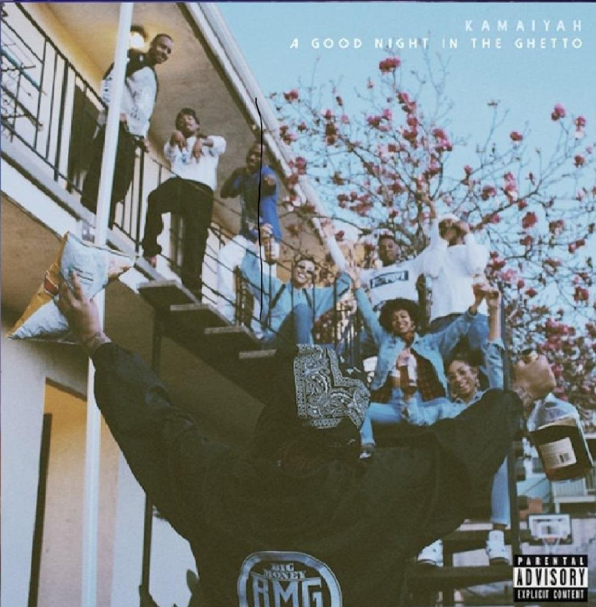

import { Slider, Button } from "@carbon/react";
import { ArrowUpRight } from "@carbon/icons-react";

import SliderJS1 from "../review/slider1";
import SliderJS2 from "../review/slider2";
import SliderJS3 from "../review/slider3";
import SliderJS4 from "../review/slider4";
import AdvJS2 from "../review/adv2";
import AdvJS3 from "../review/adv3";

import { Link } from "gatsby";

import Review1 from "../review/kamaiyah2.mdx";

Album Review

<h1 className="h1--no--margin">{props.pageContext.frontmatter.title}</h1>

	<Link to="/best50/2016/">2016 Black Music Best No.27</Link>

<Row  className="image-card-group">
	<Column colMd={3} colLg={4} noGutterMdLeft="">
		<ImageCard>

</ImageCard>
	</Column>
	<Column colMd={4} colLg={8} noGutterMdLeft="">
		

			Oakland出身の女性Rapper, Kamaiyahの初Mix Tape。自身のサイトからDownloadできる。
			 MissyやTLCに影響を受け、YGのアルバムに使われるなどし頭角をあらわそうかというところのようだ。当時21歳ということだが、低音の落ち着いたRapを聞かせ、声は中性的で言われなければ女性とは気が付かないほど。
			 Trackはもろ90年代のWest Coastっぽい懐かしいサウンドへのオマージュに溢れ、ゆるくチープで打ち込み中心なものがほとんど。なかでもファンクなチューンなどはかっこいいです。
		

		

			<Button className="button-right-mergin"  href="https://amzn.to/2XYbOb2" renderIcon={ArrowUpRight} size='sm' kind='primary'>
				amazon.com
			</Button>
			<Button className="button-right-mergin"  href="https://amzn.to/3iCzYj9" renderIcon={ArrowUpRight} size='sm' kind='secondary'>
				amazon.co.jp
			</Button>
			<Button className="button-right-mergin"  href="https://apple.co/4aCdVUm" renderIcon={ArrowUpRight} size='sm' kind='tertiary'>
				apple music	
			</Button>
			<AdvJS2/>
		

	</Column>
</Row>
<Row >
	<Column colMd={4} colLg={4} noGutterMdLeft="">
		

			<h3>Score card</h3>
			<SliderJS1 value="2" />
			<SliderJS2 value="2" />
			<SliderJS3 value="1" />
			<SliderJS4 value="8" />
		

	</Column>
	<Column colMd={8} colLg={8} noGutterMdLeft="">
		

			<h3>Producers</h3>
			

				Drew Banga(1)
				 CT Beatz(2,4,9,16)
				 DJ Official(6)
				 Trackademicks(7,14)
				 WTF Nonstop(10)
				 Link Up(12)
				 1-O.A.K.(13)
				 P-Lo(15)
			

			<h3>Guests</h3>
			

				Zay, YG
			

		

	</Column>
</Row>

<h3>Tracks</h3>

| No. | Title                     | Performer | Time  |
| --- | ------------------------- | --------- | ----- |
| 1   | I'm On                    | Kamaiyah  | 03:30 |
| 2   | Out The Bottle feat. Zay  | Kamaiyah  | 03:16 |
| 3   | Hoochie Hotline Interlude | Kamaiyah  | 00:47 |
| 4   | Niggas                    | Kamaiyah  | 04:28 |
| 5   | Fuck It Up feat. YG       | Kamaiyah  | 02:21 |
| 6   | Break You Down            | Kamaiyah  | 04:40 |
| 7   | Hoochie Hotline Interlude | Kamaiyah  | 00:39 |
| 8   | Come Back                 | Kamaiyah  | 04:00 |
| 9   | How Does It Feel          | Kamaiyah  | 02:37 |
| 10  | Mo Money Mo Problems      | Kamaiyah  | 03:07 |
| 11  | Hoochie Hotline Interlude | Kamaiyah  | 00:39 |
| 12  | Ain't Going Home Tonight  | Kamaiyah  | 02:37 |
| 13  | Swing My Way              | Kamaiyah  | 02:47 |
| 14  | Freaky Freaks             | Kamaiyah  | 02:36 |
| 15  | One Love                  | Kamaiyah  | 03:13 |
| 16  | For My Dawg               | Kamaiyah  | 03:30 |

<Row>
	<Column colMd={3} colLg={3} noGutterMdLeft>
		<Review1 />
	</Column>
</Row>

<AdvJS3/>