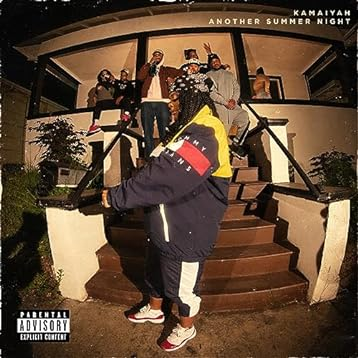

import { Slider, Button } from "@carbon/react";
import { ArrowUpRight } from "@carbon/icons-react";

import SliderJS1 from "../review/slider1";
import SliderJS2 from "../review/slider2";
import SliderJS3 from "../review/slider3";
import SliderJS4 from "../review/slider4";
import AdvJS2 from "../review/adv2";
import AdvJS3 from "../review/adv3";

import Review1 from "../review/kamaiyah1.mdx";

import { Link } from "gatsby";

Album Review

<h1 className="h1--no--margin">{props.pageContext.frontmatter.title}</h1>

<Row  className="image-card-group">
	<Column colMd={3} colLg={4} noGutterMdLeft="">
       <ImageCard>

</ImageCard>
	</Column>
	<Column colMd={4} colLg={8} noGutterMdLeft="">
		

			2023年末にリリースされた KamiyahのMix Tape。30歳を越え、ベイエリアを代表するRapperに成長している。
			 低音で落ち着いたRapは相変わらず中性的で、唄うようなものが多くなっている。ゆるめなTrackが多めで、WestSideらしいGファンクっぽいものや地元のハイフィー曲で占められており、ソウルフルな曲が続いている。
			 Guestは少なめだが、⑩⑯ではLAのRapper, 03 Greedoと相性の良さを示している。
		

		

		  <Button className="button-right-mergin"  href="https://amzn.to/3yONAVP" renderIcon={ArrowUpRight} size='sm' kind='primary'>
  	    amazon.com
  	  </Button>
  	  <Button className="button-right-mergin"  href="https://amzn.to/3RhRkFK" renderIcon={ArrowUpRight} size='sm' kind='secondary'>
  	    amazon.co.jp
  	  </Button>
			<Button className="button-right-mergin"  href="https://apple.co/3VctFYt" renderIcon={ArrowUpRight} size='sm' kind='tertiary'>
				apple music	
			</Button>
			<AdvJS2/>
		

	</Column>
</Row>
<Row >
	<Column colMd={4} colLg={4} noGutterMdLeft="">
		

		  <h3>Score card</h3>
			<SliderJS1 value="2" />
		  <SliderJS2 value="2" />
			<SliderJS3 value="1" />
		  <SliderJS4 value="8" />
		

	</Column>
	<Column colMd={8} colLg={8} noGutterMdLeft="">
		

		<h3>Producers</h3>
		

			Key Z(1,9,10,11,16)
			<r/>Linkup(2,3)
			<r/>QuakeBeatz(4,5,6,7,8,12,13,14)
			<r/>Key Z and Linkup(15,17)
		

		<h3>Guests</h3>
		

			Jay Worthy, Hott Boy Zay, 03 Greedo
		

		

	</Column>
</Row>

<h3>Tracks</h3>

| No. | Title                      | Composers                                          | Performer               | Time  |
| --- | -------------------------- | -------------------------------------------------- | ----------------------- | ----- |
| 1   | Raining Game in California | Jeffrey Sidhoo, Kamaiyah, Melchisecdec Davis       | Kamaiyah & Jay Worthy   | 02:59 |
| 2   | Take a Sip                 | Armani Love Scales, Hott Boy Zay, Kamaiyah         | Kamaiyah & Hott Boy Zay | 02:08 |
| 3   | Groupies                   | Armani Love Scales, Kamaiyah                       | Kamaiyah                | 02:32 |
| 4   | Come Fuck Me               | Kamaiyah, Patrick Le'Anthony Kelley                | Kamaiyah                | 02:20 |
| 5   | VVS                        | Kamaiyah, Patrick Le'Anthony Kelley                | Kamaiyah                | 02:38 |
| 6   | XXL Letterman              | Kamaiyah, Patrick Le'Anthony Kelley                | Kamaiyah                | 01:57 |
| 7   | Heat Warning               | Kamaiyah, Patrick Le'Anthony Kelley                | Kamaiyah                | 02:28 |
| 8   | No Pape                    | Kamaiyah, Patrick Le'Anthony Kelley                | Kamaiyah                | 01:56 |
| 9   | Every Friday               | Kamaiyah, Melchisecdec Davis                       | Kamaiyah                | 02:26 |
| 10  | Lamborghini Dreams         | Armani Love Scales,, Jason jamal Jackson, Kamaiyah | Kamaiyah & 03 Greedo    | 02:46 |
| 11  | Come Alive                 | Armani Love Scales,, Kamaiyah                      | Kamaiyah                | 01:58 |
| 12  | Main Thang                 | Kamaiyah, Patrick Le'Anthony Kelley                | Kamaiyah                | 01:34 |
| 13  | Going Thru Shit            | Kamaiyah, Patrick Le'Anthony Kelley                | Kamaiyah                | 02:06 |
| 14  | Extra Love                 | Kamaiyah, Patrick Le'Anthony Kelley                | Kamaiyah                | 03:09 |
| 15  | Steppin’                   | Armani Love Scales,, Kamaiyah, Melchisecdec Davis  | Kamaiyah                | 02:24 |
| 16  | Whole Lotta M’s            | Armani Love Scales,, Jason jamal Jackson, Kamaiyah | Kamaiyah & 03 Greedo    | 02:56 |
| 17  | The One                    | Kamaiyah, Patrick Le'Anthony Kelley                | Kamaiyah                | 03:05 |

<Row>
  <Column colMd={3} colLg={3} noGutterMdLeft>
    <Review1 />
  </Column>
</Row>

<AdvJS3/>