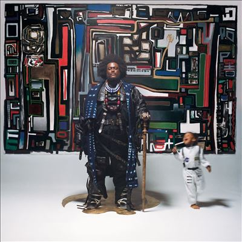

import { Slider, Button } from "@carbon/react";
import { ArrowUpRight } from "@carbon/icons-react";

import SliderJS1 from "../review/slider1";
import SliderJS2 from "../review/slider2";
import SliderJS3 from "../review/slider3";
import SliderJS4 from "../review/slider4";
import AdvJS2 from "../review/adv2";
import AdvJS3 from "../review/adv3";

import Review1 from "../review/kamasiwashington3.mdx";
import Review2 from "../review/kamasiwashington2.mdx";

import Review2_1 from "../review/dinnerparty2.mdx";
import Review2_2 from "../review/dinnerparty1.mdx";

import { Link } from "gatsby";

Album Review

<h1 className="h1--no--margin">{props.pageContext.frontmatter.title}</h1>

<Link to="/best50/2024/">2024 Black Music Best No.30</Link>

<Row  className="image-card-group">
	<Column colMd={3} colLg={4} noGutterMdLeft="">
		<ImageCard>

		</ImageCard>
	</Column>
	<Column colMd={4} colLg={8} noGutterMdLeft="">
		

			Kamasi Washington、オリジナルアルバムとしては6年ぶりの3作目。今回も2枚組の大作ではあるが、いつもよりは短め。スピリチュアルで壮大なJazz絵巻というベースラインは変わらないが、コロナ禍に作り始めたり、長女が生まれたりということもあって、本人はパーソナルで内省的なものになってると言っている。
			 またダンス(踊りたくなる)・アルバムでもあるとのこと。唄やRapが多めなDisc-1はスイートっぽくなっていて、DIsc-2は演奏中心のオプション的な位置づけのように感じられる。Disc-1は親しみやすい曲も多く、⑥では新André 3000が長めにフルートを吹いている。もちろん、Kamasiの時にはエモーショナルで、時には滔々としたソロや、おなじみThundercat, Brandon Coleman, Rtan Porter, Cameron Gravesなどによる演奏も聴きごたえ十分である。
			 ちなみに①のメロディーラインは日本の民謡っぽい感じたが、エチオピアを意識した作品らしい
		

		

			<Button className="button-right-mergin"  href="https://amzn.to/3YMMLHW" renderIcon={ArrowUpRight} size='sm' kind='primary'>
				amazon.com
			</Button>
			<Button className="button-right-mergin"  href="https://amzn.to/3SUgZoR" renderIcon={ArrowUpRight} size='sm' kind='secondary'>
				amazon.co.jp
			</Button>
			<Button className="button-right-mergin"  href="https://apple.co/4dMCBey" renderIcon={ArrowUpRight} size='sm' kind='tertiary'>
				apple music
			</Button>
			<AdvJS2/>
		

	</Column>
</Row>
<Row >
	<Column colMd={4} colLg={4} noGutterMdLeft="">
		

		  <h3>Score card</h3>
			<SliderJS2 value="4" />
		  <SliderJS2 value="3" />
			<SliderJS3 value="1" />
		  <SliderJS4 value="9" />
		

	</Column>
	<Column colMd={8} colLg={8} noGutterMdLeft="">
		

			<h3>Producers</h3>
			

				Kamasi Washington(2-6以外)
				 Ryan Porter(2-6)
			

			<h3>Guests</h3>
			

				Kamasi Washington(1-1,1-2,1-3,1-8,2-2,2-3)
				 Brandon Coleman, Cameron Graves, Terrace Martin and Kamasi Washington(1-4)
				 George Clinton, D Smoke, Ronald Bruner, Jr. and Kamasi Washington(1-5)
				 Andre Lauren Benjamin, Tony Austin, Brandon Coleman, Kamasi Washington(1-6)
				 Ryan Porter, Kamasi Washington and Bryan James Sledge(1-7)
				 Brandon Coleman and Kamasi Washington(2-1)
				 Kamasi Washington and Miles Mosley(2-4)
			

		

	</Column>
</Row>

<h3>Tracks</h3>

 Disc 1

| No. | Title           | Composers                                                            | Performer                                                            | Time  |
| --- | --------------- | -------------------------------------------------------------------- | -------------------------------------------------------------------- | ----- |
| 1   | Lesanu          | Kamasi Washington                                                    | Kamasi Washington                                                    | 09:22 |
| 2   | Asha the First  | Ras Austin, Taj Austin, Akili Asha Washington, Kamasi Washington     | Kamasi Washington feat. Thundercat, Ras Austin, Taj Austin           | 07:46 |
| 3   | Computer Love   | Shirley Murdock, Larry Troutman, Roger Troutman                      | Kamasi Washington feat. Patrice Quinn, DJ Battlecat, Brandon Coleman | 09:26 |
| 4   | The Visionary   | Brandon Coleman, Cameron Graves, Terrace Martin, Kamasi Washington   | Kamasi Washington feat. Terrace Martin                               | 01:10 |
| 5   | Get Lit         | George Clinton, Daniel Farris, Ronald Bruner, Jr., Kamasi Washington | Kamasi Washington feat. George Clinton, D Smoke                      | 03:26 |
| 6   | Dream State     | André 3000, Tony Austin, Brandon Coleman, Kamasi Washington          | Kamasi Washington feat. André 3000                                   | 08:39 |
| 7   | Together        | BJ the Chicago Kid, Ryan Porter, Kamasi Washington                   | Kamasi Washington feat. BJ the Chicago Kid                           | 05:34 |
| 8   | The Garden Path | Kamasi Washington                                                    | Kamasi Washington                                                    | 06:40 |

 Disc 2

| No. | Title                                | Composers         | Performer         | Time  |
| --- | ------------------------------------ | ----------------- | ----------------- | ----- |
| 1   | Interstellar Peace (The Last Stance) | Brandon Coleman   | Kamasi Washington | 05:04 |
| 2   | The Garden Path                      | Kamasi Washington | Kamasi Washington | 13:25 |
| 3   | Lines in the Sand                    | Kamasi Washington | Kamasi Washington | 07:25 |
| 4   | Prologue                             | Astor Piazzolla   | Kamasi Washington | 08:19 |

<Row>
  <Column colMd={3} colLg={3} noGutterMdLeft>
    <Review1 />
  </Column>
  <Column colMd={3} colLg={3} noGutterMdLeft>
    <Review2 />
  </Column>
</Row>

<Row>
  <Column colMd={3} colLg={3} noGutterMdLeft>
    <Review2_1 />
  </Column>
  <Column colMd={3} colLg={3} noGutterMdLeft>
    <Review2_2 />
  </Column>
</Row>

<AdvJS3 />
