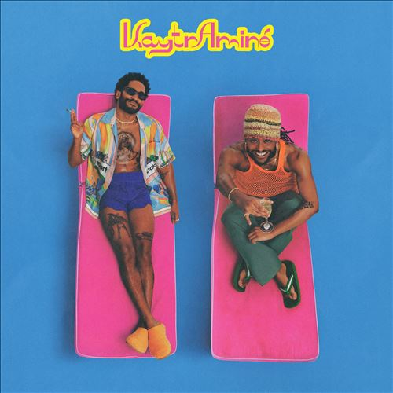

import { Slider, Button } from "@carbon/react";
import { ArrowUpRight } from "@carbon/icons-react";

import SliderJS1 from "../review/slider1";
import SliderJS2 from "../review/slider2";
import SliderJS3 from "../review/slider3";
import SliderJS4 from "../review/slider4";
import AdvJS2 from "../review/adv2";
import AdvJS3 from "../review/adv3";

import { Link } from "gatsby";

import Review1 from "../review/kaytranada1.mdx";

Album Review

<h1 className="h1--no--margin">{props.pageContext.frontmatter.title}</h1>

  <Link to="/best50/2023/">2023 Black Music Best No.32</Link>

<Row  className="image-card-group">
	<Column colMd={3} colLg={4} noGutterMdLeft="">
       <ImageCard>

</ImageCard>
	</Column>
	<Column colMd={4} colLg={8} noGutterMdLeft="">
		

			ProducerのKaytranadaとRapperのAminéによるDuo作。Malibuのビーチハウスを借りて、制作したとのことで、サマー・パーティ向けのリラックスしたアルバムに仕上がっている。
			 サウンドのほうはあくまでも軽快で、時には気怠く、BPMゆったり目の曲が多い。Aminéの抑揚少な目で、淀みなく語りかけるようなRapとマッチしている。
			 GuestはRapperの大物4人に加え、Amaaraeが可愛らしい声で清涼感を与えてくれている。
		

		

		  <Button className="button-right-mergin"  href="https://amzn.to/46mPAQX" renderIcon={ArrowUpRight} size='sm' kind='primary'>
  	    amazon.com
  	  </Button>
			<Button className="button-right-mergin"  href="https://amzn.to/3RLj1YB" renderIcon={ArrowUpRight} size='sm' kind='secondary'>
  	    amazon.co.jp
  	  </Button>
			<Button className="button-right-mergin"  href="https://apple.co/3tq6gst" renderIcon={ArrowUpRight} size='sm' kind='tertiary'>
  	    apple music
  	  </Button>
  	

		<AdvJS2/>
	</Column>
</Row>
<Row >
	<Column colMd={4} colLg={4} noGutterMdLeft="">
		

		  <h3>Score card</h3>
			<SliderJS1 value="4" />
		  <SliderJS2 value="1" />
			<SliderJS3 value="1" />
		  <SliderJS4 value="8" />
		

	</Column>
	<Column colMd={8} colLg={8} noGutterMdLeft="">
		

			<h3>Producers</h3>
			

				KATRANADA(1,2,4,6,7,8,9,10,11)
				KATRANADA and Pharrel Williams(3)
				KATRANADA and Aminé(5)
			

			<h3>Guests</h3>
			

				Freddie Gibbs, Pharrell Williams, Big Sean, Amaarae, Snoop Dogg
			

		

	</Column>
</Row>

<h3>Tracks</h3>

| No. | Title           | Composers                                                                                                                                            | Performer                                             | Time  |
| --- | --------------- | ---------------------------------------------------------------------------------------------------------------------------------------------------- | ----------------------------------------------------- | ----- |
| 1   | Who He Iz       | Adam Aminé Daniel, Louis Kevin Celestin                                                                                                              | Aminé / Kaytraminé / Kaytranada                       | 03:01 |
| 2   | letstalkaboutit | Adam Aminé Daniel, Louis Kevin Celestin, Chad Hugo, Fredrick Jamel Tipton, Gene Thompton, Jermain Dupri Mauldin, Pharrell Williams, Terrance Thornto | Aminé / Kaytraminé / Kaytranadafeat. Freddie Gibbs    | 02:46 |
| 3   | 4EVA            | Adam Aminé Daniel, Louis Kevin Celestin, Pharrell Williams                                                                                           | Aminé / Kaytraminé / Kaytranada feat. Pharrell Willia | 03:10 |
| 4   | Westside        | Adam Aminé Daniel, Louis Kevin Celestin                                                                                                              | Aminé / Kaytraminé / Kaytranada                       | 02:24 |
| 5   | Master P        | Adam Aminé Daniel, Louis Kevin Celestin, Gulzar, Iiaiyaraaja, Jahmarie Adams, Sean Michael Leonard Anderson                                          | Aminé / Kaytraminé / Kaytranada faet. Big Sean        | 03:32 |
| 6   | Rebuke          | Adam Aminé Daniel, Louis Kevin Celestin, Leon Ware, Marcio Fragoso Borge, Minnie Riperton, Salonao Borges Filho                                      | Aminé / Kaytraminé / Kaytranada                       | 01:58 |
| 7   | Sossaup         | Adam Aminé Daniel, Louis Kevin Celestin, Ama Serwah Genfi, Mason Tanner                                                                              | Aminé / Kaytraminé / Kaytranada feat. Amaarae         | 02:36 |
| 8   | STFU3           | Adam Aminé Daniel, Louis Kevin Celestin                                                                                                              | Aminé / Kaytraminé / Kaytranada                       | 02:20 |
| 9   | UGH UGH         | Adam Aminé Daniel, Louis Kevin Celestin, Karriem Riggins                                                                                             | Aminé / Kaytraminé / Kaytranada feat. Snoop Dogg      | 04:10 |
| 10  | EYE             | Adam Aminé Daniel, Louis Kevin Celestin, Calvin Cordozar Broadus Jr                                                                                  | Aminé / Kaytraminé / Kaytranada                       | 02:40 |
| 11  | K&A             | Adam Aminé Daniel, Louis Kevin Celestin, Leon Sylvers, Michael McGlory                                                                               | Aminé / Kaytraminé / Kaytranada                       | 05:04 |

<h3>Other Reviews</h3>

<Row>
  <Column colMd={3} colLg={3} noGutterMdLeft>
    <Review1 />
  </Column>
</Row>

<AdvJS3 />