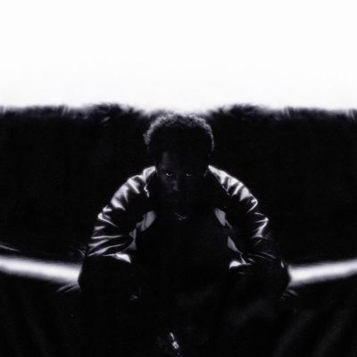

import { Slider, Button } from "@carbon/react";
import { ArrowUpRight } from "@carbon/icons-react";

import SliderJS1 from "../review/slider1";
import SliderJS2 from "../review/slider2";
import SliderJS3 from "../review/slider3";
import SliderJS4 from "../review/slider4";
import AdvJS2 from "../review/adv2";
import AdvJS3 from "../review/adv3";

import { Link } from "gatsby";

import Review1_1 from "../review/kaytranada1.mdx";

import Review2_1 from "../review/kaytramine1.mdx";

Album Review

<h1 className="h1--no--margin">{props.pageContext.frontmatter.title}</h1>

<Link to="/best50/2024/">2018 Black Music Best No.21</Link>

<Row  className="image-card-group">
	<Column colMd={3} colLg={4} noGutterMdLeft="">
       <ImageCard>

</ImageCard>
	</Column>
	<Column colMd={4} colLg={8} noGutterMdLeft="">
		

			Amineとのコラボ作を挟んでのKaytranadaの5年ぶりの3rdtアルバム。21曲で60分強の大作になっている。
			 Popで軽快な曲やスムースな曲を切れ目なくつないだ一つの作品に仕上がっていて、ダンスフロアにぴったりと言える。ただ、それだけでなく、落ち着いた雰囲気が微妙にミックスされていて、一段、音楽的価値を高めている気がする。
			 サウンドはR&Bとハウスを融合させてようなもので、Childish Gambino参加の⑪なんかWeekndの曲といっても良さそう。唄物が多いので、GuestもSingerが多く、それ以外にも、Rochelle Jordan, Durand Bernarr, Don Toliver, Ravyn Lenae, Tinashe, Anderson .Paak, SiR, Thundercat, PinkPantheressなどで豪華で通好みなものとなっている。
		

		

		  <Button className="button-right-mergin"  href="https://amzn.to/4f6dCDn" renderIcon={ArrowUpRight} size='sm' kind='primary'>
  	    amazon.com
  	  </Button>
			<Button className="button-right-mergin"  href="https://amzn.to/4f6dCDn" renderIcon={ArrowUpRight} size='sm' kind='secondary'>
  	    amazon.co.jp
  	  </Button>
			<Button className="button-right-mergin"  href="https://apple.co/3OJERZI" renderIcon={ArrowUpRight} size='sm' kind='tertiary'>
				apple music
			</Button>
			<AdvJS2/>
  	

	</Column>
</Row>
<Row >
	<Column colMd={4} colLg={4} noGutterMdLeft="">
		

		  <h3>Score card</h3>
			<SliderJS1 value="2" />
		  <SliderJS2 value="1" />
			<SliderJS3 value="1" />
		  <SliderJS4 value="9" />
		

	</Column>
	<Column colMd={8} colLg={8} noGutterMdLeft="">
		

			<h3>Producers</h3>
			

				Kaytranada(all)
			

			<h3>Guests</h3>
			

				Rochelle Jordan, Lou Phelps, Durand Bernarr, Don Toliver, Charlotte Day Wilson, Ravyn Lenae, Tinashe, Anderson .Paak, SiR, Childish Gambino, Thundercat, PinkPantheress, Mariah the Scientist
			

		

	</Column>
</Row>

<h3>Tracks</h3>

| No. | Title                   | Composers                                                                                                                                                                                               | Performer                             | Time  |
| --- | ----------------------- | ------------------------------------------------------------------------------------------------------------------------------------------------------------------------------------------------------- | ------------------------------------- | ----- |
| 1   | Pressure                | John Bowman / Louis Kevin Celestin / Thelma Houston / Michael Melvoin / Reggie Noble / Richard Pryor / Bill Schnee / Dana Stinson                                                                       | Kaytranada                            | 01:58 |
| 2   | Spit It Out             | Miguel Atwood-Ferguson / Roberto Braga / James Brown / Bobby Byrd / Erasmo Carlos / Louis Kevin Celestin / Rush Davis / Rochelle Jordan / Ronald Lenhoff                                                | Kaytranada feat. Rochelle Jordan      | 03:38 |
| 3   | Call U Up               | Louis Kevin Celestin / Louis-Philippe Celestin / Ray Martinez / Jos? Mart?nez                                                                                                                           | Kaytranada feat. Lou Phelps           | 02:58 |
| 4   | Weird                   | Louis Kevin Celestin / Bernarr Ferebee, Jr. / Lou Phelps                                                                                                                                                | Kaytranada feat. Durand Bernarr       | 03:27 |
| 5   | Dance Dance Dance Dance | Harold Beatty / G.C. Cameron / Louis Kevin Celestin / Brian Holland / Edyth Wayne                                                                                                                       | Kaytranada                            | 01:42 |
| 6   | Feel a Way              | Louis Kevin Celestin / Georges Rodi / Dave Sarkys / Caleb Toliver                                                                                                                                       | Kaytranada feat. Don Toliver          | 03:16 |
| 7   | Still                   | Louis Kevin Celestin / Marshall Erskine / Ricky Gardiner / Martin Griffiths / Jimmy Webb / Charlotte Day Wilson                                                                                         | Kaytranada feat. Charlotte Day Wilson | 02:14 |
| 8   | Video                   | Louis Kevin Celestin / Ravyn Lenae                                                                                                                                                                      | Kaytranada feat. Ravyn Lenae          | 03:12 |
| 9   | Seemingly               | Don Blackman / Louis Kevin Celestin                                                                                                                                                                     | Kaytranada                            | 03:17 |
| 10  | Drip Sweat              | James Brown / Rahul Dev Burman / Louis Kevin Celestin / Gloria Collins / Channel Tres                                                                                                                   | Kaytranada feat. Channel Tres         | 02:27 |
| 11  | Hold On                 | Louis Kevin Celestin / Dawn Richard / River Tiber                                                                                                                                                       | Kaytranada feat. Dawn Richard         | 03:16 |
| 12  | Please Babe             | Louis Kevin Celestin / Carlos Corales / Denise Corales                                                                                                                                                  | Kaytranada                            | 02:46 |
| 13  | Stepped On              | Louis Kevin Celestin                                                                                                                                                                                    | Kaytranada                            | 03:01 |
| 14  | More Than a Little Bit  | Louis Kevin Celestin / Tinashe Kachingwe                                                                                                                                                                | Kaytranada feat. Tinashe              | 03:01 |
| 15  | Do 2 Me                 | Brandon Anderson / Alissia Benveniste / Maurice Brown / Louis Kevin Celestin / Sean Combs / Bebo Dumont / Ernesto Rodriguez Dumont / Darryl Farris / Steven Jordan / Om'Mas Keith / Christopher Wallace | Kaytranada feat. Anderson .Paak / SiR | 03:50 |
| 16  | Witchy                  | Louis Kevin Celestin / Lamont Dozier / Childish Gambino / Brian Holland / Eddie Holland / Barry White                                                                                                   | Kaytranada feat. Childish Gambino     | 03:47 |
| 17  | Lover/Friend            | Louis Kevin Celestin / Rush Davis / Rochelle Jordan                                                                                                                                                     | Kaytranada feat. Rochelle Jordan      | 04:19 |

<h3>Other Reviews</h3>

<Row>
  <Column colMd={3} colLg={3} noGutterMdLeft>
    <Review1_1 />
  </Column>
</Row>

<Row>
  <Column colMd={3} colLg={3} noGutterMdLeft>
    <Review2_1 />
  </Column>
</Row>

<AdvJS3 />
