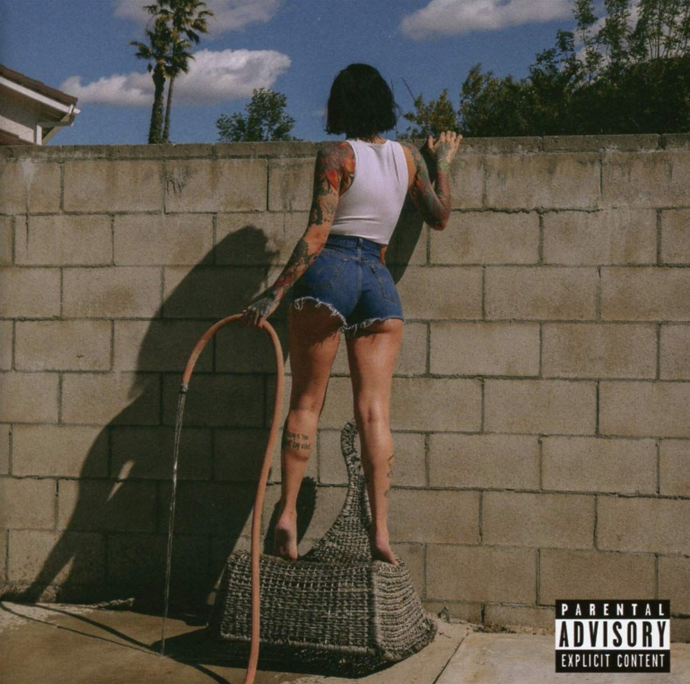

import { Slider, Button } from "carbon-components-react";
import { ArrowUpRight24 } from "@carbon/icons-react";

import SliderJS1 from "../review/slider1";
import SliderJS2 from "../review/slider2";
import SliderJS3 from "../review/slider3";
import SliderJS4 from "../review/slider4";

import { Link } from "gatsby";

import Review1 from "../review/kehlani1.mdx";
import Review2 from "../review/kehlani2.mdx";

Album Review

<h1 className="h1--no--margin">{props.pageContext.frontmatter.title}</h1>

  <Link to="/best50/2020/">2020 Black Music Best No.22</Link>

<Row  className="image-card-group">
	<Column colMd={"3"} colLg={"4"} noGutterMdLeft="">
       <ImageCard>

</ImageCard>
	</Column>
	<Column colMd={"4"} colLg={"8"} noGutterMdLeft="">
	

	Mixtape扱いだった前作を除くと、3年ぶりとなるKehlaniの2作目。十分なPromotionもできない状況で、リリースも延期されたが、R&Bチャート1位と好調なアクションを示している。
	 YGとの破局や自身の出産、Lexii Alijai, Mac Miller, Chynnaら友人の死、それにコロナ禍と、短期間での怒涛の体験を反映した作品であり、タイトルも、そんな心情を現わしているようだ。また、CDジャケットもWith コロナでの暮らしを表現している。
	 中身のほうだが、ミディアム～スロー中心で、アンニョイでダークなところもあり、1stとは大分違った趣となる。
	 サウンドは、エレクトロを適宜、取り入れたいまどきのR&Bで、Jhené Aiko, Lucky Daye, James Blakeなど、これもいまどきのGuestを迎え、アクセントをつけている。
	

	

	  <Button className="button-right-mergin"  href="https://amzn.to/3i6OHCi" kind="primary" size="small" renderIcon={ArrowUpRight24}>
      amazon.com
    </Button>
    <Button className="button-right-mergin"  href="https://amzn.to/2S23UtC" kind="secondary" size="small" renderIcon={ArrowUpRight24}>
      amazon.co.jp
    </Button>
		<Button className="button-right-mergin"  href="https://apple.co/2S38BUc" kind="tertiary" size="small" renderIcon={ArrowUpRight24}>
      apple music
    </Button>
	

	</Column>
</Row>
<Row >
	<Column colMd={"4"} colLg={"4"} noGutterMdLeft="">

  <h3>Score card</h3>
	<SliderJS1 value="5" />
  <SliderJS2 value="1" />
	<SliderJS3 value="1" />
  <SliderJS4 value="9" />

</Column>
<Column colMd={"8"} colLg={"8"} noGutterMdLeft="">

<h3>Producers</h3>

	G.Ry and K.Beazy(1)
	 Pop Wansel, Jake One and Some Randoms(2)
	 Jahaan Sweet(3,11)
	 Louie Lastic and Dan Foster(5)
	 Pop & Oak and Orphanage(6)
	 Go Grizzly and Loshendrix(8)
	 Jahaan Sweet and Yussef Dayes(9)
	 Boy1da, Jahaan Sweet and Yogitheproducer(10)
	 Pop Wansel, Some Randoms and Sam Wish(12)
	 Boy1da, Jahaan Sweet, The Rascals and Yogitheproducer(13)
	 Mars, Mike & Keys, Roget, Poshbeatz and Loshendrix(14)
	 CYHT(15)

<h3>Guests</h3>

	Tory Lanez, Jhené Aiko, Masego, James Blake, Megan Thee Stallion, Lucky Daye, Ty Dolla $ign

</Column>
</Row>

<h3>Tracks</h3>

| No. | Title                        | Composers                                                                                                                                                                 | Performer                 | Time  |
| --- | ---------------------------- | ------------------------------------------------------------------------------------------------------------------------------------------------------------------------- | ------------------------- | ----- |
| 1   | Toxic                        | Keegan Bach / Ryan Martinez / Kehlani Parrish                                                                                                                             | Kehlani                   | 02:48 |
| 2   | Can I                        | Phalon Alexander / Johnta Austin / Matthew Campfield / Bryan-Michael Cox / Jacob Dutton / Kevin Hicks / Daniel Klein / Kehlani Parrish / Daystar Peterson / Andrew Wansel | Kehlani feat. Tory Lanez  | 02:59 |
| 3   | Bad News                     | Kehlani Parrish / Jahaan Sweet                                                                                                                                            | Kehlani                   | 03:05 |
| 4   | Real Hot Girl (Skit)         | Megan Pete                                                                                                                                                                | Kehlani                   | 00:15 |
| 5   | Water                        | Alex Ben-Abdallah / Destin Conrad / Dan Foster / Louie Lastic / Kehlani Parrish / India Perkins                                                                           | Kehlani                   | 02:02 |
| 6   | Change Your Life             | Jhen? Aiko / Warren Felder / Alex Niceforo / Kehlani Parrish / Keith Sorrells / Andrew Wansel                                                                             | Kehlani feat. Jhené Aiko  | 03:11 |
| 7   | Belong to the Streets (Skit) | Anthony Creer / Jassmyn Fowlkes / Gibran Garcia / Serak Mehari / Albert Watts                                                                                             | Kehlani                   | 00:26 |
| 8   | Everybody Business           | Shawn Carter / Destin Conway / Chad Hugo / Trinidad James / Carlos Munoz / Kehlani Parrish / Kevin Price / Pharrell Williams                                              | Kehlani                   | 02:45 |
| 9   | Hate the Club                | Micah Davis / Yussef Dayes / Kehlani Parrish / Jahaan Sweet                                                                                                               | Kehlani feat. Masego      | 04:38 |
| 10  | Serial Lover                 | Johann Deterville / Vianey Emmanu?l Mfuamba / Kehlani Parrish / Matthew Samuels / Michael Samuels / Jahaan Sweet                                                          | Kehlani                   | 02:25 |
| 11  | F&MU                         | Nija Charles / Kehlani Parrish / Paolo Rodriguez / Jahaan Sweet                                                                                                           | Kehlani                   | 02:14 |
| 12  | Can You Blame Me             | Dustin Bowie / David Brown / Matthew Campfield / Nija Aisha-Alayja Charles / Daniel Klein / Michael MacGregor / Kehlani Parrish / Andrew Wansel / Sam Wishkoski           | Kehlani feat. Lucky Daye  | 03:03 |
| 13  | Grieving                     | James Blake / Johann Deterville / Kehlani Parrish / Matthew Samuels                                                                                                       | Kehlani feat. James Blake | 03:50 |
| 14  | Open (Passionate)            | Roget Chahayed / Nija Charles / Darryl Clemons / Destin Conrad / Lamar Edwards / John Groover / Los Hendrix / Michael Cox, Jr. / Kehlani Parrish / Andrew Wansel          | Kehlani                   | 04:05 |
| 15  | Lexii's (Outro)              | Cyht / Alexis Alijai Lynch / Josh Timmerman                                                                                                                               | Kehlani                   | 01:44 |

<h3>Other Reviews</h3>

<Row>
  <Column colMd={3} colLg={3} noGutterMdLeft>
    <Review1 />
  </Column>
  <Column colMd={3} colLg={3} noGutterMdLeft>
    <Review2 />
  </Column>
</Row>
