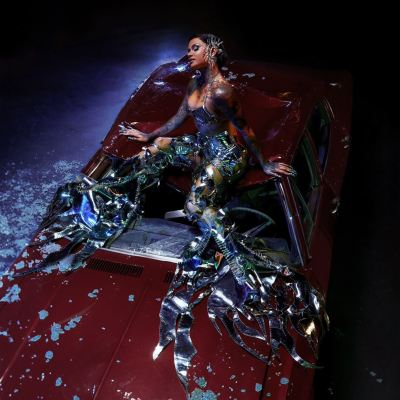

import { Slider, Button } from "@carbon/react";
import { ArrowUpRight } from "@carbon/icons-react";

import SliderJS1 from "../review/slider1";
import SliderJS2 from "../review/slider2";
import SliderJS3 from "../review/slider3";
import SliderJS4 from "../review/slider4";
import AdvJS2 from "../review/adv2";
import AdvJS3 from "../review/adv3";

import { Link } from "gatsby";

import Review1 from "../review/kehlani4.mdx";
import Review2 from "../review/kehlani3.mdx";
import Review3 from "../review/kehlani2.mdx";
import Review4 from "../review/kehlani1.mdx";

Album Review

<h1 className="h1--no--margin">{props.pageContext.frontmatter.title}</h1>

<Row  className="image-card-group">
	<Column colMd={3} colLg={4} noGutterMdLeft="">
       <ImageCard>

</ImageCard>
	</Column>
	<Column colMd={4} colLg={8} noGutterMdLeft="">
		

			2年ぶりとなるKehlaniの5作目。癒しやオーガニックといった言葉で形容されることが多いKehlaniではあるが、今回は、そんな殻を破った意欲作になっている。
			 全体的にはダークなトーンのものが多く、曲調が本当に様々で、R&Bに軸足を置きながら、ロック、カントリー、アフロ、フォーク、ハウスなどを行ったり来たりしていている。
			 Kehlaniもそれに合わせて、唄い分けていて。従来の可憐さは少し控えめ。ただ、その声で全体のまとまりを保っている気がする。ゲストは少な目で、Jill ScottとYoung Miko参加の⑥はエクスペリメンタルな感じ。⑧はNigeliaのOmah Layを招いたアフロビート曲となっている。
		

		

		  <Button className="button-right-mergin"  href="https://amzn.to/4jkc241" renderIcon={ArrowUpRight} size='sm' kind='primary'>
  	    amazon.com
  	  </Button>
  	  <Button className="button-right-mergin"  href="https://amzn.to/40xYRoX" renderIcon={ArrowUpRight} size='sm' kind='secondary'>
  	    amazon.co.jp
  	  </Button>
			<Button className="button-right-mergin"  href="https://apple.co/42eQakA" renderIcon={ArrowUpRight} size='sm' kind='tertiary'>
  	    apple music
  	  </Button>
			<AdvJS2/>
		

	</Column>
</Row>
<Row >
	<Column colMd={4} colLg={4} noGutterMdLeft="">
		

		  <h3>Score card</h3>
			<SliderJS1 value="5" />
		  <SliderJS2 value="1" />
			<SliderJS3 value="1" />
		  <SliderJS4 value="9" />
		

	</Column>
	<Column colMd={8} colLg={8} noGutterMdLeft="">
		

			<h3>Producers</h3>
			

				Dixson and Mamii(1)
				 Dixson(2)
				 Khris Riddick and Alex Goldblatt(3)
				 Khris Riddick, Jack Rochon, Aidan and Alex Goldblatt(4)
				 Dixson and Ant Clemons(5)
				 Camper(6)
				 Oak(7)
				 Guiltybeatz, Etienne, Jack Rochon and Symphony(8)
				 Jack Rochon, Camper and Ant Clemons(9)
				 Jack Rochon(10,12)
				 Jack Rochon and Dixson(11)
			

			<h3>Guests</h3>
			

				Jill Scott, Young Miko, Omah Lay
			

		

	</Column>
</Row>

<h3>Tracks</h3>

| No. | Title        | Composers                                                                                                                                                      | Performer                             | Time  |
| --- | ------------ | -------------------------------------------------------------------------------------------------------------------------------------------------------------- | ------------------------------------- | ----- |
| 1   | GrooveTheory | Kehlani Parrish, Darius Dixson, Shawntoni Nichols, Darhyl Camper, Daniel Upchurch                                                                              | Kehlani                               | 04:04 |
| 2   | Next 2 U     | Kehlani Parrish, Darius Dixson, Anthony Clemons                                                                                                                | Kehlani                               | 02:41 |
| 3   | After Hours  | Kehlani Parrish, Khris Riddick-Tynes, Alex Goldblatt, Daniel Upchurch, Diovanna Frazier, Cordel Burrell                                                        | Kehlani                               | 03:22 |
| 4   | Crash        | Kehlani Parrish, Reginald Becton, Aidan Carroll, Khris Riddick-Tynes, Jack Rochon, Daniel Upchurch, Alex Goldblatt, Aaron Cheung                               | Kehlani                               | 02:50 |
| 5   | 8            | Kehlani Parrish, Darius Dixson, Anthony Clemons Jr., Kwame Holland                                                                                             | Kehlani                               | 02:30 |
| 6   | Sucia        | Kehlani Parrish, Darius Dixson, Shawntoni Nichols, Darhyl Camper Jr., Diovanna Frazier, Morgan Belanger, Jill Scott, María Victoria Ramírez de Arellano Cardon | Kehlani feat. Jill Scott & Young Miko | 04:08 |
| 7   | Better Not   | Kehlani Parrish, Warren Felder, Destin Conrad, Reginald Becton, Alexander Ben-Abdallah, Daniel Upchurch, Morgan Belanger                                       | Kehlani                               | 02:43 |
| 8   | Tears        | Kehlani Parrish, Reginald Becton, Edgar Etienne, Jack Rochon, Ronald Banful, Stanley Omah Didia, Atia Bogs, Samik Ganguly                                      | Kehlani feat. Omah Lay                | 02:55 |
| 9   | Vegas        | Kehlani Parrish, Jack Rochon, Anthony Clemons Jr., Darhyl Camper Jr., Darius Dixson, Atia Boggs, Daniel Upchurch, Reginald Becton, Morgan Belanger              | Kehlani                               | 03:47 |
| 10  | Deep         | Kehlani Parrish, Jack Rochon, Darius Dixson, Morgan Belanger                                                                                                   | Kehlani                               | 02:26 |
| 11  | Chanel       | Kehlani Parrish, Jack Rochon, Darius Dixson, Reginald Becton, Prince-Phabian Iman Alexander Graham, Daniel Upchurch, Morgan Belanger                            | Kehlani                               | 03:54 |
| 12  | Lose My Wife | Kehlani Parrish, Jack Rochon, Darius Dixson                                                                                                                    | Kehlani                               | 02:45 |

<h3>Other Reviews</h3>

<Row>
  <Column colMd={3} colLg={3} noGutterMdLeft>
    <Review1 />
  </Column>
  <Column colMd={3} colLg={3} noGutterMdLeft>
    <Review2 />
  </Column>
  <Column colMd={3} colLg={3} noGutterMdLeft>
    <Review3 />
  </Column>
	<Column colMd={3} colLg={3} noGutterMdLeft>
    <Review4 />
  </Column>
</Row>

<AdvJS3 />
