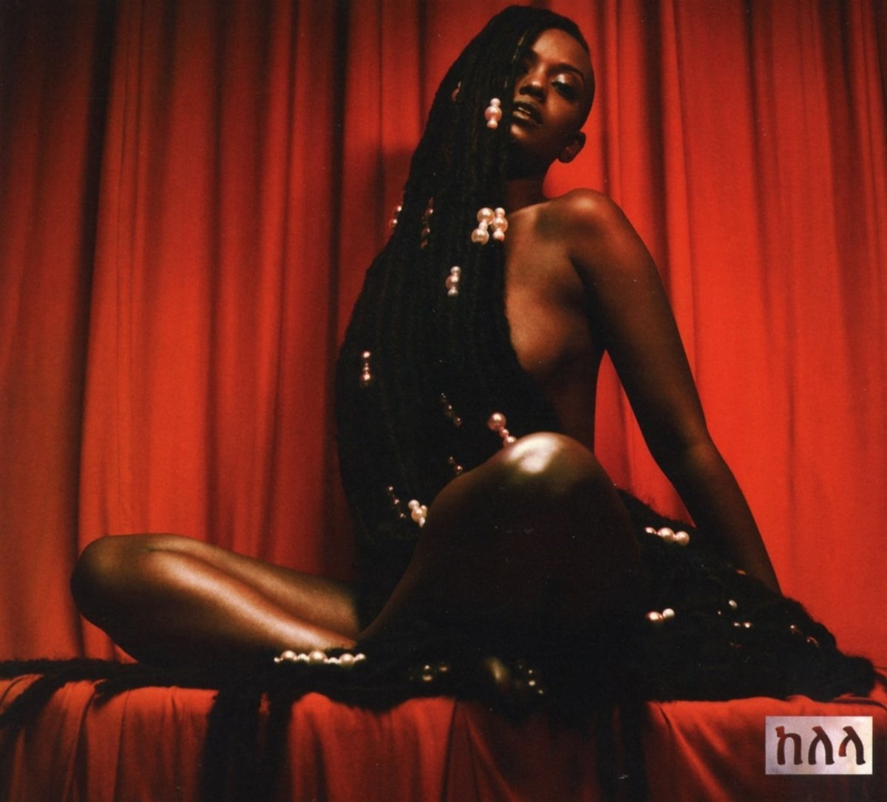

import { Slider, Button } from "carbon-components-react";
import { ArrowUpRight24 } from "@carbon/icons-react";

import SliderJS1 from "../review/slider1";
import SliderJS2 from "../review/slider2";
import SliderJS3 from "../review/slider3";
import SliderJS4 from "../review/slider4";

import { Link } from "gatsby";

Album Review

<h1 className="h1--no--margin">{props.pageContext.frontmatter.title}</h1>

  <Link to="/best50/2017/">2017 Black Music Album Best No.7</Link>

<Row  className="image-card-group">
	<Column colMd={"3"} colLg={"4"} noGutterMdLeft="">
       <ImageCard>

</ImageCard>
	</Column>
	<Column colMd={"4"} colLg={"8"} noGutterMdLeft="">
	

	2013年リリースのMix Tapeが好評だったDC出身のVocal, Kelelaのフィジカルデビュー作。そのMix Tapeに引き続きUKよりJam Cityと、なんとArcaがProducerとして参加していて、R&Bの枠を大幅に越えたジャンルレスなVocal Albumになっている。
	 シンセを多用したTrackは、スローで浮遊感のある揺蕩うようなものばかりであり、Bjorkに影響を受けたというKelelaのなめらかで透き通った声と一体化している。ただ、逆にKelelaの唄が唯一R&Bらしい気もする。
	 やや単調なところもあるが、新しいR&Bの方向性を示した意欲作だと思う。
	

	

	  <Button className="button-right-mergin"  href="https://amzn.to/2CZGbGq" kind="primary" size="small" renderIcon={ArrowUpRight24}>
      amazon.com
    </Button>
    <Button className="button-right-mergin"  href="https://amzn.to/2WUkfUd" kind="secondary" size="small" renderIcon={ArrowUpRight24}>
      amazon.co.jp
    </Button>
	

	
	</Column>
</Row>
<Row >
	<Column colMd={"4"} colLg={"4"} noGutterMdLeft="">

  <h3>Score card</h3>
	<SliderJS1 value="5" />
  <SliderJS2 value="1" />
	<SliderJS3 value="2" />
  <SliderJS4 value="9" />

</Column>
<Column colMd={"4"} colLg={"8"} noGutterMdLeft="">

<h3>Producers</h3>

	Jam City(1,2,7,8,13,14)
	 Al Shux and Jam CIty(3)
	 Arca(4,11,12)
	 Aaron David Ross(5)
	 Mckay, Bok Bok and Ariel Rechishaid(6)
	 Kingdom(9)
	 Dubbel Dutch(10)

<h3>Guests</h3>

</Column>
</Row>

<h3>Tracks</h3>

| No. | Title         | Composers                                              | Performer | Time  |
| --- | ------------- | ------------------------------------------------------ | --------- | ----- |
| 1   | Frontline     | Will Boston / Sam Dew / Jeremiah Jerry / Kelela        | Kelela    | 05:39 |
| 2   | Waitin        | Dean Bein / Kelela / Mocky                             | Kelela    | 03:15 |
| 3   | Take Me Apart | Boots / Kelela / Mocky / Al Shux                       | Kelela    | 04:02 |
| 4   | Enough        | Kelela / Mocky                                         | Kelela    | 05:09 |
| 5   | Jupiter       | Romy Madley Croft / Kelela                             | Kelela    | 02:05 |
| 6   | Better        | Romy Madley Croft / Kelela / Mocky                     | Kelela    | 04:26 |
| 7   | LMK           | Jeremiah Jerry / Kelela / Asma Maroof                  | Kelela    | 03:38 |
| 8   | Truth or Dare | Will Boston / Kelela / Asma Maroof / Talay Riley       | Kelela    | 04:12 |
| 9   | S.O.S.        | Kelela                                                 | Kelela    | 02:22 |
| 10  | Blue Light    | Nia Andrews / Bok Bok / Sam Dew / Kelela / Asma Maroof | Kelela    | 03:36 |
| 11  | Onanon        | Arca / Kelela / Jay Prince                             | Kelela    | 04:31 |
| 12  | Turn to Dust  | Arca / Jam City / Romy Madley Croft / Kelela           | Kelela    | 04:29 |
| 13  | Bluff         | Will Boston / Kelela                                   | Kelela    | 01:12 |
| 14  | Altadena      | Will Boston / Kelela / Mocky / Sabina Sciubba          | Kelela    | 05:10 |
