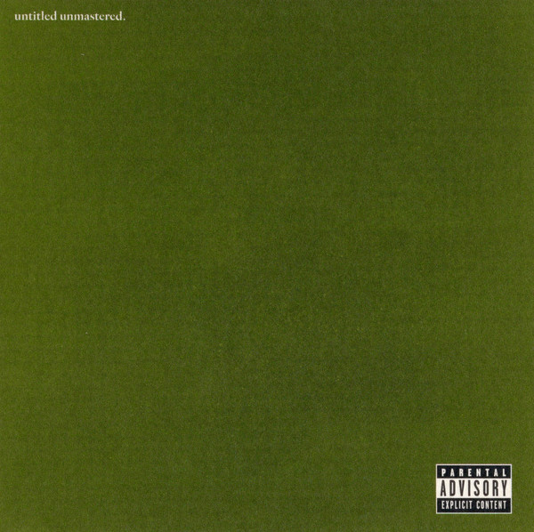

import { Slider, Button } from 'carbon-components-react';
import { ArrowUpRight24  } from '@carbon/icons-react';

import SliderJS1 from "../review/slider1"
import SliderJS2 from "../review/slider2"
import SliderJS3 from "../review/slider3"
import SliderJS4 from "../review/slider4"

import { Link } from "gatsby"

import Review1 from "../review/kendricklamar5.mdx"
import Review2 from "../review/blackpanther.mdx"

Album Review

<h1 className="h1--no--margin">{props.pageContext.frontmatter.title}</h1>

<Link to="/best50/2016/">2016 Black Music Album Best No.12</Link>

<Row  className="image-card-group">
	<Column colMd={"4"} colLg={"4"} noGutterMdLeft="">
       <ImageCard>

 
</ImageCard>
	</Column>
	<Column colMd={"8"} colLg={"8"} noGutterMdLeft="">
	

	5部門受賞したGrammy賞授賞式の17日後に突如リリースされたKendrick Lamarの未発表作品集。タイトルもなく、マスタリングもされていない8曲よりなる小品であるが、寄せ集め感はなく、それなりにまとまりの良いアルバムである。傑作だった前作(To Pomp A Buttefly)のようなコンセプチャルなところはないが、2014年レコーディングの曲が多く、個々の曲のクオリティは高いし、Kendrick Lamarのラップスキルもハイレベルだ。楽器をもちいたTrackが多く、特にRobert Glasperの絡んだ⑤などは素晴らしい。
	

	

	  <Button href="https://amzn.to/3h59AwU" kind="primary" size="small" renderIcon={ArrowUpRight24}>
      amazon.com
    </Button>
    <Button href="https://amzn.to/2GtzzBG" kind="secondary" size="small" renderIcon={ArrowUpRight24}>
      amazon.co.jp
    </Button>
	

	
	
	</Column>
</Row>
<Row >
	<Column colMd={"4"} colLg={"4"} noGutterMdLeft="">

  <h3>Score card</h3>
	<SliderJS1 value="2" />
  <SliderJS2 value="2" />
	<SliderJS3 value="2" />
  <SliderJS4 value="8" />

</Column>
<Column colMd={"8"} colLg={"8"} noGutterMdLeft="">

<h3>Producers</h3>

Ritz Reynolds(1)
 Cardo and Yung Exclusive(2)
 Astronote(3)
 Thundercat, Sounwave and Kendrick Duckworth(4)
 Sounwave and Terrace Martin(5)
 Adrian Younge and Ali Shaheed Muhammad(6)
 Cardo, Yung Exclusive, Frank Dukes and Egypt Dean(7)
 Thundercat and Mono/Poly(8)

<h3>Guests</h3>

Terrace martin, Thundercat, Sounwave, Bilal, SZA, Lance Skiiiwalker , Jay Rock, Cee-Lo Green, Robert Glasper

</Column>
</Row>

<h3>Tracks</h3>

| No. |	 Title                    |	 Composers                                                                                                           |	 Performer    |	 Time	|
| --- |	------------------------- | -------------------------------------------------------------------------------------------------------------------- | -------------- | ----- |
|	1	  |	untitled 01 - 08.19.2014.	| Kendrick Duckworth / Brent Reynolds                                                                                  | Kendrick Lamar	|	04:08 |
|	2	  |	untitled 02 - 06.23.2014.	| Kendrick Duckworth / Daveon Jackson / Ron LaTour                                                                     | Kendrick Lamar	|	04:19 |
|	3	  |	untitled 03 - 05.28.2013.	| Kendrick Duckworth / Mathieu Rakotozafy                                                                              | Kendrick Lamar	|	02:34 |
|	4	  |	untitled 04 - 08.14.2014.	| Stephen Bruner / Kendrick Duckworth / Mark Spears                                                                    | Kendrick Lamar	|	01:50 |
|	5	  |	untitled 05 - 09.21.2014.	| Kendrick Duckworth / Terrace Martin / Mark Spears                                                                    | Kendrick Lamar	|	05:38 |
|	6	  |	untitled 06 - 06.30.2014.	| Thomas Callaway / Kendrick Duckworth / Ali Shaheed Muhammad / Adrian Younge                                          | Kendrick Lamar	|	03:28 |
|	7	  |	untitled 07 - 2014 - 2016	| Stephen Bruner / Egypt Daoud Dean / Kendrick Duckworth / Adam Feeney / Daveon Jackson / Brock Korsan / Ronald Latour | Kendrick Lamar	|	08:16 |
|	8	  |	untitled 08 - 09.06.2014.	| Stephen Bruner / Charles Dickerson / Kendrick Duckworth                                                              | Kendrick Lamar	|	03:56 |

<h3>Other Reviews</h3>

<Row>
<Column colMd={3} colLg={3} noGutterMdLeft>
<Review1 />
</Column>
</Row>

<Row>
<Column colMd={3} colLg={3} noGutterMdLeft>
<Review2 />
</Column>
</Row>