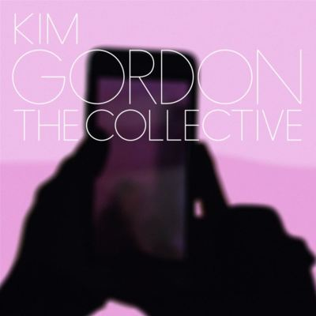

import { Slider, Button } from "@carbon/react";
import { ArrowUpRight } from "@carbon/icons-react";

import SliderJS1 from "../review/slider1";
import SliderJS2 from "../review/slider2";
import SliderJS3 from "../review/slider3";
import SliderJS4 from "../review/slider4";
import AdvJS2 from "../review/adv2";
import AdvJS3 from "../review/adv3";

import { Link } from "gatsby";

Album Review

<h1 className="h1--no--margin">{props.pageContext.frontmatter.title}</h1>

<Row className="image-card-group">
	<Column colMd={3} colLg={4} noGutterMdLeft="">
		<ImageCard>

		</ImageCard>
	</Column>
	<Column colMd={4} colLg={8} noGutterMdLeft="">
		

			Sonic Youth解散後、2作目となるKim Gordonのソロアルバム。リリース時の年齢は70歳ではあるが、攻撃的先鋭的でExperimental Hip-Hopにカテゴライズできそうな作品になっている。ギター、ドラム、ベースに演奏を目いっぱい歪ませたものに、ノイズ、効果音を加えたトラックと、Kimの厭世的なRapというか語りが合わさったサウンドはかなり強烈で迫力がある。中毒的なところもあるが、自分の感性とは合わないかな。
		

		

			<Button className="button-right-mergin" href="https://amzn.to/4gz4BEq" renderIcon={ArrowUpRight} size='sm' kind='primary'>
				amazon.com
			</Button>
			<Button className="button-right-mergin" href="https://amzn.to/40hocTL" renderIcon={ArrowUpRight} size='sm' kind='secondary'>
				amazon.co.jp
			</Button>
			<Button className="button-right-mergin" href="https://apple.co/4j58djl" renderIcon={ArrowUpRight} size='sm' kind='tertiary'>
				apple music
			</Button>
			<AdvJS2/>
		

	</Column>
</Row>
<Row>
	<Column colMd={4} colLg={4} noGutterMdLeft="">
		

			<h3>Score card</h3>
			<SliderJS1 value="2" />
			<SliderJS2 value="2" />
			<SliderJS3 value="4" />
			<SliderJS4 value="7" />
		

	</Column>
	<Column colMd={8} colLg={8} noGutterMdLeft="">
		

			<h3>Producers</h3>
			

				Justin Raisen(all)
			

			<h3>Guests</h3>
			

			

		

	</Column>
</Row>

<h3>Tracks</h3>

| No. | Title                | Composers                                                         | Performer  | Time  |
| --- | -------------------- | ----------------------------------------------------------------- | ---------- | ----- |
| 1   | Bye Bye              | Kim Gordon / Jeremiah Raisen / Justin Raisen                      | Kim Gordon | 04:13 |
| 2   | The Candy House      | Kim Gordon / Justin Raisen                                        | Kim Gordon | 02:21 |
| 3   | I Don't Miss My Mind | Kim Gordon / Justin Raisen                                        | Kim Gordon | 03:25 |
| 4   | I'm a Man            | Kim Gordon / Anthony Paul Lopez / Justin Raisen                   | Kim Gordon | 04:31 |
| 5   | Trophies             | Kim Gordon / Anthony Paul Lopez / Justin Raisen                   | Kim Gordon | 02:36 |
| 6   | It's Dark Inside     | Kim Gordon / Anthony Paul Lopez / Justin Raisen                   | Kim Gordon | 03:35 |
| 7   | Psychedelic Orgasm   | Kim Gordon / Anthony Paul Lopez / Justin Raisen                   | Kim Gordon | 03:40 |
| 8   | Tree House           | Kim Gordon / Justin Raisen                                        | Kim Gordon | 04:06 |
| 9   | Shelf Warmer         | Kim Gordon / Justin Raisen                                        | Kim Gordon | 04:11 |
| 10  | The Believers        | Kim Gordon / Anthony Paul Lopez / Jeremiah Raisen / Justin Raisen | Kim Gordon | 04:55 |
| 11  | Dream Dollar         | Kim Gordon / Joe Kennedy / Justin Raisen                          | Kim Gordon | 03:00 |

<AdvJS3 />
