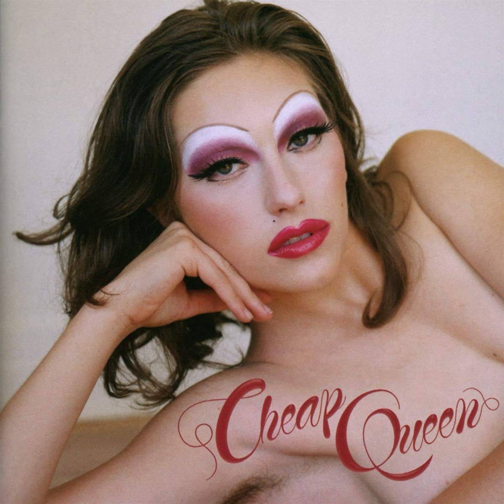

import { Slider, Button } from "@carbon/react";
import { ArrowUpRight } from "@carbon/icons-react";

import SliderJS1 from "../review/slider1";
import SliderJS2 from "../review/slider2";
import SliderJS3 from "../review/slider3";
import SliderJS4 from "../review/slider4";
import AdvJS2 from "../review/adv2";
import AdvJS3 from "../review/adv3";

import { Link } from "gatsby";

Album Review

<h1 className="h1--no--margin">{props.pageContext.frontmatter.title}</h1>

  <Link to="/best50/2019/">2019 Black Music Album Best No.32</Link>

<Row  className="image-card-group">
	<Column colMd={3} colLg={4} noGutterMdLeft="">
       <ImageCard>

</ImageCard>
	</Column>
	<Column colMd={4} colLg={8} noGutterMdLeft="">
	  

	  デビューシングルの"1950"が話題になったBrooklyn出身の21歳、King Princess(本名Mikaela Straus)のデビューアルバム。自らレズビアンであることを公言し、クイアアイコンとしても取り上げられることが多く、CDジャケットでは刺激的なショットも載せている。ただ、本人が全面的にProduce / Song Writingしている音楽のほうは全く過激なものではなく、比較的スローで穏やかな曲が多く、Popで聴きやすい。
		 今どきのアンニョイで茫洋としたところもあるが、耳に馴染むロック/フォークが中心となる。Trackに合わせて、Vocalも歌い上げるというより、淡々とした感じだ。ただし表情は豊かである。
		 父親がRecording Engineerということで音質での評価も高いようだ
	  

	  

	    <Button className="button-right-mergin"  href="https://amzn.to/2XipPAg" renderIcon={ArrowUpRight} size='sm' kind='primary'>
        amazon.com
      </Button>
      <Button className="button-right-mergin"  href="https://amzn.to/36NoKU0" renderIcon={ArrowUpRight} size='sm' kind='secondary'>
        amazon.co.jp
      </Button>
			<Button className="button-right-mergin"  href="https://apple.co/4bNyaiK" renderIcon={ArrowUpRight} size='sm' kind='tertiary'>
			apple music
		</Button>
	  <AdvJS2/>
	  

	  </Column>
</Row>
<Row >
	<Column colMd={4} colLg={4} noGutterMdLeft="">

    <h3>Score card</h3>
	<SliderJS1 value="5" />
    <SliderJS2 value="2" />
	<SliderJS3 value="1" />
    <SliderJS4 value="8" />

</Column>
<Column colMd={8} colLg={8} noGutterMdLeft="">

<h3>Producers</h3>

	King Princess and Mike Matchikoff(1,2,3,4,5,6,9,10,11,12)
	 King Princess Tim Anderson and Mike Matchikoff(7)
	 King Princess and Teo Halm(8)
	 King Princess and Kid Harpoon(13)

<h3>Guests</h3>

	Tobias Jesso Jr.

</Column>
</Row>

<h3>Tracks</h3>

| No  | Title                       | Composers                                                                        | Performer                            | Time |
| --- | --------------------------- | -------------------------------------------------------------------------------- | ------------------------------------ | ---- |
| 1   | Tough On Myself             | Mikaela Straus, Nick Long                                                        | King Princess                        | 3:43 |
| 2   | Useless Phrases             | Mikaela Straus                                                                   | King Princess                        | 1:16 |
| 3   | Cheap Queen                 | Mikaela Straus, Nick Long, Amanda Sternburg, Carl Sigman, Bub Russell            | King Princess                        | 2:41 |
| 4   | Ain't Together              | Mikaela Straus, Justin Tranter, Nick Long                                        | King Princess                        | 3:22 |
| 5   | Do You Wanna See Me Crying? | Mikaela Straus                                                                   | King Princess                        | 1:45 |
| 6   | Homegirl                    | Mikaela Straus, Nick Long, Amanda Sternburg, Carl Sigman, Bub Russell, Romy Craft | King Princess                        | 3:01 |
| 7   | Prophet                     | Mikaela Straus, Nick Long, Tim Anderson, Aaron Forbes                            | King Princess                        | 4:09 |
| 8   | Isabel's Moment             | Mikaela Straus, Teo Halm                                                         | King Princess feat. Tobias Jesso Jr. | 2:13 |
| 9   | Trust Nobody                | Mikaela Straus, Nick Long                                                        | King Princess                        | 3:15 |
| 10  | Watching My Phone           | Mikaela Straus                                                                   | King Princess                        | 3:00 |
| 11  | You Destroyed My Heart      | Mikaela Straus, Nick Long                                                        | King Princess                        | 3:40 |
| 12  | Hit the Back                | Mikaela Straus                                                                   | King Princess                        | 3:23 |
| 13  | If You Think It's Love      | Mikaela Straus, Thomas Edward                                                    | King Princess                        | 3:23 |

<AdvJS3 />
