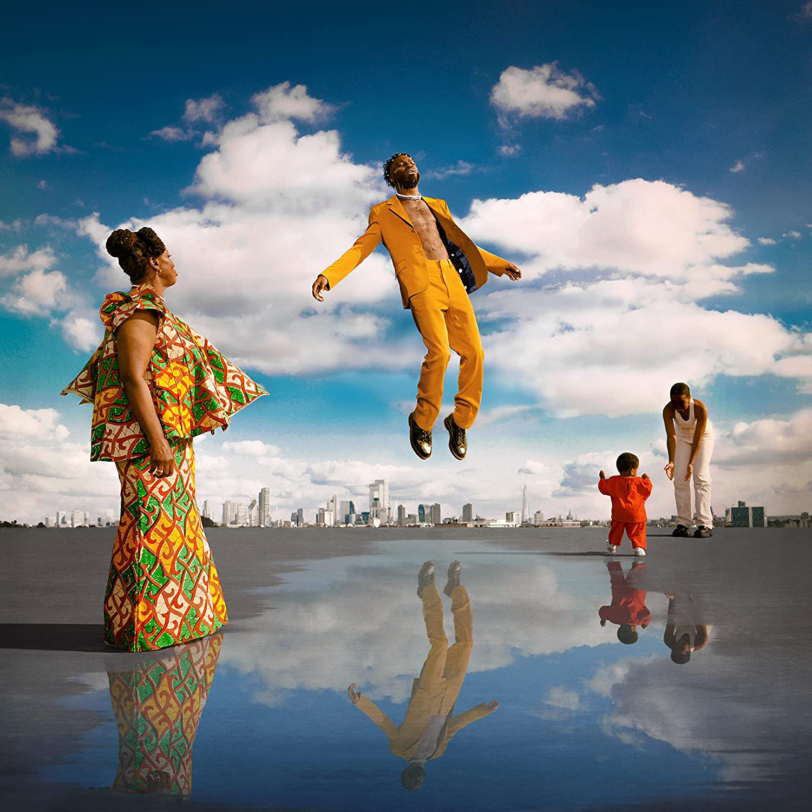

import { Slider, Button } from "@carbon/react";
import { ArrowUpRight } from "@carbon/icons-react";

import SliderJS1 from "../review/slider1";
import SliderJS2 from "../review/slider2";
import SliderJS3 from "../review/slider3";
import SliderJS4 from "../review/slider4";
import AdvJS2 from "../review/adv2";
import AdvJS3 from "../review/adv3";

import { Link } from "gatsby";

Album Review

<h1 className="h1--no--margin">{props.pageContext.frontmatter.title}</h1>

<Row  className="image-card-group">
	<Column colMd={3} colLg={4} noGutterMdLeft="">
       <ImageCard>

</ImageCard>
	</Column>
	<Column colMd={4} colLg={8} noGutterMdLeft="">
	

		East London生まれで29歳のRapper, Kojey Radicalのデビューアルバム。両親はガーナ移民とのこと。近年、シングルや客演で頭角を現し、アルバムデビューに至っている。
		 90年代のUS Hip-Hopをベースにしつつ、R&B, Jazz, Afroっぽさもミックスしたサウンドは、多分に都会的で洗練され、落ち着いた印象を受ける。数曲では唄が中心となっており、これも穏やかでゆったりとした感じの曲が多い。
		 UKより若手ゲストも多数起用し、今のシーンの勢いを感じさせる。本人のRapも芯がしっかりしていて力強いところが魅力となっている。
	

	

	  <Button className="button-right-mergin"  href="https://amzn.to/3UNElej" renderIcon={ArrowUpRight} size='sm' kind='primary'>
      amazon.com
    </Button>
    <Button className="button-right-mergin"  href="https://amzn.to/3Eq1Ft6" renderIcon={ArrowUpRight} size='sm' kind='secondary'>
      amazon.co.jp
    </Button>
		<Button className="button-right-mergin"  href="https://apple.co/3UxSBYN" renderIcon={ArrowUpRight} size='sm' kind='tertiary'>
      apple music
    </Button>
		<AdvJS2/>
	

	</Column>
</Row>
<Row >
	<Column colMd={4} colLg={4} noGutterMdLeft="">

  <h3>Score card</h3>
	<SliderJS1 value="4" />
  <SliderJS2 value="1" />
	<SliderJS3 value="2" />
  <SliderJS4 value="8" />

</Column>
<Column colMd={8} colLg={8} noGutterMdLeft="">

<h3>Producers</h3>

	Tyrell Pau, Cameron Palmer, Kwame "KZ" Kwei-Armah Jr. and Venna(1)
	 Cameron Palmer and Kwame "KZ" Kwei-Armah Jr.(2,8)
	 Kwame "KZ" Kwei-Armah Jr., Oliver Rodigan and Ric & Thadus(3)
	 Blue Lab Beats(4)
	 Cameron Palmer and Emil Larbi(5)
	 Kwame "KZ" Kwei-Armah Jr.,(6,13)
	 Adrian Francis, Curtis Antony James and Emil Larbi(7)
	 Cameron Palmer(10)
	 Jay Weathers, Kwame "KZ" Kwei-Armah Jr.(11)
	 Ayodele Oyadare,(12)
	 Jason Kawu-Eugenio(14)
	 Kwame "KZ" Kwei-Armah Jr., Edo Thomas, Cameron Palmer and Jay Weathers(15)

<h3>Guests</h3>

	Tiana Major9, Masego, Shaé Universe, Kelis, ex Amor, Knucks, Wretch 32, Shakka, Ego Ella May, Rexx Life Raj

</Column>
</Row>

<h3>Tracks</h3>

| No. | Title           | Composers                                                                          | Performer                               | Time  |
| --- | --------------- | ---------------------------------------------------------------------------------- | --------------------------------------- | ----- |
| 1   | Reason to Smile | Cameron Palmer, Eight, 9FLY, Kwame "KZ" Kwei-Armah Jr., Tiana Major9, Tyrell Paul  | Kojey Radical feat. Tiana Major9        | 03:04 |
| 2   | Together        | Cameron Palmer, Emmavie, Kwame "KZ" Kwei-Armah Jr., Maverick Sabre, Mbongo, ?yanna | Kojey Radical                           | 03:03 |
| 3   | Nappy           | Kwame "KZ" Kwei-Armah Jr., Oliver Rodigan                                          | Kojey Radical                           | 02:16 |
| 4   | Silk            | David Mrakpor, Masego, Namali Kwaten                                               | Kojey Radical feat. Masego              | 03:58 |
| 5   | Pressure        | Cameron Palmer, Emil Larbi, O. Koleoso, Shaé Universe                              | Kojey Radical feat. Shaé Universe       | 03:54 |
| 6   | Born            | Cashh, Kwame "KZ" Kwei-Armah Jr., Rayan El-Hussein Rayo Goufar                     | Kojey Radical                           | 03:26 |
| 7   | Pusher Man: BWI | Adrian Francis, Curtis Antony James, Emil Larbi                                    | Kojey Radical                           | 04:51 |
| 8   | Talkin'         | Cameron Palmer, Kelis, Kwame "KZ" Kwei-Armah Jr., Tiana Major9                     | Kojey Radical feat. Kelis, Tiana Major9 | 02:57 |
| 9   | War Outside     | Cameron Palmer, Kwame "KZ" Kwei-Armah Jr., Lex Amor                                | Kojey Radical feat. Lex Amor            | 03:56 |
| 10  | Payback         | Cameron Palmer, Knucks                                                             | Kojey Radical feat. Knucks              | 02:44 |
| 11  | Fubu            | Jay Weathers, Karriem Riggins, Kwame "KZ" Kwei-Armah Jr.                           | Kojey Radical                           | 03:04 |
| 12  | Beautiful       | Ayodele Oyadare, Shakka, Wretch 32                                                 | Kojey Radical feat. Wretch 32, Shakka   | 03:20 |
| 13  | Anywhere        | Cameron Palmer, Ego Ella May, Owen Cutts                                           | Kojey Radical feat. Ego Ella May        | 03:05 |
| 14  | Solo            | Jazon Kawu-Eugenio, Rexx Life Raj                                                  | Kojey Radical feat. Rexx Life Raj       | 03:59 |
| 15  | Gangsta         | Ed Thomas, Jay Weathers                                                            | Kojey Radical                           | 04:37 |

<AdvJS3 />
