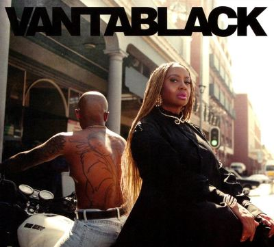

import { Slider, Button } from "@carbon/react";
import { ArrowUpRight } from "@carbon/icons-react";

import SliderJS1 from "../review/slider1";
import SliderJS2 from "../review/slider2";
import SliderJS3 from "../review/slider3";
import SliderJS4 from "../review/slider4";
import AdvJS2 from "../review/adv2";
import AdvJS3 from "../review/adv3";

import { Link } from "gatsby";

Album review

<h1 className="h1--no--margin">{props.pageContext.frontmatter.title}</h1>

	<Link to="/best50/2024/">2024 Black Music Best No.22</Link>

<Row className="image-card-group">
	<Column colMd={3} colLg={4} noGutterMdLeft="">
		<ImageCard>

		</ImageCard>
	</Column>
	<Column colMd={4} colLg={8} noGutterMdLeft="">
		

			Lalah Hathawayの7年ぶり7作目となるオリジナルアルバム。90年代から活躍してた人なので、少ない気もするが、客演が多く、ずっと一線にいた人でもある。
			 タイトルのVantablackは"人工の最も黒い物質として世界記録を誇る非常に黒いコーティング"とのことで、ほとんどの光を吸収するという。黒人としてのアイデンティティを見つめなおし、様々な音楽に接してきたLalahを投影した作品にぴったりである。
			 ①⑤⑧などは、そういった意識をストレートに現した曲であるが、それだけではないので、全体感は決して重くはない。曲調もバラードだけでなく、アップ、ミディアムをバランスよく配しており、ダンサブルな曲もある。
			 また最後の2曲が、インスト曲から主にハミングだけの曲と続き、アルバムの締め方として斬新だと思った。前作から引き続きのPhil BeaudreauにJuan Andres Carreno Arizaを加えた、畑違いの制作陣と、曲によってはしっとりと、または軽やかなLalahのVocalの相性も良さそうだ。
		

		

			<Button className="button-right-mergin" href="https://amzn.to/4iwdrE2" renderIcon={ArrowUpRight} size='sm' kind='primary'>
				amazon.com
			</Button>
			<Button className="button-right-mergin" href="https://amzn.to/4iwlXTv" renderIcon={ArrowUpRight} size='sm' kind='secondary'>
				amazon.co.jp
			</Button>
			<Button className="button-right-mergin" href="https://apple.co/4caMljz" renderIcon={ArrowUpRight} size='sm' kind='tertiary'>
				apple music
			</Button>
			<AdvJS2/>
		

	</Column>
</Row>
<Row>
	<Column colMd={4} colLg={4} noGutterMdLeft="">
		

			<h3>Score card</h3>
			<SliderJS1 value="5" />
			<SliderJS2 value="2" />
			<SliderJS3 value="1" />
			<SliderJS4 value="8" />
		

	</Column>
	<Column colMd={8} colLg={8} noGutterMdLeft="">
		

			<h3>Producers</h3>
			

				Phil Beaudreau and Lalah Hathaway(1,2,4,7,11,13,14,15,16)
				 Warryn Campbell and Eric Dawkins (3)
				 Ariza and Lalah Hathaway(5,6,8,9,10,12)
			

			<h3>Guests</h3>
			

				Rapsody, Common, Michael McDonald, MC Lyte, Phonte, Gerald Albright, Willow
			

		

	</Column>
</Row>

<h3>Tracks</h3>

| No. | Title          | Composers                                                                                     | Performer                             | Time  |
| --- | -------------- | --------------------------------------------------------------------------------------------- | ------------------------------------- | ----- |
| 1   | BLACK.         | Phil Beaudreau / Marlanna Evans / Lalah Hathaway / Lonnie Lynn                                | Lalah Hathaway feat. Rapsody, Common  | 02:37 |
| 2   | No Lie         | Phil Beaudreau / Lalah Hathaway                                                               | Lalah Hathaway feat. Michael McDonald | 04:29 |
| 3   | Mood for You   | Warryn Campbell / Affion Crockett / Eric Dawkins / Lalah Hathaway / Lana Moorer / Juan Winans | Lalah Hathaway feat. MC Lyte          | 03:55 |
| 4   | You Don't Know | BeMyFiasco / Phil Beaudreau / Phonte Coleman / Lalah Hathaway                                 | Lalah Hathaway feat. Phonte           | 02:19 |
| 5   | Vantablack     | Juan Andres Carreno Ariza / Lalah Hathaway                                                    | Lalah Hathaway                        | 02:37 |
| 6   | Returning      | Juan Andres Carreno Ariza / Lalah Hathaway                                                    | Lalah Hathaway                        | 04:54 |
| 7   | So in Love     | Phil Beaudreau / Lalah Hathaway                                                               | Lalah Hathaway                        | 04:06 |
| 8   | I AM           | Juan Andres Carreno Ariza / Nicole Cohen / Lalah Hathaway                                     | Lalah Hathaway                        | 02:56 |
| 9   | The Machine    | Juan Andres Carreno Ariza / Lalah Hathaway                                                    | Lalah Hathaway                        | 02:43 |
| 10  | Myth of Being  | Juan Andres Carreno Ariza / Nicole Cohen / Lalah Hathaway                                     | Lalah Hathaway                        | 03:20 |
| 11  | Higher         | Phil Beaudreau / Lalah Hathaway / Stephanie Thom                                              | Lalah Hathaway                        | 03:47 |
| 12  | The Energy     | Juan Andres Carreno Ariza / Nicole Cohen / Lalah Hathaway                                     | Lalah Hathaway                        | 03:40 |
| 13  | #BITMFW        | Phil Beaudreau / Lalah Hathaway                                                               | Lalah Hathaway                        | 02:55 |
| 14  | Clearly        | Phil Beaudreau / Lalah Hathaway                                                               | Lalah Hathaway                        | 04:18 |
| 15  | Lower          | Gerald Albright / Phil Beaudreau / Lalah Hathaway                                             | Lalah Hathaway feat. Gerald Albright  | 01:55 |
| 16  | Tunnels        | Phil Beaudreau / Lalah Hathaway / Willow Smith                                                | Lalah Hathaway feat. Willow           | 04:12 |

<AdvJS3 />
