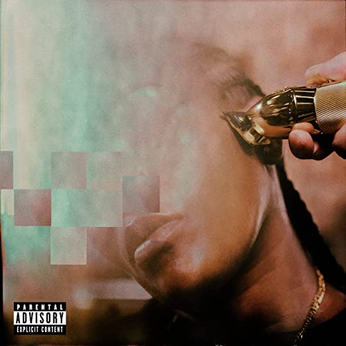

import { Slider, Button } from "carbon-components-react";
import { ArrowUpRight24 } from "@carbon/icons-react";

import SliderJS1 from "../review/slider1";
import SliderJS2 from "../review/slider2";
import SliderJS3 from "../review/slider3";
import SliderJS4 from "../review/slider4";
import AdvJS2 from "../review/adv2";
import AdvJS3 from "../review/adv3";

import { Link } from "gatsby";

Album review

<h1 className="h1--no--margin">{props.pageContext.frontmatter.title}</h1>

<Row  className="image-card-group">
	<Column colMd={"3"} colLg={"4"} noGutterMdLeft="">
       <ImageCard>

</ImageCard>
	</Column>
	<Column colMd={"4"} colLg={"8"} noGutterMdLeft="">
		

			BrooklynのRapper、Leikeli47の4作目。Virginia出身であることは判っているが、本名不詳、年齢不詳で、ライブでもバンダナなどで顔を隠しているという、謎多い人である。
			 当作は2017年から始まる"Beauty Series"3部作の3作目となっている。
			 サウンドは結構ユニークで、音数の少なくベースのきいた、パーカッシブでトライバルなTrackに唄うようなRap、あるいは、Rapのような唄の組み合わせがベースとなっている。
			 ⑫のような、しっとりとしたバラードや⑥⑦のようなメローな曲もアクセントになっている。多彩なところは判ったので、次の展開も期待したい。
		

		

		  <Button className="button-right-mergin"  href="https://amzn.to/3SIoAov" kind="primary" size="small" renderIcon={ArrowUpRight24}>
  	    amazon.com
  	  </Button>
  	  <Button className="button-right-mergin"  href="https://amzn.to/3bHaUK8" kind="secondary" size="small" renderIcon={ArrowUpRight24}>
  	    amazon.co.jp
  	  </Button>
			<Button className="button-right-mergin"  href="https://apple.co/3QrvcWC" kind="tertiary" size="small" renderIcon={ArrowUpRight24}>
  	   	apple music
  	  </Button>
			<AdvJS2/>
		

	</Column>
</Row>
<Row >
	<Column colMd={"4"} colLg={"4"} noGutterMdLeft="">
		

		  <h3>Score card</h3>
			<SliderJS1 value="3" />
		  <SliderJS2 value="2" />
			<SliderJS3 value="2" />
		  <SliderJS4 value="8" />
		

	</Column>
	<Column colMd={"8"} colLg={"8"} noGutterMdLeft="">
		

			<h3>Producers</h3>
			

				Michael Barney(1,6,8,9,11,13)
				 Jabber Stevens(2,3,5)
				 Michael Barney and Jabber Stevens(4)
				 Dave Hamelin(7)
				 Michael Barney and Osinachi Nwaneri(10)
				 Gavin Williams(12)
				 Clyde Elison, HaHarry Mejias(14)
			

			<h3>Guests</h3>
			

				Miss J Alexander
			

		

	</Column>
</Row>

<h3>Tracks</h3>

| No. | Title           | Composers                                                                                                                        | Performer                        | Time  |
| --- | --------------- | -------------------------------------------------------------------------------------------------------------------------------- | -------------------------------- | ----- |
| 1   | Chitty Bang     | Harold Lilly, Hasben Jones, Michael Barney                                                                                       | Leikeli47                        | 02:26 |
| 2   | Secret Service  | Harold Lilly, Hasben Jones, Jabber Stevens                                                                                       | Leikeli47                        | 03:16 |
| 3   | New Money       | Aaron Renner Lilly, Hasben Jones, Jabber Stevens                                                                                 | Leikeli47                        | 03:08 |
| 4   | LL Cool J       | Harold Lilly, Hasben Jones, Jabber Stevens, Michael Barney                                                                       | Leikeli47                        | 03:33 |
| 5   | Zoom            | Harold Lilly, Hasben Jones, Jabber Stevens, Osinachi Nwaneri                                                                     | Leikeli47                        | 02:50 |
| 6   | Done Right      | Clyde Elison, Dave Hamelin, Harold Lilly, Harry Mejias, Hasben Jones, Michael Barney                                             | Leikeli47                        | 03:24 |
| 7   | Free to Love    | Dave Hamelin, Harold Lilly, Hasben Jones, Mike Meme, Paul Alade, Ukachukwu Anokauru                                              | Leikeli47                        | 02:44 |
| 8   | BITM            | George kranz, Hasben Jones, Michael Barney                                                                                       | Leikeli47                        | 03:09 |
| 9   | Baseball        | Clyde Elison, Don Cannon, Harold Lilly, Harry Mejias, Hasben Jones, Herscholt Polk, Homer Talbert, LaMar Edwards, Michael Barney | Leikeli47                        | 03:35 |
| 10  | Carry Anne      | Hasben Jones, Michael Barney, Osinachi Nwaneri                                                                                   | Leikeli47                        | 03:33 |
| 11  | Jay Walk        | Harold Lilly, Michael Barney                                                                                                     | Leikeli47 feat. Miss J Alexander | 02:37 |
| 12  | Hold My Hand    | Gavin Williams, Harold Lilly, Hasben Jones                                                                                       | Leikeli47                        | 04:33 |
| 13  | Get the Riches  | Harold Lilly, Hasben Jones, Michael Barney                                                                                       | Leikeli47                        | 02:47 |
| 14  | Instant Classic | Clyde Elison, Harold Lilly, Harry Mejias, Hasben Jones                                                                           | Leikeli47                        | 02:37 |

<AdvJS3 />
