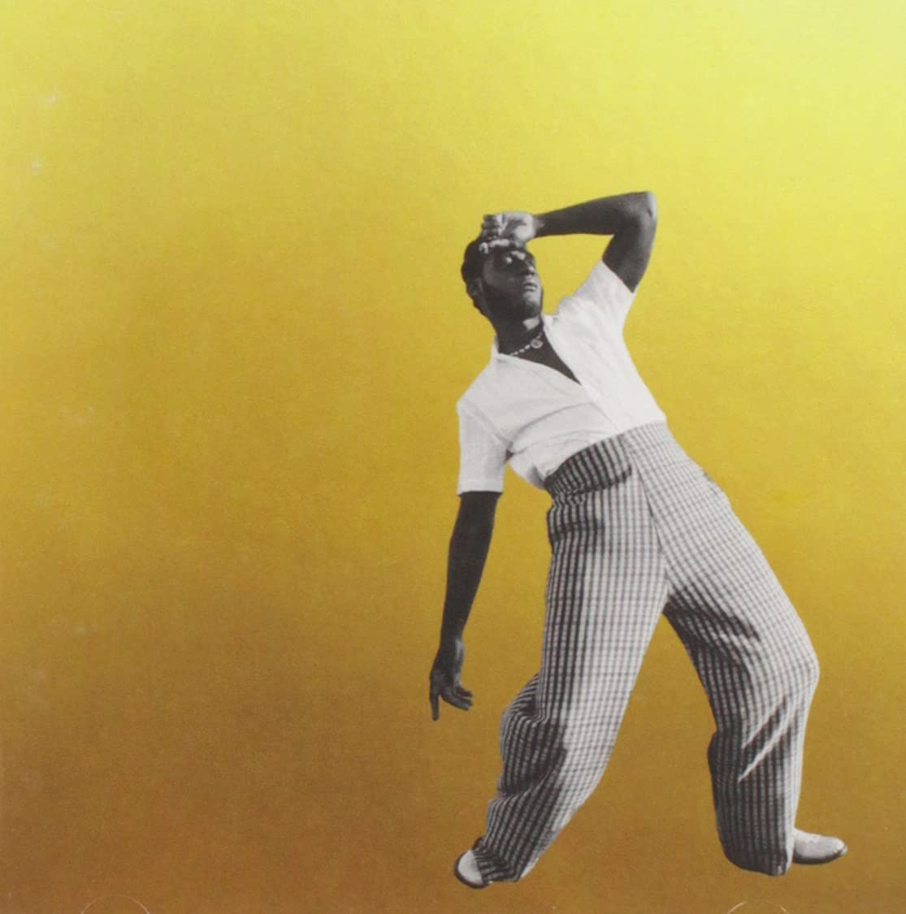

import { Slider, Button } from "carbon-components-react";
import { ArrowUpRight24 } from "@carbon/icons-react";

import SliderJS1 from "../review/slider1";
import SliderJS2 from "../review/slider2";
import SliderJS3 from "../review/slider3";
import SliderJS4 from "../review/slider4";
import AdvJS2 from "../review/adv2";
import AdvJS3 from "../review/adv3";

import { Link } from "gatsby";

import Review1 from "../review/leonbridges2.mdx";

Album review

<h1 className="h1--no--margin">{props.pageContext.frontmatter.title}</h1>

<Row  className="image-card-group">
	<Column colMd={"3"} colLg={"4"} noGutterMdLeft="">
       <ImageCard>

</ImageCard>
	</Column>
	<Column colMd={"4"} colLg={"8"} noGutterMdLeft="">
		

			Leon Bridgesの3年ぶり3作目。前作ではGrammyを獲得したが、今回もノミネートされている。タイトルのあるGold-DiggersとはLAにあるLeonお気に入りのHotel兼Studioの名称で、ここに住んでRecordingまで行ったとのこと。
			 25歳でのデビュー当時、年の割には渋いと話題になったが、30歳台になった今でも、まだまだ年に比べて渋く、引き続きのレトロ・ソウルが堪能できる。その前作同様、Ricky ReadとNate Mercereauが全曲Produceしているが、Jazzっぽい曲が増えたり、Guest参加を迎えたり、また⑤みたいなSadeっぽい曲や中国風？な旋律が聞かれる⑫もあったりして、ちょっとした変化をつけている。また、Vocalを少し抑え気味にしているのも前作との違いと思われる。
		

		

		  <Button className="button-right-mergin"  href="https://amzn.to/3EpG2G7" kind="primary" size="small" renderIcon={ArrowUpRight24}>
  	    amazon.com
  	  </Button>
  	  <Button className="button-right-mergin"  href="https://amzn.to/3H5MJ1G" kind="secondary" size="small" renderIcon={ArrowUpRight24}>
  	    amazon.co.jp
  	  </Button>
			<Button className="button-right-mergin"  href="https://apple.co/3qo8IKF" kind="tertiary" size="small" renderIcon={ArrowUpRight24}>
  	   	apple music
  	  </Button>
			<AdvJS2/>
		

	</Column>
</Row>
<Row >
	<Column colMd={"4"} colLg={"4"} noGutterMdLeft="">
		

		  <h3>Score card</h3>
			<SliderJS1 value="5" />
		  <SliderJS2 value="5" />
			<SliderJS3 value="1" />
		  <SliderJS4 value="8" />
		

	</Column>
	<Column colMd={"8"} colLg={"8"} noGutterMdLeft="">
		

			<h3>Producers</h3>
			

				Ricky Read, Nate Mercereau and Robert Glasper(1)
				 Ricky Read and Nate Mercereau(2,3,5,6,8,9,10)
				 Ricky Read, Nate Mercereau and 9AM(5)
				 Ricky Read, Nate Mercereau and King Garbage(7)
				 Ricky Read, Nate Mercereau and DJ Stanfill(11)
			

			<h3>Guests</h3>
			

				Robert Glasper, Terrace Martin, INK
			

		

	</Column>
</Row>

<h3>Tracks</h3>

| No. | Title                           | Composers                                                                                                                                  | Performer                         | Time  |
| --- | ------------------------------- | ------------------------------------------------------------------------------------------------------------------------------------------ | --------------------------------- | ----- |
| 1   | Born Again                      | Todd Bridges / Eric Federick / Robert Glasper / Daniel Stanfill                                                                            | Leon Bridges feat. Robert Glasper | 03:43 |
| 2   | Motorbike                       | Todd Bridges / Eric Federick / Nate Mercereau / Paris Strother / Dan Wilson                                                                | Leon Bridges                      | 03:08 |
| 3   | Steam                           | Jordan Blackmon / Atia Boggs / Todd Bridges / Eric Federick / Antoine Katz / Trevor Lawrence / Nate Mercereau / Justin Tranter             | Leon Bridges                      | 03:23 |
| 4   | Why Don't You Touch Me          | Jeff Baranowski / Todd Bridges / Eric Federick / Kim Krysiuk / Luke Milano                                                                 | Leon Bridges                      | 03:17 |
| 5   | Magnolias                       | Atia Boggs / Todd Bridges / Rome Castille / Steven Cheung / Eric Federick / Nate Mercereau / Michael Neil / Steve Wyreman                  | Leon Bridges                      | 03:22 |
| 6   | Gold-Diggers (Junior's Fanfare) | Lemar Guillary                                                                                                                             | Leon Bridges                      | 00:41 |
| 7   | Details                         | Todd Bridges / Eric Federick / Nate Mercereau / Amber Strother                                                                             | Leon Bridges                      | 03:16 |
| 8   | Sho Nuff                        | Atia Boggs / Todd Bridges / Rome Castille / Eric Federick / Ian Fitchuk / Austin Jenkins / Nate Mercereau / Daniel Tashian / Steve Wyreman | Leon Bridges                      | 03:07 |
| 9   | Sweeter                         | Todd Bridges / Rome Castille / Zach Cooper / Vic Dimotsis / Eric Federick / Terrace Martin / Nate Mercereau / Dan Wilson                   | Leon Bridges feat. Terrace Martin | 02:48 |
| 10  | Don't Worry                     | Atia Boggs / Todd Bridges / Joshua Crumbly / Eric Federick / Nate Mercereau / Amber Strother / Steve Wyreman                               | Leon Bridges                      | 06:41 |
| 11  | Blue Mesas                      | Todd Bridges / Eric Federick / Harold Lilly / Olivia Salas / Daniel Stanfill                                                               | Leon Bridges feat. INK            | 03:15 |

<h3>Other Reviews</h3>

<Row>
  <Column colMd={3} colLg={3} noGutterMdLeft>
    <Review1 />
  </Column>
</Row>

<AdvJS3 />