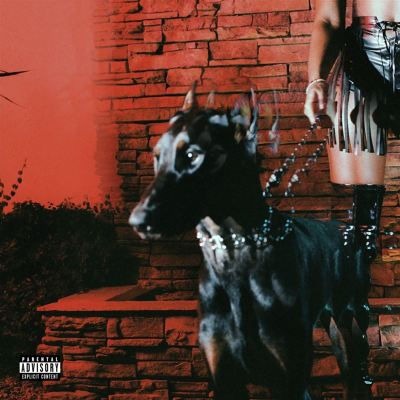

import { Slider, Button } from "@carbon/react";
import { ArrowUpRight } from "@carbon/icons-react";

import SliderJS1 from "../review/slider1";
import SliderJS2 from "../review/slider2";
import SliderJS3 from "../review/slider3";
import SliderJS4 from "../review/slider4";
import AdvJS2 from "../review/adv2";
import AdvJS3 from "../review/adv3";

import { Link } from "gatsby";

Album review

<h1 className="h1--no--margin">{props.pageContext.frontmatter.title}</h1>

	<Link to="/best50/2024/">2024 Black Music Best No.14</Link>

<Row className="image-card-group">
	<Column colMd={3} colLg={4} noGutterMdLeft="">
		<ImageCard>

		</ImageCard>
	</Column>
	<Column colMd={4} colLg={8} noGutterMdLeft="">
		

			R&B SingerでProduceやSong Writingでも著名なLeon Thomasの2ndアルバム。ゲストとしても参加しているTy Dolla $ignのレーベルENMNYの第1号アーティストでもある。
			 もともと俳優として子役時代から映画/TV/Broadwayで活躍してた人で、そのつながりでAriana Grande作品の制作に携わり、その後、Drake, Ella Mai, Chris Brown, Kehlani, Rick Ross, SZAなど錚々たるアーティストの作品にProduce, Song Writingで参加し、グラミーも受賞してと輝かしい実績とともに、2023年にSingerとしてアルバムデビューを果たしている。
			 ベースにあるのは、70年代から受け継がれるオールド・ソウルで、ゆったりとした曲が多い。そんなサウンドそのままの曲が半分くらい。あとは、Rapのように唄ったり、Trapであったり、声にエフェクトを効かせたりと変化をつけている。アルバムリリース時に30歳であったLeonの唄は正統的で、やや抑え気味。声のトーンは少し高めではあるが、年相応な印象を受ける。
			 ちなみに、アルバムタイトルの"MUTT"はバイクメイカーで、1曲目冒頭のバイクの排気音がそれなのではないかと思われます。
		

		

			<Button className="button-right-mergin" href="https://amzn.to/436GVmY" renderIcon={ArrowUpRight} size='sm' kind='primary'>
				amazon.com
			</Button>
			<Button className="button-right-mergin" href="https://amzn.to/433Qao3" renderIcon={ArrowUpRight} size='sm' kind='secondary'>
				amazon.co.jp
			</Button>
			<Button className="button-right-mergin" href="https://apple.co/3QvnDjO" renderIcon={ArrowUpRight} size='sm' kind='tertiary'>
				apple music
			</Button>
			<AdvJS2/>
		

	</Column>
</Row>
<Row>
	<Column colMd={4} colLg={4} noGutterMdLeft="">
		

			<h3>Score card</h3>
			<SliderJS1 value="4" />
			<SliderJS2 value="2" />
			<SliderJS3 value="1" />
			<SliderJS4 value="8" />
		

	</Column>
	<Column colMd={8} colLg={8} noGutterMdLeft="">
		

			<h3>Producers</h3>
			

				Leon Thomas, Bizzy Crook and Peter Lee Johnson(1)
				 FaxOnly(2)
				 Leon Thomas, Ali P and Yuli(3)
				 J.LBS, Cam Griff and Omar Grand(4)
				 Leon Thomas, D. Phelps and Freaky Rob(5)
				 Conductor Williams, Leon Thomas, Frollen Music Library and Nile Hargrove(6)
				 Leon Thomas, Peter Lee Johnson and Freaky Rob(7)
				 Mike Hector, Ali P, Lil Rod, JEHREEUS and Peter Lee Johnson(8)
				 Leon Thomas & Oshi(9)
				 Leon Thomas and Axl Folie(10)
				 D. Phelps and Freaky Rob(11,12,14)
				 D. Phelps, Mamii, Stanley Randolph and Freaky Rob(13)
			

			<h3>Guests</h3>
			

				Masego, Wale, Ty Dolla $ign, Axl Folie, Baby Rose, Freddie Gibbs
			

		

	</Column>
</Row>

<h3>Tracks</h3>

| No. | Title               | Composers                                                                                                              | Performer                       | Time  |
| --- | ------------------- | ---------------------------------------------------------------------------------------------------------------------- | ------------------------------- | ----- |
| 1   | HOW FAST            | Lazaro Camejo / Robert E. Fairfax III / Peter Lee Johnson / Leon Thomas                                               | Leon Thomas                     | 02:55 |
| 2   | SAFE PLACE          | Brandon Avant / Lazaro Camejo / Donny Hathaway / Robert E. Fairfax III / Leon Thomas                                   | Leon Thomas                     | 02:39 |
| 3   | DANCING WITH DEMONS | Ali Prawl / Leon Thomas / Yuli                                                                                         | Leon Thomas                     | 04:02 |
| 4   | VIBES DON'T LIE     | Lazaro Camejo / Omar Grand / Cam Griffin / Jason Pounds / Leon Thomas                                                  | Leon Thomas                     | 03:22 |
| 5   | LUCID DREAMS        | Masego / David Phelps / Freaky Rob / Leon Thomas                                                                       | Leon Thomas feat: Masego        | 03:46 |
| 6   | FEELINGS ON SILENT  | Lazaro Camejo / Nile Hargrove / Henry Jenkins / Leon Thomas / David Thor / Wale / Hudson Whitlock / Conductor Williams | Leon Thomas feat: Wale          | 03:29 |
| 7   | ANSWER YOUR PHONE   | Peter Lee Johnson / Freaky Rob / Leon Thomas / Diane Warren                                                            | Leon Thomas                     | 04:02 |
| 8   | YES IT IS           | Jehreeus Banks / Lazaro Camejo / Mike Hector / Peter Lee Johnson / Rodney Jones, Jr. / Ali Prawl / Leon Thomas         | Leon Thomas                     | 03:48 |
| 9   | FAR FETCHED         | Ty Dolla $ign / Joshua Brennan / Lazaro Camejo / Deavon Petty Chisolm / Leon Thomas                                    | Leon Thomas feat: Ty Dolla $ign | 04:08 |
| 10  | SOONER OR LATER     | Axl Folie / Leon Thomas                                                                                                | Leon Thomas feat: Axl Folie     | 01:49 |
| 11  | MUTT                | Lazaro Camejo / Rob Gueringer / David Phelps / Leon Thomas                                                             | Leon Thomas                     | 03:13 |
| 12  | I DO                | Lazaro Camejo / David Phelps / Freaky Rob / Leon Thomas                                                                | Leon Thomas                     | 02:41 |
| 13  | I USED TO           | Lazaro Camejo / Mamii / David Phelps / Stanley Randolph / Freaky Rob / Baby Rose / Leon Thomas                         | Leon Thomas feat: Baby Rose     | 03:28 |
| 14  | MUTT [REMIX]        | Lazaro Camejo / Freddie Gibbs / David Phelps / Freaky Rob / Leon Thomas                                                | Leon Thomas feat: Freddie Gibbs | 04:17 |

<AdvJS3 />
