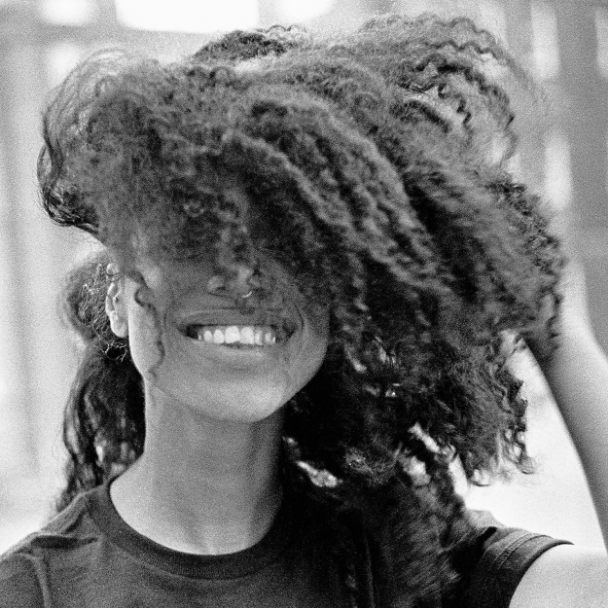

import { Slider, Button } from 'carbon-components-react';
import { ArrowUpRight24  } from '@carbon/icons-react';

import SliderJS1 from "../review/slider1"
import SliderJS2 from "../review/slider2"
import SliderJS3 from "../review/slider3"
import SliderJS4 from "../review/slider4"

import { Link } from "gatsby"

Album Review

<h1 className="h1--no--margin">{props.pageContext.frontmatter.title}</h1>

<Link to="/best50/2020/">2020 Black Music Best No.15</Link>

<Row className="image-card-group">
	<Column colMd={"3"} colLg={"4"} noGutterMdLeft="">
    <ImageCard>

 

</ImageCard>
	</Column>
	<Column colMd={"4"} colLg={"8"} noGutterMdLeft="">
	

	  London出身のSinger, Lianne La Havasの3rdアルバム。他にもSong Writing, Produce, Guiter演奏まで担っている。
     ギリシャ系とジャマイカ系の両親を持つということで、もろにUKソウルな曲に加えて、カリブやブラジルっぽい曲も含まれる。Trackは流麗で耳にやさしいメディアム～スローが中心で、バックのバンド演奏がなかなか良い。抑え気味でシルキーなLianneのVocalとの相性抜群である。
     Radioheadのカバーの⑥なんかも、カッコ良いベースと浮遊感が相俟って面白い。
     なお、Lyricのほうでは恋愛や彼女の考え方みたいなものを表現しているようだ。
  

  

	  <Button href="https://amzn.to/3bM36Ed" kind="primary" size="small" renderIcon={ArrowUpRight24}>
      amazon.com
    </Button>
    <Button href="https://amzn.to/3nNrkQR" kind="secondary" size="small" renderIcon={ArrowUpRight24}>
      amazon.co.jp
    </Button>
    <Button href="https://apple.co/38OWcfK" kind="tertiary" size="small" renderIcon={ArrowUpRight24}>
      apple music
    </Button>
	

	</Column>
</Row>
<Row >
  <Column colMd={"4"} colLg={"4"} noGutterMdLeft="">
    

      <h3>Score card</h3>
	    <SliderJS1 value="5" />
      <SliderJS2 value="2" />
	    <SliderJS3 value="1" />
      <SliderJS4 value="9" />
    

  </Column>
  <Column colMd={"4"} colLg={"8"} noGutterMdLeft="">
    

      <h3>Producers</h3>
      

        Lianne La Havas, Matt Hales and Beni Giles(1,2,8)
         Lianne La Havas and Sam Crowe(3)
         Lianne La Havas, Matt Hales, Beni Giles and Mura Masa(4)
         Lianne La Havas, Homer Steinweiss and Joe Harryson(5)
         Lianne La Havas and Beni GIles(6)
         Lianne La Havas and Nick Hakim(7)
         Lianne La Havas and Joe Harrison(9)
         Lianne La Havas and Chris Tabron(10)
      

      <h3>Guests</h3>
      

      

    

  </Column>
</Row>

<h3>Tracks</h3>

| No. |	 Title                    |	 Composers                                                                             |	 Performer     | Time	 |
| --- |	------------------------- | -------------------------------------------------------------------------------------- | --------------- | ----- |
|	1	  |	Bittersweet [Full Length]	| Matt Hales / Lianne La Havas                                                           | Lianne La Havas | 04:53 |
|	2	  |	Read My Mind             	| Matt Hales / Lianne La Havas / Bruno Major                                             | Lianne La Havas | 04:48 |
|	3	  |	Green Papaya             	| Sam Crowe / Matt Hales / Lianne La Havas                                               | Lianne La Havas | 04:05 |
|	4	  |	Can't Fight              	| Alex Crossan / Matt Hales / Lianne La Havas                                            | Lianne La Havas | 03:10 |
|	5	  |	Paper Thin               	| Matt Hales / Lianne La Havas                                                           | Lianne La Havas | 06:03 |
|	6	  |	Weird Fishes             	| Colin Greenwood / Jonny Greenwood / Edward O'Brien / Phil Selway / Thomas Edward Yorke | Lianne La Havas | 05:54 |
|	7	  |	Please Don't Make Me Cry 	| Nick Hakim / Matt Hales / Lianne La Havas                                              | Lianne La Havas | 05:14 |
|	8	  |	Seven Times              	| Matt Hales / Lianne La Havas                                                           | Lianne La Havas | 03:30 |
|	9	  |	Courage                  	| Matt Hales / Joe Harrison / Lianne La Havas                                            | Lianne La Havas | 03:38 |
|	10	|	Sour Flower              	| Sam Crowe / Matt Hales / Lianne La Havas                                               | Lianne La Havas | 06:48 |
