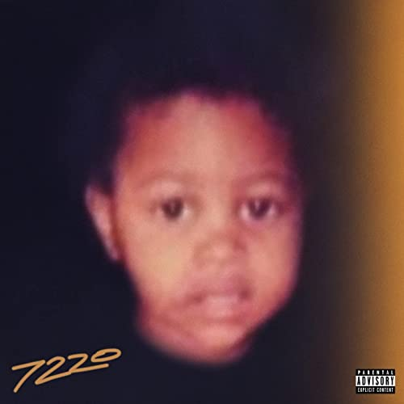

import { Slider, Button } from "carbon-components-react";
import { ArrowUpRight24 } from "@carbon/icons-react";

import SliderJS1 from "../review/slider1";
import SliderJS2 from "../review/slider2";
import SliderJS3 from "../review/slider3";
import SliderJS4 from "../review/slider4";
import AdvJS2 from "../review/adv2";
import AdvJS3 from "../review/adv3";

import { Link } from "gatsby";

Album Review

<h1 className="h1--no--margin">{props.pageContext.frontmatter.title}</h1>

<Row className="image-card-group">
	<Column colMd={"3"} colLg={"4"} noGutterMdLeft="">
    <ImageCard>

</ImageCard>
	</Column>
	<Column colMd={"4"} colLg={"8"} noGutterMdLeft="">
	

	  Chicago近郊出身のRapper, Lil Durkの7作目。2010年代初期から活動を始め、2015年にデビュー作をリリースしており、その後は年に1作以上と珍しく多作な人である。
     そんな活動を通して、Chicago Drillのムーブメントの中心人物のひとりとしての十分な名声も得ている。ただ、当アルバムではその危うさ、不穏さみたいなものは、そこまで押し出されてなくて、哀愁感あふれるTrackのうえで、メランコリックでメロディアスはRapを披露している。
     合わせて活舌の良いフローも特徴的だと思う。タイトルは祖母の住所からとっているようで、Lyricでは自身の半生について語っている。
  

  

	  <Button className="button-right-mergin" href="https://amzn.to/3bt2yoA" kind="primary" size="small" renderIcon={ArrowUpRight24}>
      amazon.com
    </Button>
    <Button className="button-right-mergin" href="https://amzn.to/3yjMEGs" kind="secondary" size="small" renderIcon={ArrowUpRight24}>
      amazon.co.jp
    </Button>
    <Button className="button-right-mergin" href="https://apple.co/3tZ6Cn9" kind="tertiary" size="small" renderIcon={ArrowUpRight24}>
      apple music
    </Button>
    <AdvJS2/>
	

	</Column>
</Row>
<Row >
  <Column colMd={"4"} colLg={"4"} noGutterMdLeft="">
    

      <h3>Score card</h3>
	    <SliderJS1 value="5" />
      <SliderJS2 value="4" />
	    <SliderJS3 value="2" />
      <SliderJS4 value="8" />
    

  </Column>
  <Column colMd={"4"} colLg={"8"} noGutterMdLeft="">
    

      <h3>Producers</h3>
      

        Touch of Trent andHaze(1)
         Touch of Trent and David Morse(2)
         Southside, TM88, NFE Paris, Too Dope and Nuki(3)
         DJ Bandz, DJ FMCT and JahDaGod(4)
         Cubeatz, Hitmaka, YC and Real Red(5)
         Touch of Trent and Hoops(6)
         DJ Young Pharaoh, Irocconthebeat and Zypitano(7)
         Dmac, John Lam and Pluto Brazy(8)
         Chopsquad DJ(9)
         David Morse, Chase Davis, Will-A-Fool, Oz on the Track, Faatkid Goin, Crazy and K1ngm3(10)
         DJ Bandz, DJ FMCT, Uncle Cameron and Stg2x(11)
         DJ Bandz, DJ FMCT and JahDaGod(12)
         Touch of Trent and AyeTM(13)
         Touch of Trent, Tahj Money, Ayo Bleu, DJ Mxngo(14)
         Ayo Bleu, Turn Me Up Josh and Coco(15)
         MatthewFM(16)
         Charlie Handsom and, Joe Reeves(17)
      

      <h3>Guests</h3>
      

        Future, Gunna, Summer Walker, Morgan Wallen
      

    

  </Column>
</Row>

<h3>Tracks</h3>

| No. | Title                      | Composers                                                                                                               | Performer                    | Time  |
| --- | -------------------------- | ----------------------------------------------------------------------------------------------------------------------- | ---------------------------- | ----- |
| 1   | Started From               | Durk Banks, Trenton Turner, Ethan Hayes                                                                                 | Lil Durk                     | 02:01 |
| 2   | Headtaps                   | Durk Banks, Trenton Turner, David Morse                                                                                 | Lil Durk                     | 02:53 |
| 3   | Ahhh Ha                    | Durk Banks, Joshua Luellen, Bryan Simmons, Brian Roke, Lesidney Ragland, Konstantinos Latos                             | Lil Durk                     | 03:06 |
| 4   | Shootout @ My Crib         | Durk Banks, Devonte Richmond, Maliki Decampos, Jarvis Adams, Jr.                                                        | Lil Durk                     | 02:33 |
| 5   | Golden Child               | Durk Banks, Tim Gomringer, Kevin Gomringer, Christian Ward, Christopher Pearson, Jorres Nelson                          | Lil Durk                     | 01:54 |
| 6   | No Interviews              | Durk Banks, Trenton Turner, Henri Velasco                                                                               | Lil Durk                     | 02:59 |
| 7   | Petty Too                  | Durk Banks, Nayvadius Wilburn, Roderick Hughey, Broderick Hughey, Adarsh Mani                                           | Lil Durk feat. Future        | 02:39 |
| 8   | Barbarian                  | Durk Banks, David McDowell, John Lam, Roland Hannah                                                                     | Lil Durk                     | 02:29 |
| 9   | What Happened to Virgil    | Durk Banks, Sergio Kitchens, Darrel Jackson                                                                             | Lil Durk feat. Gunna         | 03:01 |
| 10  | Grow Up/Keep It on Speaker | Durk Banks, David Morse, Julian Davis, William Byrd, Daniel Ivy, Dominic Brooks, Ridge Williams                         | Lil Durk                     | 03:16 |
| 11  | Smoking & Thinking         | Durk Banks, Devonte Richmond, Maliki Decampos, Cameron Hubler, Gabriel Kerr                                             | Lil Durk                     | 02:27 |
| 12  | Blocklist                  | Durk Banks, Devonte Richmond, Maliki Decampos, Jarvis Adams, Jr.,                                                       | Lil Durk                     | 02:06 |
| 13  | Difference Is              | Durk Banks, Summer Walker, Trenton Turner, Thomas Moore, Jocelyn Donald                                                 | Lil Durk feat. Summer Walker | 03:13 |
| 14  | Federal Nightmares         | Durk Banks, Trenton Turner, Tahj Vaughn, Braylen Rembert                                                                | Lil Durk                     | 02:31 |
| 15  | Love Dior Banks            | Durk Banks, Braylen Rembert, Joshua Samuel, Saad Ghallab                                                                | Lil Durk                     | 03:11 |
| 16  | Pissed Me Off              | Durk Banks, Matthew Manuel                                                                                              | Lil Durk                     | 02:03 |
| 17  | Broadway Girls             | Durk Banks, Morgan Wallen, Alexander Izquierdo, Ernest Keith Smith, Grady Block, Rocky Block, Ryan Vojtesak, Joe Reeves | Lil Durk feat. Morgan Wallen | 03:05 |

<AdvJS3 />
