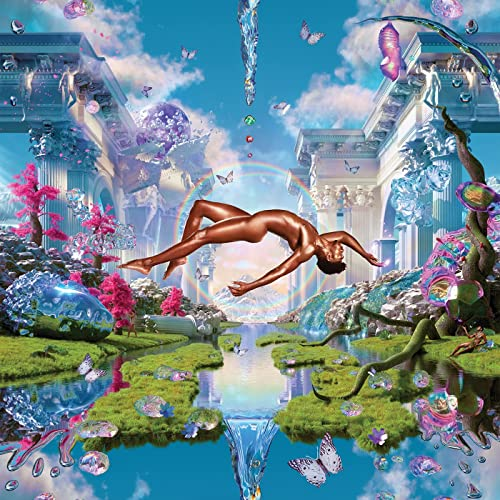

import { Slider, Button } from "carbon-components-react";
import { ArrowUpRight24 } from "@carbon/icons-react";

import SliderJS1 from "../review/slider1";
import SliderJS2 from "../review/slider2";
import SliderJS3 from "../review/slider3";
import SliderJS4 from "../review/slider4";
import AdvJS2 from "../review/adv2";
import AdvJS3 from "../review/adv3";

import { Link } from "gatsby";

Album review

<h1 className="h1--no--margin">{props.pageContext.frontmatter.title}</h1>

  <Link to="/best50/2021/">2021 Black Music Best No.3</Link>

<Row  className="image-card-group">
	<Column colMd={"3"} colLg={"4"} noGutterMdLeft="">
       <ImageCard>

</ImageCard>
	</Column>
	<Column colMd={"4"} colLg={"8"} noGutterMdLeft="">
		

			2018年リリースのCountry Rap曲"Old Town Road"をヒットさせたLil Nas Xのデビューアルバム。一発屋と見られていたが、そうではなく、当作も大ヒットし、Grammy主要部門にもノミネートされている。
			 2019年にジェンダーレスであることをカミングアウトし、物議を醸したが、Princeっぽいジャケットも含め、特にLyric面で、そちら方面の世界観を強く押し出した作品になっている。また、自身を曝け出すという意味か、アルバムタイトルの本名からとられている。Elton JohnやMiley CyrusをGuestに迎えたのもその一環であろう。
			 ただ、曲自体は流麗でメロディアスな、聴き易いものが多く、これだけで十分に魅力的。Trackは小賢しい捻りがなく、唄物のそれに近くて、好感が持てる。Lil Nas XのRapは唄うようなフローであったり、普通に唄ってたりとストレートなRapは無し。⑮のMiley Cyrusとのデュオなんかは、切なさが染みてくる。
		

		

		  <Button className="button-right-mergin"  href="https://amzn.to/3pD5tzU" kind="primary" size="small" renderIcon={ArrowUpRight24}>
  	    amazon.com
  	  </Button>
  	  <Button className="button-right-mergin"  href="https://amzn.to/3qzGlJK" kind="secondary" size="small" renderIcon={ArrowUpRight24}>
  	    amazon.co.jp
  	  </Button>
			<Button className="button-right-mergin"  href="https://apple.co/3JrQwbM" kind="tertiary" size="small" renderIcon={ArrowUpRight24}>
  	   	apple music
  	  </Button>
			<AdvJS2/>
		

	</Column>
</Row>
<Row >
	<Column colMd={"4"} colLg={"4"} noGutterMdLeft="">
		

		  <h3>Score card</h3>
			<SliderJS1 value="4" />
		  <SliderJS2 value="2" />
			<SliderJS3 value="1" />
		  <SliderJS4 value="9" />
		

	</Column>
	<Column colMd={"8"} colLg={"8"} noGutterMdLeft="">
		

			<h3>Producers</h3>
			

				Omer Fedi and Roy Lenzo and Take A Daytrip(1,11)
				 Jasper Harris, Take A Daytrip and Tom Levesque(3)
				 Kanye West and Take A Daytrip(3)
				 Omer Fedi, Blake Slatkin, Ryan Tedder and KBeaZy(4)
				 Roy Lenzo and Take A Daytrip(5,6)
				 Jasper Sheff and John Cunningham(7)
				 John Cunningham(8)
				 Take A Daytrip(9)
				 Omer Fedi and Take A Daytrip(10,15)
				 John Cunningham and Carter Lang(12)
				 Nick Mira, DT and Take A Daytrip(13)
				 Jasper Harris, John Cunningham and Carter Lang(14)
			

			<h3>Guests</h3>
			

				Jack Harlow, Doja Cat, Megan thee Stallion, Elton John,  Miley Cyrus
			

		

	</Column>
</Row>

<h3>Tracks</h3>

| No. | Title                          | Composers                                                                                                               | Performer                           | Time  |
| --- | ------------------------------ | ----------------------------------------------------------------------------------------------------------------------- | ----------------------------------- | ----- |
| 1   | Montero (Call Me By Your Name) | Denzel Baptiste, David Biral, Omer Fedi, Roy Lenzo, Montero Hill                                                        | Lil Nas X                           | 02:18 |
| 2   | Dead Right Now                 | Denzel Baptiste, David Biral, Jasper Harris, Thomas James Levesque, Montero Hill                                        | Lil Nas X                           | 03:41 |
| 3   | Industry Baby                  | Denzel Baptiste, David Biral, Jack Harlow, Nick Lee, Montero Hill, Kanye West                                           | Lil Nas X & Jack Harlow             | 03:32 |
| 4   | Thats What I Want              | Omer Fedi, Keegan Bach, Montero Hill, Blake Slatkin, Ryan Tedder                                                        | Lil Nas X                           | 02:23 |
| 5   | The Art of Realization         | Denzel Baptiste, David Biral, Roy Lenzo, Montero Hill                                                                   | Lil Nas X                           | 00:24 |
| 6   | Scoop                          | Amala Zandile Dlamini, Denzel Baptiste, David Biral, Roy Lenzo, Montero Hill                                            | Lil Nas X feat. Doja Cat            | 02:54 |
| 7   | One of Me                      | John Cunningham, Isley Juber, Montero Hill, Jasper Sheff                                                                | Lil Nas X feat. Elton John          | 02:42 |
| 8   | Lost in the Citadel            | John Cunningham, Montero Hill                                                                                           | Lil Nas X                           | 02:50 |
| 9   | Dolla Sign Slime               | Denzel Baptiste, David Biral, Nick Lee, Megan Pete, Montero Hill                                                        | Lil Nas X feat. Megan thee Stallion | 02:25 |
| 10  | Tales of Dominica              | Denzel Baptiste, David Biral, Omer Fedi, Roy Lenzo, Montero Hill                                                        | Lil Nas X                           | 02:26 |
| 11  | Sun Goes Down                  | Denzel Baptiste, David Biral, Omer Fedi, Keegan Bach, Roy Lenzo, Andrew Luce, Montero Hill, Michael Olmo, Blake Slatkin | Lil Nas X                           | 02:48 |
| 12  | Void                           | John Cunningham, Carter Lang, Montero Hill                                                                              | Lil Nas X                           | 04:08 |
| 13  | Don't Want It                  | Denzel Baptiste, David Biral, Nicholas Mira, Montero Hill, Dorien Theus                                                 | Lil Nas X                           | 02:12 |
| 14  | Life After Salem               | John Cunningham, Carter Lang, Montero Hill, Jasper Sheff                                                                | Lil Nas X                           | 03:31 |
| 15  | Am I Dreaming                  | Denzel Baptiste, David Biral, Miley Cyrus, Omer Fedi, Vincent Goodyer, Montero Hill, William K Ward                     | Lil Nas X feat. Miley Cyrus         | 03:03 |
