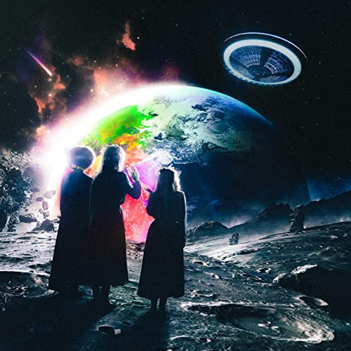

import { Slider, Button } from "carbon-components-react";
import { ArrowUpRight24 } from "@carbon/icons-react";

import SliderJS1 from "../review/slider1";
import SliderJS2 from "../review/slider2";
import SliderJS3 from "../review/slider3";
import SliderJS4 from "../review/slider4";

import Review1 from "../review/liluzivert1.mdx";

import { Link } from "gatsby";

Album review

<h1 className="h1--no--margin">{props.pageContext.frontmatter.title}</h1>

  <Link to="/best50/2020/">2020 Black Music Best No.10</Link>

<Row  className="image-card-group">
	<Column colMd={"3"} colLg={"4"} noGutterMdLeft="">
       <ImageCard>

</ImageCard>
	</Column>
	<Column colMd={"4"} colLg={"8"} noGutterMdLeft="">
	

	Lil Uzi Vertの2作目。前作同様、チャート1位を獲得している。Guest多数のMixtape集を含んだ2枚組Deluxe盤もあるが、レビュー対象はオリジナルのほうにした。とはいえ、18曲65分の大作でもある。
   メインProducerは同じ地元、フィリーのProducer集団、Working On Dyingより、Brandon Finessinに変わったが、哀愁感のあるTrackに唄うようなRapの組み合わせは前作同様。ただ、Trackもフローも力強さが増し、芯が太くなっていて、逆に不穏な雰囲気はやや薄れた気がする。
   良い意味で普通っぽくなったというか。Lyricのほうは金、女、自分自慢中心で、こちらは相変わらずだ。
	

    

	  <Button className="button-right-mergin"  href="https://amzn.to/2YSMZg5" kind="primary" size="small" renderIcon={ArrowUpRight24}>
      amazon.com
    </Button>
    <Button className="button-right-mergin"  href="https://amzn.to/37Oadbj" kind="secondary" size="small" renderIcon={ArrowUpRight24}>
      amazon.co.jp
    </Button>
	

	
	</Column>
</Row>
<Row >
	<Column colMd={"4"} colLg={"4"} noGutterMdLeft="">

  <h3>Score card</h3>
	<SliderJS1 value="1" />
  <SliderJS2 value="2" />
	<SliderJS3 value="2" />
  <SliderJS4 value="9" />

</Column>
<Column colMd={"8"} colLg={"8"} noGutterMdLeft="">

<h3>Producers</h3>

  Ike Beatz, Brandon Finessin, Bugz Ronin and Cousin Vinny(1)
   Brandon Finessin and Bugz Ronin(2)
   Supah Mario(3)
   Brandon Finessin and Oogie Mane(4)
   Brandon Finessin (5)
   Bugz Ronin(6)
   Brandon Finessin and Starbo(7)
   Brandon Finessin and Outtatown(8)
   Dez Wright Beats and Oogie Mane(9)
   Chief Keef(10)
   Bugz Ronin(11)
   Harold Harper (12)
   Bobby Raps and Wheezy(13)
   Brandon Finessin and Outtatown (14)
   Bugz Ronin(15)
   TM88(16)
   Brandon Finessin, LOESOE, Mayyzo and Starbo(17)
   Felipe Spain, Supah Mario and Yung Lan(18)

<h3>Guests</h3>

  Syd

</Column>
</Row>

<h3>Tracks</h3>

| No. | Title                             | Composers                                                                                                                                                            | Performer        | Time  |
| --- | --------------------------------- | -------------------------------------------------------------------------------------------------------------------------------------------------------------------- | ---------------- | ----- |
| 1   | Baby Pluto                        | Symere Woods, Brandon Veal, Daniel Perez, Vincent DeLon, Ivison Smith                                                                                                | Brandon Finessin | 03:30 |
| 2   | Lo Mein                           | Symere Woods, Brandon Veal, Daniel Perez                                                                                                                             | Brandon Finessin | 03:15 |
| 3   | Silly Watch                       | Symere Woods,, Jonathan Priester                                                                                                                                     | Supah Mario      | 03:16 |
| 4   | Pop                               | Symere Woods, Jordan Ortiz, Brandon Veal                                                                                                                             | Brandon Finessin | 03:47 |
| 5   | You Better Move                   | Symere Woods, Brandon Veal                                                                                                                                           | Brandon Finessin | 03:17 |
| 6   | Homecoming                        | Symere Woods, Daniel Perez                                                                                                                                           | Bugz Ronin       | 03:34 |
| 7   | I'm Sorry                         | Symere Woods, Brandon Veal, Anton Mendo                                                                                                                              | Brandon Finessin | 03:32 |
| 8   | Celebration Station               | Symere Woods, Brandon Veal, Tobias Dekker                                                                                                                            | Brandon Finessin | 03:15 |
| 9   | Bigger Than Life                  | Symere Woods, Jordan Ortiz, Dylan Cleary-Krell                                                                                                                       | Dez Wright       | 03:13 |
| 10  | Chrome Heart Tags                 | Symere Woods, Keith Cozart                                                                                                                                           | Chief Keef       | 03:33 |
| 11  | Bust Me                           | Symere Woods, Daniel Perez                                                                                                                                           | Bugz Ronin       | 03:14 |
| 12  | Prices                            | Symere Woods, Harold Harper, Jacques Webster, Rog?t Chahayed, Scott Mescudi, Kasseem Dean, Magnus H?iberg, Chauncey Hollis, Jr., Brittany Hazzard, Carlton Mays, Jr. | Harper           | 03:53 |
| 13  | Urgency (featuring Syd)           | Symere Woods, Sydney Bennett, Nick Eaholtz, Wesley Glass, Robert Richardson                                                                                          | Bobby Raps       | 03:01 |
| 14  | Venetia                           | Symere Woods, Brandon Veal, Tobias Dekker                                                                                                                            | Brandon Finessin | 03:09 |
| 15  | Secure the Bag                    | Symere Woods, Daniel Perez                                                                                                                                           | Bugz Ronin       | 03:58 |
| 16  | P2                                | Symere Woods, Bryan Simmons                                                                                                                                          | TM88             | 03:55 |
| 17  | Futsal Shuffle 2020 (bonus track) | Symere Woods, Anton Mendo, Brandon Veal, Cas van der Heijden, Mees van der Bruggen                                                                                   | Brandon Finessin | 03:19 |
| 18  | That Way (bonus track)            | Symere Woods, Jonathan Priester, Andres Espana, Milan Modi, Andreas Carlsson, Max Martin                                                                             | Felipe Spain     | 03:32 |

<h3>Other Reviews</h3>

<Row>
  <Column colMd={3} colLg={3} noGutterMdLeft>
    <Review1 />
  </Column>
</Row>
