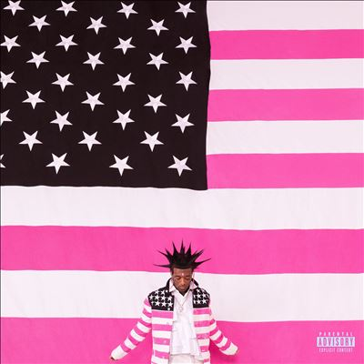

import { Slider, Button } from "@carbon/react";
import { ArrowUpRight } from "@carbon/icons-react";

import SliderJS1 from "./slider1";
import SliderJS2 from "./slider2";
import SliderJS3 from "./slider3";
import SliderJS4 from "./slider4";
import AdvJS2 from "../review/adv2";
import AdvJS3 from "../review/adv3";

import Review1 from "./liluzivert2.mdx";
import Review2 from "./liluzivert1.mdx";

import { Link } from "gatsby";

Album review

<h1 className="h1--no--margin">{props.pageContext.frontmatter.title}</h1>

  <Link to="/best50/2023/">2023 Black Music Best No.17</Link>

<Row  className="image-card-group">
	<Column colMd={3} colLg={4} noGutterMdLeft="">
       <ImageCard>

</ImageCard>
	</Column>
	<Column colMd={4} colLg={8} noGutterMdLeft="">
	  

	    Lil Uzi Vertの3年ぶり3作目。Vonus Track扱いの3曲を含む26曲87分弱の、前作を凌ぐ大作であり、そのうち18曲をBillboard Hot100に送り込んでいる。
       制作は前作同様、Brandon Finessinが中心となり、Bugz Roninあたりが存在感を示している。Trackはダークで音圧高め。今までの方向性は変わってないが、特に後半、ハード目のRpckっぽい曲が続いたり、エレクトロな曲やホラーな感じの曲もあったりと様々。
       世界的プロレスラー中邑真輔の以前の入場曲をサンプリングした、その名も"Nakamura"という曲や、Babymetalをフィーチャーした⑬(Babymetalを手がけるKOBAMETALが制作)があったり、㉖で原宿での出来事を唄っていたりと、日本のサブカル好きは変わらないようだ。
       哀愁感のあるTrackに唄うようなRapという組み合わせも引き続き。ちなみにアルバムジャケットはOutkastのStankomiaの黒いストライプをピンクに替えたものだ。
    

    

	    <Button className="button-right-mergin"  href="https://amzn.to/3Swad7L" renderIcon={ArrowUpRight} size='sm' kind='primary'>
        amazon.com
      </Button>
      <Button className="button-right-mergin"  href="https://amzn.to/42Cgp2r" renderIcon={ArrowUpRight} size='sm' kind='secondary'>
        amazon.co.jp
      </Button>
      <Button className="button-right-mergin"  href="https://apple.co/3SCiGGk" renderIcon={ArrowUpRight} size='sm' kind='tertiary'>
        apple music
      </Button>
      <AdvJS2/>
	  

	  </Column>
</Row>
<Row >
	<Column colMd={4} colLg={4} noGutterMdLeft="">
    

      <h3>Score card</h3>
    	<SliderJS1 value="2" />
      <SliderJS2 value="2" />
    	<SliderJS3 value="1" />
      <SliderJS4 value="9" />
    

  </Column>
  <Column colMd={8} colLg={8} noGutterMdLeft="">
    

      <h3>Producers</h3>
      

        arold Harper and Cannon(1)
         Brandon Finessin, leqn, yugen and Arca(2)
         BNYX and Brandon Finessin(3)
         WondaGurl, CuBeatz, Cannon and FORTHENIGHT(4)
         Bugz Ronin, 1wakeupp, Zkup and Jkari(5)
         Clifshayne and Ken Carson(6)
         Brandon Finessin, leqn and Sense(7)
         Brandon Finessin and Swvsh(8)
         Brandon Finessin, ZeeGoinXrazy and Sixthursdays(9)
         Brandon Finessin, Outtatown and star boy(10)
         Bugz Ronin and Ike Beatz(11)
         Bugz Ronin and Bobby Raps(12)
         Don Cannon, Pitt Tha Kid and Lyle Leduff(13)
         Brandon Finessin, Lyle Leduff and Ike Beatz(14)
         MCVertt and Synthetic(15)
         Cannon(16)
         Benjamin Thomas(17)
         Bring Me The Horizon, Evil Twinand, Zakk Cervini(18)
         Deckard3000 and Brandon Finessin(19)
         Bugz Ronin(20)
         Cannon and Tommy Parker(21)
         Brandon Finessin, Don Cannon, qqqu1ncy, Breezey Muzik and Bugz Ronin(22)
         KOBAMETAL(23)
         Wheezy and Charlie Handsome(24)
         Oogie Mane, Forza, Kado(25)
         Bugz Ronin, John Ross, ISOBeats and Ike Beatz(26)
      

      <h3>Guests</h3>
      

        Travis Scott, Nicki Minaj, Snow Stripers, Bring Me The Horizon, Don Toliver, Babymetal
      

    

  </Column>
</Row>

<h3>Tracks</h3>

| No. | Title              | Composers                                                                                               | Performer                               | Time  |
| --- | ------------------ | ------------------------------------------------------------------------------------------------------- | --------------------------------------- | ----- |
| 1   | Flooded the Face   | Lil Uzi Vert, Harper , Don Cannon ,Robert Remming                                                       | Lil Uzi Vert                            | 03:12 |
| 2   | Suicide Doors      | Lil Uzi Vert, Brandon Finessin, leqn, yugen ,Arca                                                       | Lil Uzi Vert                            | 04:19 |
| 3   | Aye                | Lil Uzi Vert, Travis Scott, BNYX, Brandon Finessin ,iamBNJMIIN                                          | Lil Uzi Vert feat. Travis Scott         | 03:27 |
| 4   | Crush Em           | Lil Uzi Vert, WondaGurl, Tim Gomringer, Kevin Gomringer, Don Cannon, duce.6x ,FORTHENIGHT               | Lil Uzi Vert                            | 02:45 |
| 5   | Amped              | Lil Uzi Vert, Bugz Ronin, 1wakeupp, Zkup, Jkari ,Landers                                                | Lil Uzi Vert                            | 02:53 |
| 6   | x2                 | Lil Uzi Vert, Clif Shayne ,Ken Carson                                                                   | Lil Uzi Vert                            | 03:54 |
| 7   | Died and Came Back | Lil Uzi Vert, Brandon Finessin, leqn ,Sense                                                             | Lil Uzi Vert                            | 03:00 |
| 8   | Spin Again         | Lil Uzi Vert, Brandon Finessin ,Swvsh                                                                   | Lil Uzi Vert                            | 01:37 |
| 9   | That Fiya          | Lil Uzi Vert, Brandon Finessin, ZeeGoinXrazy ,Sixthursdays                                              | Lil Uzi Vert                            | 02:34 |
| 10  | I Gotta            | Lil Uzi Vert, Brandon Finessin, Outtatown ,star boy                                                     | Lil Uzi Vert                            | 02:53 |
| 11  | Endless Fashion    | Lil Uzi Vert, Nicki Minaj, Bugz Ronin, Ike Beatz, Jeffrey Jey, Massimo Gabutti ,Maury                   | Lil Uzi Vert feat. Nicki Minaj          | 03:36 |
| 12  | Mama, I’m Sorry    | Bobby Raps, Bugz Ronin, Lil Uzi Vert, Luiz Bonf?, Young Chop, Chief Keef, Gotye, Wiz Khalifa ,50 Cent   | Lil Uzi Vert                            | 03:30 |
| 13  | All Alone          | Lil Uzi Vert, Don Cannon, Quincy Riley, Pitt Tha Kid ,Lyle Leduff                                       | Lil Uzi Vert                            | 03:42 |
| 14  | Nakamura           | Lil Uzi Vert, Brandon Finessin, Lyle Leduff, Ike Beatz, Gregg Wattenberg, John Alicastro ,Michael Lauri | Lil Uzi Vert                            | 03:17 |
| 15  | Just Wanna Rock    | Lil Uzi Vert, MCVertt, Synthetic                                                                        | Lil Uzi Vert                            | 02:04 |
| 16  | Fire Alarm         | Lil Uzi Vert, Graham T Perez, Tatiana J Schwaninger, Don Cannon, Gaspard Aug?, Xavier de Rosnay         | Lil Uzi Vert feat. Snow Stripers        | 03:05 |
| 17  | CS                 | Serj Tankian, Daron Malakian, Rick Rubin, Shavo Odadjian, John Dolmayan                                 | Lil Uzi Vert                            | 03:32 |
| 18  | Werewolf           | Lil Uzi Vert, Jordan Fish, Oli Sykes, Zakk Cervini, KrishnaMusic                                        | Lil Uzi Vert feat. Bring Me The Horizon | 03:59 |
| 19  | Pluto to Mars      | Lil Uzi Vert, Deckard3000, Brandon Finessin                                                             | Lil Uzi Vert                            | 04:06 |
| 20  | Patience           | Lil Uzi Vert, Don Toliver, Bugz Ronin, 206Derek, iamBNJMIIN, Matt Spatola                               | Lil Uzi Vert feat. Don Toliver          | 04:22 |
| 21  | Days Come and Go   | Lil Uzi Vert, Don Cannon, Tommy Parker                                                                  | Lil Uzi Vert                            | 04:17 |
| 22  | Rehab              | Lil Uzi Vert, Brandon Finessin, Don Cannon, qqqu1ncy, Foushe?, Breezey Muzik, Bugz Ronin                | Lil Uzi Vert                            | 04:05 |
| 23  | The End            | Lil Uzi Vert, Miki Watanabe, Daisuke Ehara                                                              | Lil Uzi Vert feat. Babymetal            | 03:07 |
| 24  | Zoom               | Lil Uzi Vert, Wheezy, Charlie Handsome                                                                  | Lil Uzi Vert                            | 02:46 |
| 25  | Of Course          | Lil Uzi Vert, Oogie Mane, Kado, Forza                                                                   | Lil Uzi Vert                            | 03:28 |
| 26  | Shardai            | Lil Uzi Vert, Bugz Ronin, John Ross, ISOBeats, Ike Beatz                                                | Lil Uzi Vert                            | 03:21 |

<h3>Other Reviews</h3>

<Row>
  <Column colMd={3} colLg={3} noGutterMdLeft>
    <Review1 />
  </Column>
  <Column colMd={3} colLg={3} noGutterMdLeft>
    <Review2 />
  </Column>
</Row>

<AdvJS3 />
