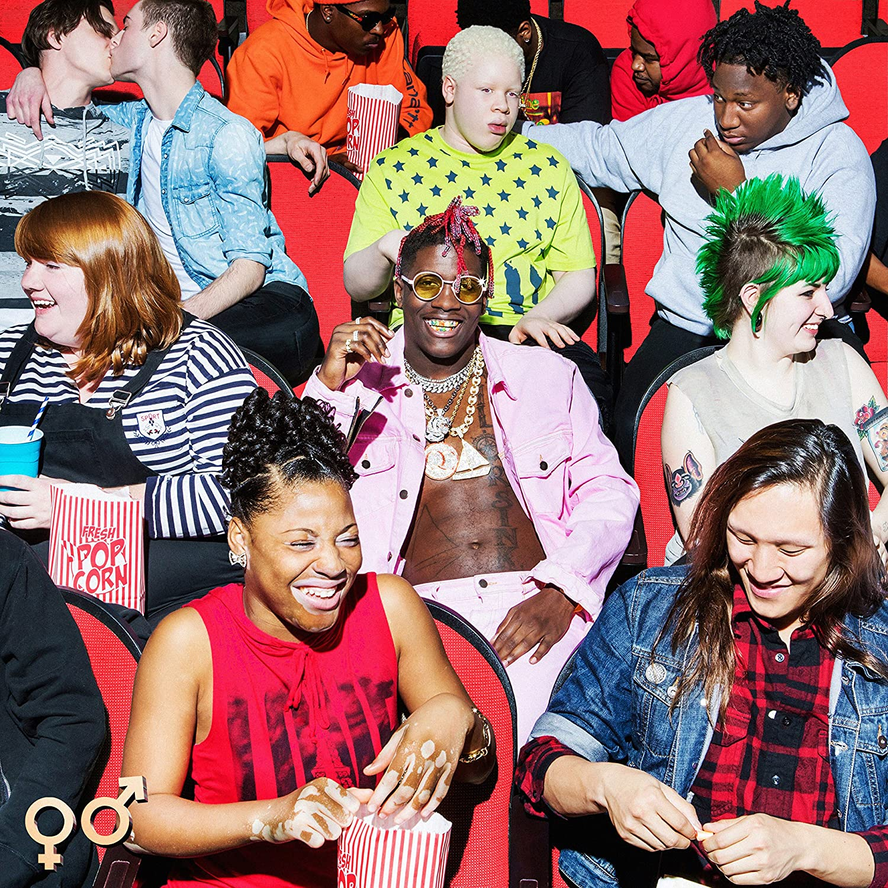

import { Slider, Button } from "@carbon/react";
import { ArrowUpRight } from "@carbon/icons-react";

import SliderJS1 from "../review/slider1";
import SliderJS2 from "../review/slider2";
import SliderJS3 from "../review/slider3";
import SliderJS4 from "../review/slider4";
import AdvJS2 from "../review/adv2";
import AdvJS3 from "../review/adv3";

import { Link } from "gatsby";

import Review1 from "../review/lilyachty2.mdx";

Album review

<h1 className="h1--no--margin">{props.pageContext.frontmatter.title}</h1>

<Row  className="image-card-group">
	<Column colMd={3} colLg={4} noGutterMdLeft="">
       <ImageCard>

</ImageCard>
	</Column>
	<Column colMd={4} colLg={8} noGutterMdLeft="">
	

	ATL出身で派手なヘアスタイルが特徴のRapper, Lil Yachtyの初商用アルバム。ここ1,2年で話題になっていた人だが、この作品で一気にブレークした。アルバムリリース時は19歳であったが、作品のクオリティはかなり高い。
	 Diversityたっぷりのアルバムジャケットは一部からの批判を受け、本人もHip-Hop Legendのあまり影響を受けてないそうで、大人に支配されない新しい世代のHip-Hop Artistの誕生と言える。
	 そんな賑やかなアルバムジャケットとは違って、サウンドはアンビエントでPopな印象で、技巧はさておき、ところどころでAuto Tuneを使ったメローで唄うようなRapは今どきっぽい。70分の長尺だが、ProducerやGuestも多様で飽きさせない。物静かな曲が多い中、⑨のRaggae曲が楽しめた。
	

	

	  <Button className="button-right-mergin"  href="https://amzn.to/2Es8iPa" renderIcon={ArrowUpRight} size='sm' kind='primary'>
      amazon.com
    </Button>
    <Button className="button-right-mergin"  href="https://amzn.to/3jOHVTC" renderIcon={ArrowUpRight} size='sm' kind='secondary'>
      amazon.co.jp
    </Button>
	

	
	<AdvJS2/>
	</Column>
</Row>
<Row >
	<Column colMd={4} colLg={4} noGutterMdLeft="">

  <h3>Score card</h3>
	<SliderJS1 value="2" />
  <SliderJS2 value="2" />
	<SliderJS3 value="2" />
  <SliderJS4 value="9" />

</Column>
<Column colMd={8} colLg={8} noGutterMdLeft="">

<h3>Producers</h3>

	D33J(1)
	 Digital Nas(2)
	 Ricky Racks(3)
	 30roc(4,14)
	 K Swisha(5,18)
	 Lex Luger(6)
	 BL$$D and Reefer Alston(7)
	 Earl(8)
	 The Stereotypes(9)
	 Diplo(10)
	 Wandagurl(11)
	 Mittus(12,19)
	 Pierre Bourne(13)
	 Free School(15)
	 The Good Perry(16)
	 ILoveUPeter(17)
	 Free School and Rio(20)
	 TrapMoneyBenny(21)

<h3>Guests</h3>

	Migos, YG, Kamaiyah, Stefflon Don, Diplo, Evander Griiim, Grace, Sonyae Elice

</Column>
</Row>

<h3>Tracks</h3>

| No. | Title                 | Composers                                                                                                                                 | Performer                       | Time  |
| --- | --------------------- | ----------------------------------------------------------------------------------------------------------------------------------------- | ------------------------------- | ----- |
| 1   | Like a Star           | D33J / Miles McCollum / Djavan Santos                                                                                                     | Lil Yachty                      | 03:44 |
| 2   | DN Freestyle          | Miles McCollum / Nasir Pemberton                                                                                                          | Lil Yachty                      | 02:10 |
| 3   | Peek a Boo            | Kirsnick Ball / Kiari Cephus / Ricky Harrell, Jr. / Quavious Marshall / Miles McCollum                                                    | Lil Yachty feat. Migos          | 04:06 |
| 4   | Dirty Mouth           | Samuel Gloade / Thomas Mann / Miles McCollum / Lamont Porter                                                                              | Lil Yachty                      | 02:47 |
| 5   | Harley                | Karl Hamnqvist / Miles McCollum                                                                                                           | Lil Yachty                      | 02:48 |
| 6   | All Around Me         | Keenon Jackson / Kamaiyah Johnson / Lexus Lewis / Miles McCollum                                                                          | Lil Yachty feat. YG, Kamaiyah   | 03:31 |
| 7   | Say My Name           | Miles McCollum / Eric Shamsid-Deen / Tariq Sharrieff                                                                                      | Lil Yachty                      | 03:07 |
| 8   | All You Had to Say    | Isaac Earl Bynum / Miles McCollum                                                                                                         | Lil Yachty                      | 03:39 |
| 9   | Better                | Stephanie Allen / Miles McCollum / Ray McCullough / Jeremey Reeves / Ray Romulus / Jonathan Yip                                           | Lil Yachty feta. Stefflon Don   | 04:02 |
| 10  | Forever Young         | Miles McCollum / Thomas Wesley Pentz / Dashiell Mark Tortoriello / Dexter Tortoriello                                                     | Lil Yachty feat. Diplo          | 02:57 |
| 11  | Lady in Yellow        | Miles McCollum / Ebony "Wondagurl" Oshunrinde                                                                                             | Lil Yachty                      | 03:38 |
| 12  | Moments in Time       | Christian Boggs / Miles McCollum                                                                                                          | Lil Yachty                      | 02:57 |
| 13  | Otha Shit (Interlude) | Jordan Jenks / Miles Parks                                                                                                                | Lil Yachty                      | 00:50 |
| 14  | X Men                 | Evander Chantz / Samuel Gloade / Thomas Mann / Miles McCollum / Lamont Porter                                                             | Lil Yachty feat. Evander Griiim | 02:44 |
| 15  | Bring It Back         | Ryan Buendia / Darnell Donohue / Jean-Baptiste Kouame / Miles McCollum / Michael McHenry / Alain Whyte                                    | Lil Yachty                      | 04:52 |
| 16  | Running with a Ghost  | Miles McCollum / Perry Moise / Grace Sewell                                                                                               | Lil Yachty feat. Grace          | 03:51 |
| 17  | FYI (Know Now)        | Peter Jennings / Miles McCollum                                                                                                           | Lil Yachty                      | 02:45 |
| 18  | Priorities            | Karl Hamnqvist / Miles McCollum                                                                                                           | Lil Yachty                      | 03:31 |
| 19  | No More               | Christian Boggs / Miles McCollum                                                                                                          | Lil Yachty                      | 03:12 |
| 20  | Made of Glass         | Ryan Buendia / Jonathan Buice / Darnell Donohue / Mario Jefferson / Jean-Baptiste Kouame / Miles McCollum / Michael McHenry / Alain Whyte | Lil Yachty                      | 03:59 |
| 21  | Momma (Outro)         | Sonyae Elise / Miles McCollum / Benjamin Workman                                                                                          | Lil Yachty feat. Sonyae Elice   | 04:06 |

<h3>Other Reviews</h3>

<Row>
  <Column colMd={3} colLg={3} noGutterMdLeft>
    <Review1 />
  </Column>
</Row>

<AdvJS3 />