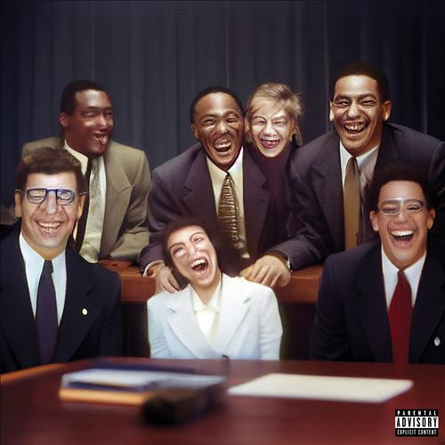

import { Slider, Button } from "@carbon/react";
import { ArrowUpRight } from "@carbon/icons-react";

import SliderJS1 from "../review/slider1";
import SliderJS2 from "../review/slider2";
import SliderJS3 from "../review/slider3";
import SliderJS4 from "../review/slider4";
import AdvJS2 from "../review/adv2";
import AdvJS3 from "../review/adv3";

import { Link } from "gatsby";

import Review1 from "../review/lilyachty1.mdx";

Album review

<h1 className="h1--no--margin">{props.pageContext.frontmatter.title}</h1>

  <Link to="/best50/2023/">2023 Black Music Best No.13</Link>

<Row  className="image-card-group">
	<Column colMd={3} colLg={4} noGutterMdLeft="">
       <ImageCard>

</ImageCard>
	</Column>
	<Column colMd={4} colLg={8} noGutterMdLeft="">
		

			Lil Yachtyの3年ぶりとなるアルバム。予告通り、Hip-Hop的要素ほぼ無しの、サイケデリック・ロック, エレクトリック・ポップ志向の作品となっている。
			 気まぐれに作った感は全く無く、本格的なものであり、各曲のクオリティは高いし、メロディもしっかりとロック、ポップなものになっている。制作面でもPatrick WimberlyなどRock/PopのProducerの力を借りている。
			 全体のトーンはメランコリックで茫洋としたものになるが、Pop寄りの曲では最近のWeeknd作品に近いものを感じる。
			 一作だけの方向転換なのか、継続なのかは判らないが、こっち方面での今後の展開にも期待したい。
		

		

		  <Button className="button-right-mergin"  href="https://amzn.to/3Jsf3Pq" renderIcon={ArrowUpRight} size='sm' kind='primary'>
  	    amazon.com
  	  </Button>
  	  <Button className="button-right-mergin"  href="https://amzn.to/3XpOQ9Z" renderIcon={ArrowUpRight} size='sm' kind='secondary'>
  	    amazon.co.jp
  	  </Button>
			<Button className="button-right-mergin"  href="https://apple.co/44fD3gH" renderIcon={ArrowUpRight} size='sm' kind='tertiary'>
  	    apple music
			</Button>
			<AdvJS2/>
		

	</Column>
</Row>
<Row >
	<Column colMd={4} colLg={4} noGutterMdLeft="">
		

		  <h3>Score card</h3>
			<SliderJS1 value="2" />
		  <SliderJS2 value="2" />
			<SliderJS3 value="2" />
		  <SliderJS4 value="9" />
		

	</Column>
	<Column colMd={8} colLg={8} noGutterMdLeft="">
		

			<h3>Producers</h3>
			

				Jake Portrait, Justin Raisen, Lil Yachty, Patrick Wimberly, and SADPONY(1,7)
				 Jam City, Justin Raisen, Lil Yachty, Patrick Wimberly and SADPONY(2,4,10)
				 Justin Raisen, Lil Yachty, Magdalena Bay, Patrick Wimberly and SADPONY(3)
				 Jake Portrait(5)
				 Jake Portrait, Lil Yachty, Patrick Wimberly and SADPONY(6,9,13)
				 Lil Yachty, Patrick Wimberly, SADPONY and Teo(8)
				 Justin Raisen, Lil Yachty, Patrick Wimberly and SADPONY(11,12,14)
			

			<h3>Guests</h3>
			

				Daniel Caesar, Nick Hakim
			

		

	</Column>
</Row>

<h3>Tracks</h3>

| No. | Title                          | Composers                                                                                                                                           | Performer  | Time  |
| --- | ------------------------------ | --------------------------------------------------------------------------------------------------------------------------------------------------- | ---------- | ----- |
| 1   | the BLACK seminole             | .Joe Kennedy / Anthony Lopez / Miles McCollum / Jake Portrait / Jeremiah Raisen / Justin Raisen / Patrick Wimberly                                  | Lil Yachty | 06:52 |
| 2   | the ride-                      | Jack Latham / Miles McCollum / Jeremiah Raisen / Justin Raisen / Miles Robinson / Aaron Thomas / Patrick Wimberly                                   | Lil Yachty | 03:11 |
| 3   | running out of time            | Matthew Lewin / Miles McCollum / Jeremiah Raisen / Justin Raisen / Justine Skye / Aris Tatalovich / Mica Tenenbaum / Patrick Wimberly               | Lil Yachty | 04:29 |
| 4   | pRETTy                         | Fousheé / Jack Latham / Miles McCollum / Jeremiah Raisen / Justin Raisen / Patrick Wimberly                                                         | Lil Yachty | 02:42 |
| 5   | :[failure[:                    | Mac DeMarco / Alex Giannascoli / Nick Hakim / Miles McCollum / Jake Portrait                                                                        | Lil Yachty | 02:47 |
| 6   | THE zone~                      | Khaya Cohen / Miles McCollum / Jake Portrait / Jeremiah Raisen / Justine Skye / Patrick Wimberly                                                    | Lil Yachty | 04:10 |
| 7   | WE SAW THE SUN!                | Ant Clemons / Miles McCollum / Jake Portrait / Jeremiah Raisen / Justin Raisen / Patrick Wimberly                                                   | Lil Yachty | 05:31 |
| 8   | drive ME crazy!                | Mac DeMarco / Ben Goldwasser / Teo Halm / Miles McCollum / Jeremiah Raisen / Rue / Dylan Ismael Teixeira / Patrick Wimberly                         | Lil Yachty | 03:50 |
| 9   | IVE OFFICIALLY LOST ViSiON!!!! | Miles McCollum / Jake Portrait / Jeremiah Raisen / Rue / Patrick Wimberly                                                                           | Lil Yachty | 05:22 |
| 10  | sAy sOMETHINg                  | Jack Latham / Miles McCollum / Jeremiah Raisen / Justin Raisen / Patrick Wimberly                                                                   | Lil Yachty | 03:33 |
| 11  | paint THE sky                  | Tory Lanez / Miles McCollum / Jeremiah Raisen / Justin Raisen / Patrick Wimberly                                                                    | Lil Yachty | 03:05 |
| 12  | sHouLd i B?                    | Miles McCollum / Jake Portrait / Jeremiah Raisen / Justin Raisen / Patrick Wimberly                                                                 | Lil Yachty | 02:49 |
| 13  | The Alchemist.                 | Fousheé / Miles McCollum / Jake Portrait / Jeremiah Raisen / Patrick Wimberly                                                                       | Lil Yachty | 02:57 |
| 14  | REACH THE SUNSHINE.            | Daniel Caesar / Nick Hakim / Joe Kennedy / Anthony Paul Lopez / Miles McCollum / Jake Portrait / Jeremiah Raisen / Justin Raisen / Patrick Wimberly | Lil Yachty | 05:58 |

<h3>Other Reviews</h3>

<Row>
  <Column colMd={3} colLg={3} noGutterMdLeft>
    <Review1 />
  </Column>
</Row>

<AdvJS3 />
