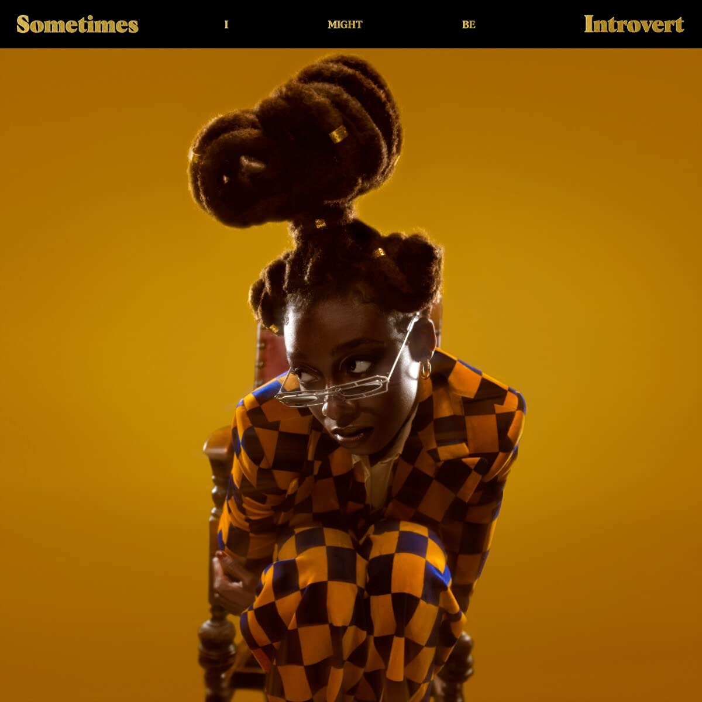

import { Slider, Button } from "carbon-components-react";
import { ArrowUpRight24 } from "@carbon/icons-react";

import SliderJS1 from "../review/slider1";
import SliderJS2 from "../review/slider2";
import SliderJS3 from "../review/slider3";
import SliderJS4 from "../review/slider4";
import AdvJS2 from "../review/adv2";
import AdvJS3 from "../review/adv3";

import { Link } from "gatsby";

import Review1 from "../review/littlesimz1.mdx";

Album review

<h1 className="h1--no--margin">{props.pageContext.frontmatter.title}</h1>

  <Link to="/best50/2021/">2021 Black Music Best No.1</Link>

<Row  className="image-card-group">
	<Column colMd={"3"} colLg={"4"} noGutterMdLeft="">
       <ImageCard>

</ImageCard>
	</Column>
	<Column colMd={"4"} colLg={"8"} noGutterMdLeft="">
		

			前作が高評価で、メジャーな存在となったLittle Simzの2年ぶりの4thアルバム。その前作に引き続き、Saultより、InfroがProducerとして参加し、今回は全曲Produceしている。
			 いままでの路線を踏襲しつつもスケールが二回りくらい大きく、豊潤になった印象で、Hip-Hop, Soul, Funkをベースに、荘厳なオーケストラや、ElectricやAfroにと、振り幅は相当に広い。
			 また、すべてのTrackがキャッチーでカッコ良く、それだけで楽しめる。Infroの才能は相当なレベルだと思う。
			 Little SimzのRapは、基本、低体温で、ただ数曲では力強さも魅せている。また、これもSaultより、2ndのリリースが迫っているCleo SolがGuest参加し、透明感のあるVocalを披露している。
			 対照的に、Album TitleにあるようにLyricは内向的/内省的で、その対比も興味深い。
		

		

		  <Button className="button-right-mergin"  href="https://amzn.to/3kem3D5" kind="primary" size="small" renderIcon={ArrowUpRight24}>
  	    amazon.com
  	  </Button>
  	  <Button className="button-right-mergin"  href="https://amzn.to/3CT5F2h" kind="secondary" size="small" renderIcon={ArrowUpRight24}>
  	    amazon.co.jp
  	  </Button>
			<Button className="button-right-mergin"  href="https://apple.co/3qeyv9z" kind="tertiary" size="small" renderIcon={ArrowUpRight24}>
  	   	apple music
  	  </Button>
			<AdvJS2/>
		

	</Column>
</Row>
<Row >
	<Column colMd={"4"} colLg={"4"} noGutterMdLeft="">
		

		  <h3>Score card</h3>
			<SliderJS1 value="2" />
		  <SliderJS2 value="1" />
			<SliderJS3 value="1" />
		  <SliderJS4 value="9" />
		

	</Column>
	<Column colMd={"8"} colLg={"8"} noGutterMdLeft="">
		

			<h3>Producers</h3>
			

				Inflo(all)
			

			<h3>Guests</h3>
			

				Cleo Sol, Emma Corrin, Obongjayar
			

		

	</Column>
</Row>

<h3>Tracks</h3>

| No. | Title                                   | Composers                                                       | Performer                    | Time  |
| --- | --------------------------------------- | --------------------------------------------------------------- | ---------------------------- | ----- |
| 1   | Introvert                               | Simbiatu Ajikawo, Dean Josiah Cover                             | Little Simz                  | 06:03 |
| 2   | Woman                                   | Simbiatu Ajikawo, Dean Josiah Cover, Cleopatra Nikolic          | Little Simz feat. Cleo Sol   | 04:29 |
| 3   | Two Worlds Apart                        | Simbiatu Ajikawo, Dean Josiah Cover                             | Little Simz                  | 02:58 |
| 4   | I Love You I Hate You                   | Simbiatu Ajikawo, Dean Josiah Cover                             | Little Simz                  | 04:15 |
| 5   | Little Q, Pt. 1 (Interlude)             | Simbiatu Ajikawo, Dean Josiah Cover, Kadeem Clarke, Miles James | Little Simz                  | 01:08 |
| 6   | Little Q, Pt. 2                         | Simbiatu Ajikawo, Dean Josiah Cover, Kadeem Clarke, Miles James | Little Simz                  | 03:46 |
| 7   | Gems (Interlude)                        | Simbiatu Ajikawo, Dean Josiah Cover, Kadeem Clarke              | Little Simz                  | 02:57 |
| 8   | Speed                                   | Simbiatu Ajikawo, Dean Josiah Cover                             | Little Simz                  | 02:40 |
| 9   | Standing Ovation                        | Simbiatu Ajikawo, Dean Josiah Cover                             | Little Simz                  | 04:08 |
| 10  | I See You                               | Simbiatu Ajikawo, Dean Josiah Cover, Miles James, Nathan Allen  | Little Simz                  | 03:58 |
| 11  | The Rapper That Came to Tea (Interlude) | Simbiatu Ajikawo, Dean Josiah Cover, Miles James, Kadeem Clarke | Little Simz                  | 02:45 |
| 12  | Rollin Stone                            | Simbiatu Ajikawo, Dean Josiah Cover, Miles James                | Little Simz                  | 03:39 |
| 13  | Protect My Energy                       | Simbiatu Ajikawo, Dean Josiah Cover                             | Little Simz                  | 03:08 |
| 14  | Never Make Promises (Interlude)         | Simbiatu Ajikawo, Dean Josiah Cover                             | Little Simz                  | 01:02 |
| 15  | Point and Kill                          | Simbiatu Ajikawo, Dean Josiah Cover, James Jacob                | Little Simz                  | 03:05 |
| 16  | Fear No Man                             | Simbiatu Ajikawo, Dean Josiah Cover                             | Little Simz feat. Obongjayar | 04:03 |
| 17  | The Garden (Interlude)                  | Simbiatu Ajikawo, Dean Josiah Cover, Miles James, Kadeem Clarke | Little Simz                  | 02:38 |
| 18  | How Did You Get Here                    | Simbiatu Ajikawo, Dean Josiah Cover                             | Little Simz                  | 04:56 |
| 19  | Miss Understood                         | Simbiatu Ajikawo, Dean Josiah Cover                             | Little Simz                  | 03:27 |

<h3>Other Reviews</h3>

<Row>
  <Column colMd={3} colLg={3} noGutterMdLeft>
    <Review1 />
  </Column>
</Row>

<AdvJS3 />