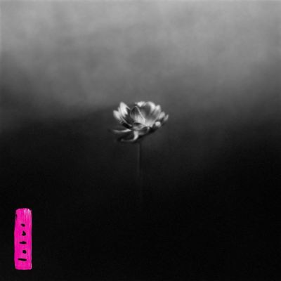

import { Slider, Button } from "@carbon/react";
import { ArrowUpRight } from "@carbon/icons-react";

import SliderJS1 from "../review/slider1";
import SliderJS2 from "../review/slider2";
import SliderJS3 from "../review/slider3";
import SliderJS4 from "../review/slider4";
import AdvJS2 from "../review/adv2";
import AdvJS3 from "../review/adv3";

import { Link } from "gatsby";

import Review1 from "../review/littlesimz4.mdx";
import Review2 from "../review/littlesimz3.mdx";
import Review3 from "../review/littlesimz2.mdx";
import Review4 from "../review/littlesimz1.mdx";

Album review

<h1 className="h1--no--margin">{props.pageContext.frontmatter.title}</h1>

	<Link to="/best50/2025/">2025 Black Music Best No.5</Link>

<Row  className="image-card-group">
	<Column colMd={3} colLg={4} noGutterMdLeft="">
			<ImageCard>

</ImageCard>
	</Column>
	<Column colMd={4} colLg={8} noGutterMdLeft="">
		

			EPを挟んで3年ぶりとなるLittle Simzの6作目。盟友だったはずのInfloとは金銭トラブル(かなりの額を踏み倒されて裁判になっている。)もあって袂を別ち、新たに、そこまで著名ではないMiles Clinton JameをProducerに迎えているが、これが良い方向に働いている。
			 そのInfloの件を唄った①(タイトルはThief)など怒りを表現した曲もあるが、後半にかけて穏やかな曲が多めになっている。全体的にTrackは楽器メインであり、密室性の高かった今までと比べ、ナチュラルでプリミティブになっているのも特徴で、Jazz,、Afro、Latinを取り入れた曲が並んでいる。
			 Guestも多めになっており、身近なところでのMichael Kiwanuka, Yussef Dayes, Samphaに加え、Obongjayar, Miraa May, Moonchild Sanellyなどのアフリカ勢もぴったりとはまっている。
			 アルバムタイトルのLotusに再生と成長の象徴の意味を込めているとのことだが、まさにその通りの作品に仕上がっていると思う。
		

		

		  <Button className="button-right-mergin"  href="https://amzn.to/3X59X3d" renderIcon={ArrowUpRight} size='sm' kind='primary'>
		    amazon.com
		  </Button>
		  <Button className="button-right-mergin"  href="https://amzn.to/4aJnrFd" renderIcon={ArrowUpRight} size='sm' kind='secondary'>
		    amazon.co.jp
		  </Button>
			<Button className="button-right-mergin"  href="https://apple.co/4aJ1HJx" renderIcon={ArrowUpRight} size='sm' kind='tertiary'>
		   	apple music
		  </Button>
			<AdvJS2/>
		

	</Column>
</Row>
<Row >
	<Column colMd={4} colLg={4} noGutterMdLeft="">
		

		  <h3>Score card</h3>
			<SliderJS1 value="2" />
		  <SliderJS2 value="2" />
			<SliderJS3 value="1" />
		  <SliderJS4 value="9" />
		

	</Column>
	<Column colMd={8} colLg={8} noGutterMdLeft="">
		

			<h3>Producers</h3>
			

				Miles Clinton James(all)
			

			<h3>Guests</h3>
			

				Obongjayar, Moonchild Sanelly, Lydia Kitto, Miraa May, Moses Sumney, Wretch 32, Cashh, Michael Kiwanuka, Yussef Dayes, Sampha
			

		

	</Column>
</Row>

<h3>Tracks</h3>

| No. | Title  | Composers                                                                                                       | Performer                                        | Time  |
| --- | ------ | --------------------------------------------------------------------------------------------------------------- | ------------------------------------------------ | ----- |
| 1   | Thief  | Simbiatu Ajikawo, Miles Clinton James, Alexander Bonfanti                                                       | Little Simz                                      | 04:00 |
| 2   | Flood  | Simbiatu Ajikawo, Miles Clinton James, Steven Umoh, Jonah Stevens, Saneldwe Sanelly, Dacoury Natche,            | Little Simz feat. Obongjayar, Moonchild Sanelly  | 02:47 |
| 3   | Young  | Simbiatu Ajikawo, Miles Clinton James                                                                           | Little Simz                                      | 02:50 |
| 4   | Only   | Simbiatu Ajikawo, Miles Clinton James, Lydia Kitto, Jermaine Sinclair                                           | Little Simz deat. Lydia Kitto                    | 03:35 |
| 5   | Free   | Simbiatu Ajikawo, Miles Clinton James, Josh Arcé, Alexander Bonfanti                                            | Little Simz                                      | 03:35 |
| 6   | Peace  | Simbiatu Ajikawo, Miles Clinton James, Miraa May, Moses Sumney, Jonah Stevens, Dacoury Natche,                  | Little Simz feat. Miraa May, Moses Sumney        | 04:27 |
| 7   | Hollow | Simbiatu Ajikawo, Miles Clinton James                                                                           | Little Simz                                      | 02:54 |
| 8   | Lion   | Simbiatu Ajikawo, Miles Clinton James, Steven Umoh, Malk Venner                                                 | Little Simz feat, Obongjayar                     | 02:57 |
| 9   | Enough | Simbiatu Ajikawo, Miles Clinton James, Yukimi Nagano                                                            | Little Simz                                      | 03:02 |
| 10  | Blood  | Simbiatu Ajikawo, Miles Clinton James, Jonah Stevens, Dacoury Natche, Cashief Nichols, Jermaine Sinclaire Scott | Little Simz feat. Wretch 32, Cashh               | 04:28 |
| 11  | Lotus  | Simbiatu Ajikawo, Miles Clinton James, Hannah Khemoh, Michael Kiwanuka, Yussef Dayes                            | Little Simz feat. Michael Kiwanuka, Yussef Dayes | 06:35 |
| 12  | Lonely | Simbiatu Ajikawo, Miles Clinton James                                                                           | Little Simz                                      | 04:25 |
| 13  | Blue   | Simbiatu Ajikawo, Miles Clinton James, Sampha Slsay                                                             | Little Simz feat. Sampha                         | 04:14 |

<h3>Other Reviews</h3>

<Row>
	<Column colMd={3} colLg={3} noGutterMdLeft>
		<Review1 />
	</Column>
	<Column colMd={3} colLg={3} noGutterMdLeft>
		<Review2 />
	</Column>
	<Column colMd={3} colLg={3} noGutterMdLeft>
		<Review3 />
	</Column>
	<Column colMd={3} colLg={3} noGutterMdLeft>
		<Review4 />
	</Column>
</Row>

<AdvJS3 />
