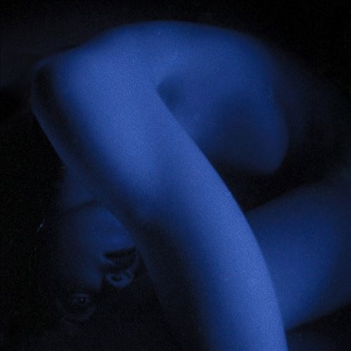

import { Slider, Button } from "@carbon/react";
import { ArrowUpRight } from "@carbon/icons-react";

import SliderJS1 from "../review/slider1";
import SliderJS2 from "../review/slider2";
import SliderJS3 from "../review/slider3";
import SliderJS4 from "../review/slider4";
import AdvJS2 from "../review/adv2";
import AdvJS3 from "../review/adv3";

import { Link } from "gatsby";

Album review

<h1 className="h1--no--margin">{props.pageContext.frontmatter.title}</h1>

<Row  className="image-card-group">
	<Column colMd={3} colLg={4} noGutterMdLeft="">
       <ImageCard>

</ImageCard>
	</Column>
	<Column colMd={4} colLg={8} noGutterMdLeft="">
		

			Dallas出身で、今はLAを拠点とするR&B Singer, Song WriteであるLiv.Eの2ndアルバム。2010年代後半から活動してきて、まだ知る人ぞ知るって感じだが、当作でブレイクを果たす可能性大である。
			 前作ではErykah Baduらから影響受けたネオソウル志向だったようだが、今回はExperimentalな方向にかなり振り切っている。ソウルにどうにしか片足残しつつも、テクノ, ハウス色の強い曲が多く、ドラムンベースやWeather Reportっぽい⑭など、曲調は様々。
			 普通にメロディアスなスローやほぼVocalが入らない曲も数曲あり、試したいことを出し切ったということなのだろう。
			 Vocalは⑦のようにシャウトする曲は稀で、ほぼ囁くような唄い方に徹している。
		

		

		  <Button className="button-right-mergin"  href="https://amzn.to/3p5R8hP" renderIcon={ArrowUpRight} size='sm' kind='primary'>
  	    amazon.com
  	  </Button>
  	  <Button className="button-right-mergin"  href="https://amzn.to/3X2c3z1" renderIcon={ArrowUpRight} size='sm' kind='secondary'>
  	    amazon.co.jp
  	  </Button>
			<Button className="button-right-mergin"  href="https://apple.co/43PVuse" renderIcon={ArrowUpRight} size='sm' kind='secondary'>
  	    amazon.co.jp
  	  </Button>
			<AdvJS2/>
		

	</Column>
</Row>
<Row >
	<Column colMd={4} colLg={4} noGutterMdLeft="">
		

		  <h3>Score card</h3>
			<SliderJS1 value="5" />
		  <SliderJS2 value="1" />
			<SliderJS3 value="3" />
		  <SliderJS4 value="9" />
		

	</Column>
	<Column colMd={8} colLg={8} noGutterMdLeft="">
		

			<h3>Producers</h3>
			

				Liv.E(1,2,5,9,10,13,15,16)
				 Mndsgn(3,6,12,14,17)
				 Justin Raisen(4)
				 Liv.E and Aaron Liao(7,8)
				 Hailee Olivia Williams, John Carroll Kirby and Solomonophonic(11)
			

			<h3>Guests</h3>
			

			

		

	</Column>
</Row>

<h3>Tracks</h3>

| No. | Title              | Composers                                                 | Performer | Time  |
| --- | ------------------ | --------------------------------------------------------- | --------- | ----- |
| 1   | Gardetto.          | Hailee Olivia Williams                                    | Liv.e     | 02:55 |
| 2   | A Slumber Party?   | Hailee Olivia Williams                                    | Liv.e     | 01:53 |
| 3   | Lake Psilocybin    | Hailee Olivia Williams, Ringgo Ancheta                    | Liv.e     | 03:00 |
| 4   | Six Weeks          | Hailee Olivia Williams, Justin Raisen                     | Liv.e     | 01:19 |
| 5   | Ghost              | Hailee Olivia Williams                                    | Liv.e     | 02:38 |
| 6   | Find Out           | Hailee Olivia Williams, Ringgo Ancheta                    | Liv.e     | 02:28 |
| 7   | Clowns             | Hailee Olivia Williams, Aaron Liao                        | Liv.e     | 02:36 |
| 8   | Heart Break Escape | Hailee Olivia Williams, Aaron Liao                        | Liv.e     | 02:20 |
| 9   | HowTheyLikeMe!     | Hailee Olivia Williams                                    | Liv.e     | 01:44 |
| 10  | Snowing!           | Hailee Olivia Williams                                    | Liv.e     | 03:31 |
| 11  | Wild Animals       | Hailee Olivia Williams, Jared Solomon, John Carroll Kirby | Liv.e     | 03:38 |
| 12  | RESET!             | Hailee Olivia Williams, Ringgo Ancheta                    | Liv.e     | 02:24 |
| 13  | Underground        | Hailee Olivia Williams                                    | Liv.e     | 02:04 |
| 14  | Back Alley         | Hailee Olivia Williams, Ringgo Ancheta                    | Liv.e     | 00:53 |
| 15  | Our Father         | Hailee Olivia Williams                                    | Liv.e     | 02:44 |
| 16  | NoNewNews!!!       | Hailee Olivia Williams                                    | Liv.e     | 01:58 |
| 17  | Glass Shadows      | Hailee Olivia Williams, Ringgo Ancheta                    | Liv.e     | 02:36 |
