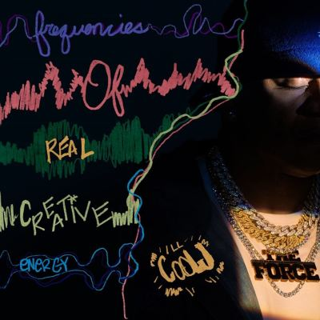

import { Slider, Button } from "@carbon/react";
import { ArrowUpRight } from "@carbon/icons-react";

import SliderJS1 from "../review/slider1";
import SliderJS2 from "../review/slider2";
import SliderJS3 from "../review/slider3";
import SliderJS4 from "../review/slider4";
import AdvJS2 from "../review/adv2";
import AdvJS3 from "../review/adv3";

import { Link } from "gatsby";

Album review

<h1 className="h1--no--margin">{props.pageContext.frontmatter.title}</h1>

	<Link to="/best50/2024/">2024 Black Music Best No.34</Link>

<Row  className="image-card-group">
	<Column colMd={3} colLg={4} noGutterMdLeft="">
			<ImageCard>

</ImageCard>
	</Column>
	<Column colMd={4} colLg={8} noGutterMdLeft="">
		

			2024秋にリリースされた大ヴェテラン LL Cool Jのなんと11年ぶりの新作。こちらもヴェテランであるQ-Tipがほぼ全曲Produceしている。
			 ゲストとしてSnoop, Eminem, Nas, Busta RhymesにRick Rossと大物が脇を固めており、ブランクを感じさせない良質なHip-Hop作品となっている。サンプリング中心のTrackはオーソドックスでありつつ、古臭い感じは無いが、この辺はQ-Tipの功績が大きい。
			 LL Cool Jのラップも力強く、二人の相性はかなり良さそう。メローな⑥ではSaweetieが唄とRapで華を添えている。
		
	
		

		  <Button className="button-right-mergin"  href="https://amzn.to/4iGT7PB" renderIcon={ArrowUpRight} size='sm' kind='primary'>
		    amazon.com
		  </Button>
		  <Button className="button-right-mergin"  href="https://amzn.to/3EAJnZb" renderIcon={ArrowUpRight} size='sm' kind='secondary'>
		    amazon.co.jp
		  </Button>
			<Button className="button-right-mergin"  href="https://apple.co/4iGadgu" renderIcon={ArrowUpRight} size='sm' kind='tertiary'>
		   	apple music
		  </Button>
			<AdvJS2/>
		

	</Column>
</Row>
<Row >
	<Column colMd={4} colLg={4} noGutterMdLeft="">
		

		  <h3>Score card</h3>
			<SliderJS1 value="2" />
		  <SliderJS2 value="1" />
			<SliderJS3 value="1" />
		  <SliderJS4 value="9" />
		

	</Column>
	<Column colMd={8} colLg={8} noGutterMdLeft="">
		

			<h3>Producers</h3>
			

				Q-Tip(1,2,3,4,5,6,7,8,9,10,11,12,13)
				 JS.A.N.D.. and Kizzo(14)
			

			<h3>Guests</h3>
				Snoop Dogg,, Rick Ross, Fat Joe, Sona Jobarteh, Saweetie, Busta Rhymes, Nas, Eminem, Mad Squanbiz, JS.A.N.D.., Don Pablito
			

			

		

	</Column>
</Row>

<h3>Tracks</h3>

| No. | Title                  | Composers                                                                                                                   | Performer                                             | Time  |
| --- | ---------------------- | --------------------------------------------------------------------------------------------------------------------------- | ----------------------------------------------------- | ----- |
| 1   | Spirit of Cyrus        | Kamaal Fareed / Simon Park / JT Smith                                                                                       | LL Cool J feat. Snoop Dogg                            | 03:30 |
| 2   | The Force              | Kamaal Fareed / Michael Jackson / JT Smith                                                                                  | LL Cool J                                             | 02:49 |
| 3   | Saturday Night Special | Joseph Cartagena / Kamaal Fareed / Pye Hastings / William Roberts / JT Smith                                                | LL Cool J feat. Rick Ross, Fat Joe                    | 03:28 |
| 4   | Black Code Suite       | Jon Eberson / Kamaal Fareed / Sona Jobarteh / JT Smith                                                                      | LL Cool J feat. Sona Jobarteh                         | 04:26 |
| 5   | Passion                | Kamaal Fareed / Herbie Hancock / JT Smith                                                                                   | LL Cool J                                             | 02:29 |
| 6   | Proclivities           | Kamaal Fareed / Gary Numan / Saweetie / JT Smith                                                                            | LL Cool J deat. Saweetie                              | 03:39 |
| 7   | Post Modern            | Kamaal Fareed / JT Smith                                                                                                    | LL Cool J                                             | 02:09 |
| 8   | 30 Decembers           | Kamaal Fareed / Pekka Rechardt / JT Smith                                                                                   | LL Cool J                                             | 03:26 |
| 9   | Runnit Back            | Kamaal Fareed / Jon Lind / JT Smith / Maurice White                                                                         | LL Cool J                                             | 02:46 |
| 10  | Huey in the Chair      | Kamaal Fareed / Michael Karoli / Jaki Liebezeit / Irmin Schmidt / Holger Schuering / JT Smith / Trevor Smith / Kenji Suzuki | LL Cool J feat. Busta Rhymes                          | 02:24 |
| 11  | Basquiat Energy        | Kamaal Fareed / JT Smith / Alex Wiska                                                                                       | LL Cool J                                             | 02:22 |
| 12  | Praise Him             | Kamaal Fareed / Oluko Imo / Nasir Jones / JT Smith                                                                          | LL Cool J feat. Nas                                   | 02:24 |
| 13  | Murdergram Deux        | Kamaal Fareed / Anthony King / Marshall Mathers / JT Smith                                                                  | LL Cool J feat. Eminem                                | 03:05 |
| 14  | The Vow                | James Brown / Kashif Dove / Dahseim Henry / Betty Jean Newsome / Tierce Person / Jaleel Marquis Ross / JT Smith             | LL Cool J feat. Mad Squanbiz, JS.A.N.D.., Don Pablito | 04:35 |

<AdvJS3 />
