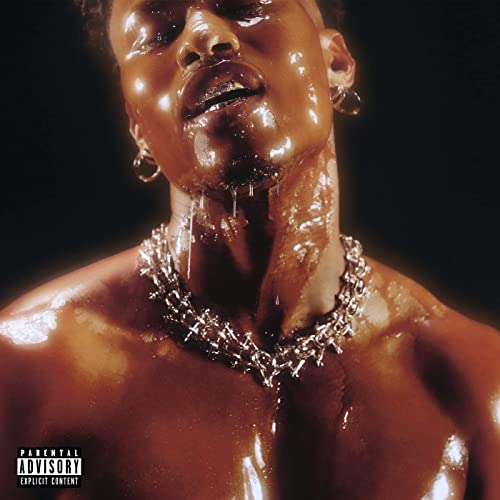

import { Slider, Button } from "@carbon/react";
import { ArrowUpRight } from "@carbon/icons-react";

import SliderJS1 from "../review/slider1";
import SliderJS2 from "../review/slider2";
import SliderJS3 from "../review/slider3";
import SliderJS4 from "../review/slider4";
import AdvJS2 from "../review/adv2";
import AdvJS3 from "../review/adv3";

import { Link } from "gatsby";

Album review

<h1 className="h1--no--margin">{props.pageContext.frontmatter.title}</h1>

  <Link to="/best50/2022/">2022 Black Music Best No.16</Link>

<Row  className="image-card-group">
	<Column colMd={3} colLg={4} noGutterMdLeft="">
       <ImageCard>

</ImageCard>
	</Column>
	<Column colMd={4} colLg={8} noGutterMdLeft="">
		

			令和の客演王、Lucky Dayeの3年ぶりの2作目。NO出身の35歳ということで、年齢的には中堅の域であり、落ち着きと若々しさの両方を兼ね備えたVocal Styleが魅力となっている。
			 サウンドも懐かしさと先鋭さを適度にバランスさせており、この辺はメインプロデューサーであるD'Mileの腕の見せ所となっていて、00年代から現代に至るまでのR&Bを総括するようなつくりとなっている。
			 曲調もオーソドックスなR&B, メローなスロー、軽快なPop、ジャケットから連想されるようなファルセット使いの官能的な曲に、アコースティックでLatinぽい⑫⑰など様々。ただ、基調は明るいので気楽に聴けるアルバムでもある。
		

		

		  <Button className="button-right-mergin"  href="https://amzn.to/3Aey5om" renderIcon={ArrowUpRight} size='sm' kind='primary'>
  	    amazon.com
  	  </Button>
  	  <Button className="button-right-mergin"  href="https://amzn.to/3Qfibjl" renderIcon={ArrowUpRight} size='sm' kind='secondary'>
  	    amazon.co.jp
  	  </Button>
			<Button className="button-right-mergin"  href="https://apple.co/3QE7Eh5" renderIcon={ArrowUpRight} size='sm' kind='tertiary'>
  	   	apple music
  	  </Button>
			<AdvJS2/>
		

	</Column>
</Row>
<Row >
	<Column colMd={4} colLg={4} noGutterMdLeft="">
		

		  <h3>Score card</h3>
			<SliderJS1 value="5" />
		  <SliderJS2 value="2" />
			<SliderJS3 value="1" />
		  <SliderJS4 value="9" />
		

	</Column>
	<Column colMd={8} colLg={8} noGutterMdLeft="">
		

			<h3>Producers</h3>
			

				Dernst Emile II and Alex Isley(1,9)
				 Dernst Emile II(2,3,4,5,7,8,10,16)
				 Dernst Emile II, Carlin White and Marcus Reddick(6)
				 Ayo N Keyzbaby and Gabriel Lambirth(11)
				 Yonatan Ayal , Dernst Emile II and Pierre-Luc Rioux(12,17)
				 SIR DYLAN(13)
				 M-Phasez and Aidan Rodriguez(14)
				 Yonatan Ayal , Aliandro Prawl, Dernst Emile II and Pierre-Luc Rioux(15)
			

			<h3>Guests</h3>
			

				Smino, Lil Durk, Chiiild
			

		

	</Column>
</Row>

<h3>Tracks</h3>

| No. | Title                      | Composers                                                                                                                   | Performer                 | Time  |
| --- | -------------------------- | --------------------------------------------------------------------------------------------------------------------------- | ------------------------- | ----- |
| 1   | Intro                      | David Brown / Dernst Emile II / Alex Isley / Mike McGregor                                                                  | Lucky Daye                | 01:53 |
| 2   | God Body                   | David Brown / Dernst Emile II / Christopher Smith Jr.                                                                       | Lucky Daye feat. Smino    | 03:21 |
| 3   | Feels Like                 | David Brown / Dernst Emile II                                                                                               | Lucky Daye                | 03:29 |
| 4   | NWA                        | Durk Banks / David Brown / Dernst Emile II                                                                                  | Lucky Daye feat. Lil Durk | 03:51 |
| 5   | Guess                      | David Brown / Chad Hugo / Dernst Emile II / Mike McGregor / Pharrell Williams                                               | Lucky Daye                | 03:13 |
| 6   | Candy Drip (Interlude)     | David Brown / Dernst Emile II                                                                                               | Lucky Daye                | 01:55 |
| 7   | Candy Drip                 | David Brown / Dernst Emile II                                                                                               | Lucky Daye                | 04:40 |
| 8   | Deserve                    | David Brown / Dernst Emile II                                                                                               | Lucky Daye                | 04:39 |
| 9   | Intermission               | David Brown / Dernst Emile II / Alex Isley                                                                                  | Lucky Daye                | 00:31 |
| 10  | Over                       | Ivan Barias / David Brown / Carl Devonish / Carvin Haggins / Dernst Emile II / Taalib Johnson / Francis Lai / Mike McGregor | Lucky Daye                | 03:27 |
| 11  | Fuckin' Sound              | David Brown / Dernst Emile II / James Foye III / Austin Owens                                                               | Lucky Daye                | 02:44 |
| 12  | Compassion                 | Yonatan Ayal / Dustin Bowie / David Brown / Dernst Emile II / Mike McGregor / Pierre-Luc Rioux                              | Lucky Daye feat. Chiiild  | 04:32 |
| 13  | Touch Somebody (Interlude) | David Brown / Dylan Wiggins                                                                                                 | Lucky Daye                | 01:37 |
| 14  | Used to Be                 | David Brown / Mark Landon / Aidan Rodriguez                                                                                 | Lucky Daye                | 04:01 |
| 15  | Fever                      | Yonatan Ayal / Dustin Bowie / David Brown / Dernst Emile II / Mike McGregor / Aliandro Prawl / Pierre-Luc Rioux             | Lucky Daye                | 04:00 |
| 16  | Cherry Forest              | David Brown / Dernst Emile II / Mike McGregor                                                                               | Lucky Daye                | 04:00 |
| 17  | Ego                        | Yonatan Ayal / David Brown / Dernst Emile II / Mike McGregor / Pierre-Luc Rioux                                             | Lucky Daye                | 05:50 |

<AdvJS3 />
