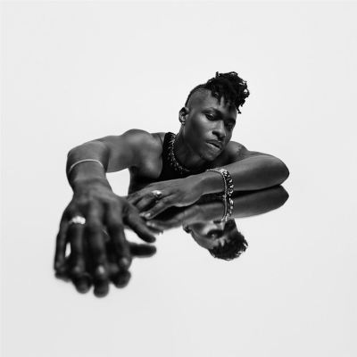

import { Slider, Button } from "@carbon/react";
import { ArrowUpRight } from "@carbon/icons-react";

import SliderJS1 from "../review/slider1";
import SliderJS2 from "../review/slider2";
import SliderJS3 from "../review/slider3";
import SliderJS4 from "../review/slider4";
import AdvJS2 from "../review/adv2";
import AdvJS3 from "../review/adv3";

import { Link } from "gatsby";

import Review1 from "../review/luckydaye1.mdx";

Album review

<h1 className="h1--no--margin">{props.pageContext.frontmatter.title}</h1>

  <Link to="/best50/2024/">2024 Black Music Best No.15</Link>

<Row  className="image-card-group">
	<Column colMd={3} colLg={4} noGutterMdLeft="">
       <ImageCard>

</ImageCard>
	</Column>
	<Column colMd={4} colLg={8} noGutterMdLeft="">
		

			Lucky Dayeの3年ぶりの2作目。引き続き、D’Mileがメインプロデューサーとして、堅実かつ、Lucky Dayeの世界観をうまく表現した楽曲を提供している。
			 今までの路線を維持しつつ、ファンク、ロック、プリンスっぽい曲や、甘めのバラードなど聴きどころは多め。全体的にインスト部分が多く、ちょっと長めの曲が多いのも、特徴的である。
			 また、Bruno Masrsが制作に参加した⑩などは、いかのもBrunoらしい曲になっている。
			 アラフォーになったということで、後半にかけてエモーショナルに唄いあげる曲もでてくるが、まだまだ若さを感じさせてくれるのが印象的だ。
		

		

		  <Button className="button-right-mergin"  href="https://amzn.to/3EJNul9" renderIcon={ArrowUpRight} size='sm' kind='primary'>
  	    amazon.com
  	  </Button>
  	  <Button className="button-right-mergin"  href="https://amzn.to/4hN6UDW" renderIcon={ArrowUpRight} size='sm' kind='secondary'>
  	    amazon.co.jp
  	  </Button>
			<Button className="button-right-mergin"  href="https://apple.co/4hBXtI8" renderIcon={ArrowUpRight} size='sm' kind='tertiary'>
  	   	apple music
  	  </Button>
			<AdvJS2/>
		

	</Column>
</Row>
<Row >
	<Column colMd={4} colLg={4} noGutterMdLeft="">
		

		  <h3>Score card</h3>
			<SliderJS1 value="5" />
		  <SliderJS2 value="2" />
			<SliderJS3 value="1" />
		  <SliderJS4 value="9" />
		

	</Column>
	<Column colMd={8} colLg={8} noGutterMdLeft="">
		

			<h3>Producers</h3>
			

				D’Mile(1,2,4,5,6,9,11,12,14)
				 D’Mile, Livvy Bennett and Michael B. Hunter(3)
				 Jeff “Gitty” Gitelman and Deputy(7)
				 Michael B. Hunter(8)
				 D’Mile and Bruno Mars(10)
				 D’Mile & The Monsterz(13)
			

			<h3>Guests</h3>
			

				Teddy Swims, Raye
			

		

	</Column>
</Row>

<h3>Tracks</h3>

| No. | Title                  | Composers                                                                                                    | Performer                    | Time  |
| --- | ---------------------- | ------------------------------------------------------------------------------------------------------------ | ---------------------------- | ----- |
| 2   | Title                  | Composer                                                                                                     | Performer                    | Time  |
| 1   | Never Leavin' U Lonely | Austin Brown / David Brown / Michael Hunter / Dernst Emile II / Mike McGregor                                | Lucky Daye                   | 04:40 |
| 2   | HERicane               | Dustin Bowie / Frank Brim / David Brown / Dernst Emile II / Mike McGregor                                    | Lucky Daye                   | 03:47 |
| 3   | Soft                   | Livvy Bennett / Dustin Bowie / Austin Brown / David Brown / Michael Hunter / Dernst Emile II / Mike McGregor | Lucky Daye                   | 05:19 |
| 4   | Pin                    | Dustin Bowie / David Brown / Dernst Emile II / Mike McGregor                                                 | Lucky Daye                   | 04:24 |
| 5   | Top                    | David Brown / Dernst Emile II / Mike McGregor / David Wade                                                   | Lucky Daye                   | 02:57 |
| 6   | Algorithm              | David Brown / Larolyn Dodd / Mike McGregor                                                                   | Lucky Daye                   | 03:20 |
| 7   | Blame                  | David Brown / Mikky Ekko / Jeff Gitelman / Jamil Pierre / Teddy Swims                                        | Lucky Daye feat. Teddy Swims | 03:44 |
| 8   | Think Different        | Dustin Bowie / David Brown / Michael Hunter / Mike McGregor                                                  | Lucky Daye                   | 04:08 |
| 9   | Breakin' The Bank      | Dustin Bowie / David Brown / Dernst Emile II / Mike McGregor                                                 | Lucky Daye                   | 04:49 |
| 10  | That's You             | Austin Brown / David Brown / Dernst Emile II / Bruno Mars / Mike McGregor                                    | Lucky Daye                   | 05:19 |
| 11  | Mary                   | Austin Brown / David Brown / Dernst Emile II / Mike McGregor                                                 | Lucky Daye                   | 04:42 |
| 12  | Paralyzed              | Austin Brown / David Brown / Dernst Emile II / Rachel Keen / Mike McGregor                                   | Lucky Daye feat. Raye        | 04:38 |
| 13  | Lemonade               | Austin Brown / David Brown / Dernst Emile II / Mike McGregor                                                 | Lucky Daye                   | 03:27 |
| 14  | Diamonds in Teal       | Dustin Bowie / Frank Brim / David Brown / Dernst Emile II / Mike McGregor                                    | Lucky Daye                   | 05:56 |

<h3>Other Reviews</h3>

<Row>
  <Column colMd={3} colLg={3} noGutterMdLeft>
    <Review1 />
  </Column>
</Row>

<AdvJS3 />
