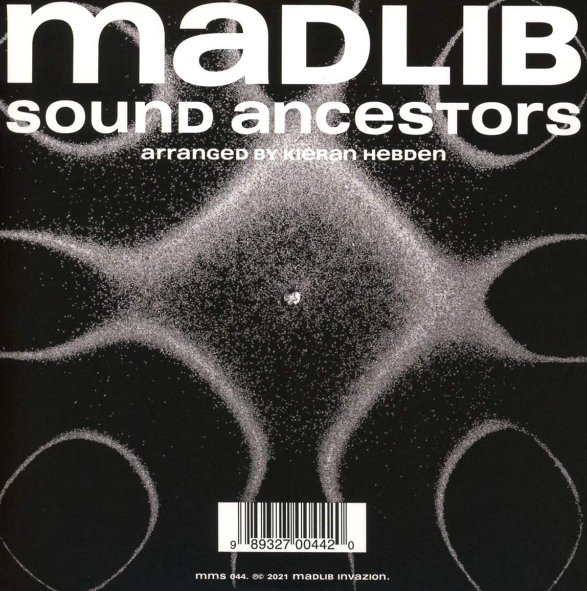

import { Slider, Button } from "carbon-components-react";
import { ArrowUpRight24 } from "@carbon/icons-react";

import SliderJS1 from "../review/slider1";
import SliderJS2 from "../review/slider2";
import SliderJS3 from "../review/slider3";
import SliderJS4 from "../review/slider4";
import AdvJS2 from "../review/adv2";
import AdvJS3 from "../review/adv3";

import { Link } from "gatsby";

import Review1 from "../review/fgibsandmadlib2";

Album review

<h1 className="h1--no--margin">{props.pageContext.frontmatter.title}</h1>

<Row  className="image-card-group">
	<Column colMd={"3"} colLg={"4"} noGutterMdLeft="">
       <ImageCard>

</ImageCard>
	</Column>
	<Column colMd={"4"} colLg={"8"} noGutterMdLeft="">
	

		多様なアーティストとのコラボレーションで知られるベテラン・プロデューサー、Madlibが長年の友、Kieran Hebden と組んだアルバム。アルバム。CDジャケットには"arranged by Kieran Hebden"と記されている。
		 Madlibがここ数年作りためた100以上のBeatやStudio Sessionなどの素材をKieranが編集・アレンジして、仕立て上げた作品である。
		 Madlibの作り上げる太いビートが中核となるが、曲調はロック、ソウルをメインにスパニッシュ、アフリカン、スピリチュアルなものや瞑想的なものなど様々。アクセント的にVocalやVoiceが加えられている。二人が敬愛するJ Dillaに捧げたTrackもある。
		 密室的で頭の中で作りました、という印象はあるものの、高次元でのコラボレーションが楽しめる。
	

	

	  <Button className="button-right-mergin"  href="https://amzn.to/3yqgvtA" kind="primary" size="small" renderIcon={ArrowUpRight24}>
      amazon.com
    </Button>
    <Button className="button-right-mergin"  href="https://amzn.to/3jnUXcH" kind="secondary" size="small" renderIcon={ArrowUpRight24}>
      amazon.co.jp
    </Button>
		<Button className="button-right-mergin"  href="https://geo.music.apple.com/us/album/sound-ancestors/1548810974?itsct=music_box_link&itscg=30200&at=11lcug&ct=albums_sound_ancestors&ls=1&app=music" kind="tertiary" size="small" renderIcon={ArrowUpRight24}>
      apple music
    </Button>
		<AdvJS2/>
	

	</Column>
</Row>
<Row >
	<Column colMd={"4"} colLg={"4"} noGutterMdLeft="">
		

    	<h3>Score card</h3>
			<SliderJS1 value="5" />
    	<SliderJS2 value="1" />
			<SliderJS3 value="2" />
    	<SliderJS4 value="8" />
		

	</Column>
	<Column colMd={"8"} colLg={"8"} noGutterMdLeft="">
		

			<h3>Producers</h3>
			

				Madlib(all)
			

			<h3>Guests</h3>
			

			

		

	</Column>
</Row>

<h3>Tracks</h3>

| No. | Title                      | Composers                  | Performer | Time  |
| --- | -------------------------- | -------------------------- | --------- | ----- |
| 1   | There Is No Time (Prelude) | Otis Jackson, Jr. / Madlib | Madlib    | 01:16 |
| 2   | The Call                   | Otis Jackson, Jr. / Madlib | Madlib    | 02:05 |
| 3   | Theme de Crabtree          | Otis Jackson, Jr. / Madlib | Madlib    | 02:16 |
| 4   | Road of the Lonely Ones    | Otis Jackson, Jr. / Madlib | Madlib    | 03:38 |
| 5   | Loose Goose                | Otis Jackson, Jr. / Madlib | Madlib    | 02:21 |
| 6   | Dirtknock                  | Otis Jackson, Jr. / Madlib | Madlib    | 02:14 |
| 7   | Hopprock                   | Otis Jackson, Jr. / Madlib | Madlib    | 03:27 |
| 8   | Riddim Chant               | Otis Jackson, Jr. / Madlib | Madlib    | 01:58 |
| 9   | Sound Ancestors            | Otis Jackson, Jr. / Madlib | Madlib    | 02:50 |
| 10  | One for Quartab?/Right Now | Otis Jackson, Jr. / Madlib | Madlib    | 02:42 |
| 11  | Hang Out (Phone Off)       | Otis Jackson, Jr. / Madlib | Madlib    | 02:15 |
| 12  | Two for 2 (For Dilla)      | Otis Jackson, Jr. / Madlib | Madlib    | 02:51 |
| 13  | Latino Negro               | Otis Jackson, Jr. / Madlib | Madlib    | 03:36 |
| 14  | The New Normal             | Otis Jackson, Jr. / Madlib | Madlib    | 02:28 |
| 15  | Chino                      | Otis Jackson, Jr. / Madlib | Madlib    | 01:57 |
| 16  | Duumbiyay                  | Otis Jackson, Jr. / Madlib | Madlib    | 03:13 |

<Row>
  <Column colMd={3} colLg={3} noGutterMdLeft>
    <Review1 />
  </Column>
</Row>

<AdvJS3 />
