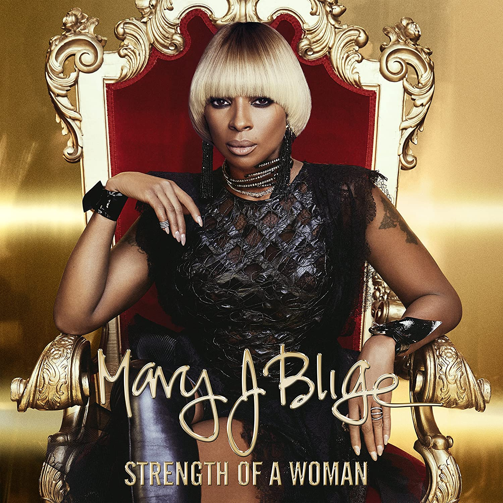

import { Slider, Button } from 'carbon-components-react';
import { ArrowUpRight24  } from '@carbon/icons-react';

import SliderJS1 from "../review/slider1"
import SliderJS2 from "../review/slider2"
import SliderJS3 from "../review/slider3"
import SliderJS4 from "../review/slider4"

import { Link } from "gatsby"

Album review

<h1 className="h1--no--margin">{props.pageContext.frontmatter.title}</h1>

<Row  className="image-card-group">
	<Column colMd={"3"} colLg={"4"} noGutterMdLeft="">
       <ImageCard>

 

</ImageCard>
	</Column>
	<Column colMd={"4"} colLg={"8"} noGutterMdLeft="">
	

	企画物やサントラが続いてたMary J BilgeのHip-Hop Soul回帰作。若手中堅が懐古的な作風やアンビエントな方向に流れる中で、40代半ばのベテランがストリート感覚あふれる今どきのR&Bを展開していて、なかなか爽快だ。以前のMaryのような痛々しい印象は微塵もなく、最初から最後まで力強く感情のこもったVocalで引っ張っている。Upな曲、Jazzっぽい曲、しっとりしたスローと構成もバラエティに富んでいる。良曲揃いだが、　特にKaytranada+Badbadnotgood Produceの⑫などは、クールでリズムに凝っていて面白いと思う。
	

    

	  <Button className="button-right-mergin"  href="https://amzn.to/3fm4JXC" kind="primary" size="small" renderIcon={ArrowUpRight24}>
      amazon.com
      </Button>
      <Button className="button-right-mergin"  href="https://amzn.to/30nNz7N" kind="secondary" size="small" renderIcon={ArrowUpRight24}>
      amazon.co.jp
      </Button>
	

	
	
	</Column>
</Row>
<Row >
	<Column colMd={"4"} colLg={"4"} noGutterMdLeft="">

    <h3>Score card</h3>
	<SliderJS1 value="5" />
    <SliderJS2 value="2" />
	<SliderJS3 value="1" />
    <SliderJS4 value="9" />

</Column>
<Column colMd={"8"} colLg={"8"} noGutterMdLeft="">

<h3>Producers</h3>

Darhyl Camper Jr.(1,2,3,5,8)
 Brandon "B.A.M." Hodge(4,6,7,9,13)
 @Thereallambo and @Darealbiggd(10)
 Theron "Neff-U" Feemser(11)
 Kaytranada and Badbadnotgood(12)
 Hit-Boy(14)

<h3>Guests</h3>

	Kanye West, Quavo, DJ Khaled, Missy Elliott, Prince Charlez, Kaytranada, Badbadnotgood

</Column>
</Row>

<h3>Tracks</h3>

| No. |	 Title               |	 Composers                                                                                              |	 Performer                                       | Time	 |
| --- |	-------------------- | -------------------------------------------------------------------------------------------------------- | -------------------------------------------------- | ----- |
| 1	  |	Love Yourself        | Mary J. Blige / David D. Brown / Charles Hinshaw / Darhyl "DJ" Camper Jr. / Kanye West                  	| Mary J. Blige feat. Kanye West                     | 04:58 |
| 2	  |	Thick of It          | Mary J. Blige / John Goodison / Darhyl "DJ" Camper Jr. / Jazmine Sullivan / Phil Wainman                	| Mary J. Blige                                      | 04:01 |
| 3	  |	Set Me Free          | Mary J. Blige / Charles Hinshaw / Darhyl "DJ" Camper Jr. / Jazmine Sullivan                             	| Mary J. Blige                                      | 03:29 |
| 4	  |	It's Me              | Mary J. Blige / Richard Butler / Brandon Hodge / Dwayne Nesmith / Tremaine Neverson / Priscilla Renea   	| Mary J. Blige                                      | 04:30 |
| 5	  |	Glow Up              | Mary J. Blige / Missy Elliott / Darhyl "DJ" Camper Jr. / Quavious Marshall / Jazmine Sullivan           	| Mary J. Blige feat. Quavo,DJ Khaled, Missy Elliott | 04:06 |
| 6	  |	U + Me (Love Lesson) | Mary J. Blige / David D. Brown / Charles Hinshaw / Brandon Hodge                                        	| Mary J. Blige                                      | 04:56 |
| 7	  |	Indestructible       | Mary J. Blige / Eric Dawkins / Davion Farris / Brandon "B.A.M." Hodge / Elese Teyonie Russell           	| Mary J. Blige                                      | 04:43 |
| 8	  |	Thank You            | Mary J. Blige / David D. Brown / Jazmine Sullivan                                                       	| Mary J. Blige                                      | 04:05 |
| 9	  |	Survivor             | Mary J. Blige / Davion Farris / Dave Hoddell / Spike Hoddell / Brandon "B.A.M." Hodge / William Tyler   	| Mary J. Blige                                      | 04:44 |
| 10  |	Find the Love        | Derrick Baker / Vincent Berry / Mary J. Blige / Cortni Elisa Jordan / Cainon Lamb                       	| Mary J. Blige                                      | 03:23 |
| 11  |	Smile                | Mary J. Blige / Theron Feemster / Charles Hinshaw                                                       	| Mary J. Blige feat. Prince Charlez                 | 03:42 |
| 12  |	Telling the Truth    | Mary J. Blige / Louis Celestin / Chester Hansen / Ashton Simmonds / Alexander Sowinski / Matthew Tavares	| Mary J. Blige feat. Kaytranada, Badbadnotgood      | 03:57 |
| 13  |	Strength of a Woman  | Mary J. Blige / Eric Dawkins / Davion Farris / Brandon "B.A.M." Hodge / Benjamin Wright                 	| Mary J. Blige                                      | 03:49 |
| 14  |	Hello Father         | Mary J. Blige / Chauncey Hollis / Benjamin Wright                                                       	| Mary J. Blige                                      | 03:19 |
