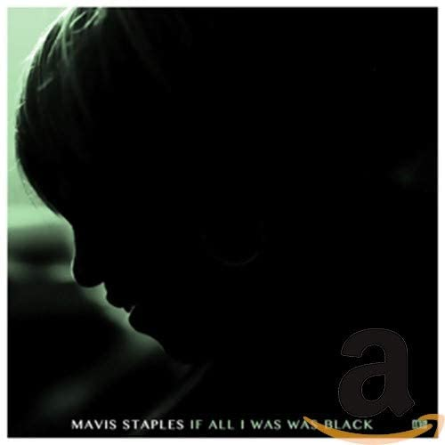

import { Slider, Button } from 'carbon-components-react';
import { ArrowUpRight24  } from '@carbon/icons-react';

import SliderJS1 from "../review/slider1"
import SliderJS2 from "../review/slider2"
import SliderJS3 from "../review/slider3"
import SliderJS4 from "../review/slider4"

import { Link } from "gatsby"

Album review

<h1 className="h1--no--margin">{props.pageContext.frontmatter.title}</h1>

<Link to="/best50/2017/">2017 Black Music Best No.25</Link>

<Row  className="image-card-group">
	<Column colMd={"3"} colLg={"4"} noGutterMdLeft="">
       <ImageCard>

 

</ImageCard>
	</Column>
	<Column colMd={"4"} colLg={"8"} noGutterMdLeft="">
	

	Mavis Staplesの1年振りとなるアルバム。WilcoのJeff Tweedyと3度目のタッグを組んている。前回組んだ前々作と同じ印象で、R&B色は弱く、Rock, Country, Folk, Bluesの要素も交えた如何にもアメリカらしいアルバムになっている。今回の楽曲は全て、そのJeff Tweedyによる新作で、ゆったりしたバンドサウンドの上にMavisの落ち着きつつ、意思が込められた歌声がマッチしている。社会性の高いメッセージを諭すように唄っている。最初、このタイトル、誤植かと思ったのですが、これで文法的にあってるんですね。
	

    

	  <Button className="button-right-mergin"  href="https://amzn.to/2WvFVFQ" kind="primary" size="small" renderIcon={ArrowUpRight24}>
      amazon.com
    </Button>
    <Button className="button-right-mergin"  href="https://amzn.to/3eDZbr6" kind="secondary" size="small" renderIcon={ArrowUpRight24}>
      amazon.co.jp
    </Button>
	

	
	
	</Column>
</Row>
<Row >
	<Column colMd={"4"} colLg={"4"} noGutterMdLeft="">

    <h3>Score card</h3>
	<SliderJS1 value="5" />
    <SliderJS2 value="5" />
	<SliderJS3 value="2" />
    <SliderJS4 value="8" />

</Column>
<Column colMd={"8"} colLg={"8"} noGutterMdLeft="">

<h3>Producers</h3>

Jeff Tweedy(all)

<h3>Guests</h3>

</Column>
</Row>

<h3>Tracks</h3>

| No. |	 Title                  |	 Composers                |	 Performer    |	 Time |
| --- |	----------------------- | --------------------------- | ------------- | ----- |
| 1	  |	Little Bit             	| Jeff Tweedy                 |	Mavis Staples |	03:51 |
| 2	  |	If All I Was Was Black 	| Mavis Staples / Jeff Tweedy |	Mavis Staples |	03:55 |
| 3	  |	Who Told You That      	| Jeff Tweedy                 |	Mavis Staples |	02:48 |
| 4	  |	Ain't No Doubt About It	| Jeff Tweedy                 |	Mavis Staples |	03:18 |
| 5	  |	Peaceful Dream         	| Jeff Tweedy                 |	Mavis Staples |	03:20 |
| 6	  |	No Time for Crying     	| Mavis Staples / Jeff Tweedy |	Mavis Staples |	04:36 |
| 7	  |	Build a Bridge         	| Jeff Tweedy                 |	Mavis Staples |	03:37 |
| 8	  |	We Go High             	| Mavis Staples / Jeff Tweedy |	Mavis Staples |	03:26 |
| 9	  |	Try Harder             	| Jeff Tweedy                 |	Mavis Staples |	03:51 |
| 10  |	All Over Again         	| Jeff Tweedy                 |	Mavis Staples |	01:54 |
