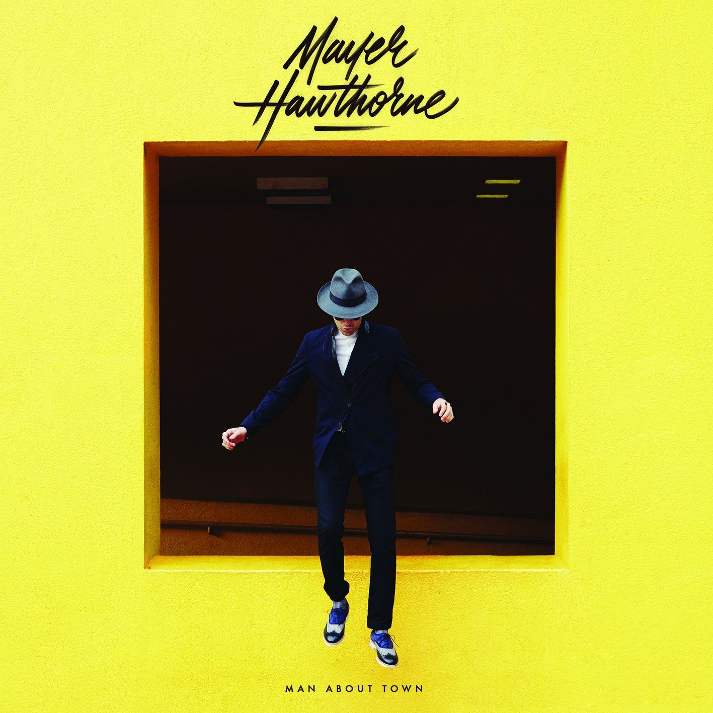

import { Slider, Button } from "carbon-components-react";
import { ArrowUpRight24 } from "@carbon/icons-react";

import SliderJS1 from "../review/slider1";
import SliderJS2 from "../review/slider2";
import SliderJS3 from "../review/slider3";
import SliderJS4 from "../review/slider4";

import { Link } from "gatsby";

Album review

<h1 className="h1--no--margin">{props.pageContext.frontmatter.title}</h1>

 
<Row  className="image-card-group">
	<Column colMd={"3"} colLg={"4"} noGutterMdLeft="">
       <ImageCard>

</ImageCard>
	</Column>
	<Column colMd={"4"} colLg={"8"} noGutterMdLeft="">
	

		Tuxedoでのアルバムをはさんで3年ぶりとなるMayer Hawthorneの4作目。前作より外部Producerは減って、Self Produce曲が増え、相変わらず、Mix, Masteringもこなしているが、パッケージとしてのクオリティはどんどん上がっていると思うし、唄も含めて安定感がある。
		 フィーリーソウルやMotownを下敷きにした、スロー中心のTrackは、メローで上品でPop。単純にメロディが良い曲も多数で、多幸感のようなものも感じられる。
	

	

	  <Button className="button-right-mergin"  href="https://amzn.to/3hdNPeJ" kind="primary" size="small" renderIcon={ArrowUpRight24}>
      amazon.com
    </Button>
    <Button className="button-right-mergin"  href="https://amzn.to/2ZoPrfg" kind="secondary" size="small" renderIcon={ArrowUpRight24}>
      amazon.co.jp
    </Button>
	

	
	</Column>
</Row>
<Row >
	<Column colMd={"4"} colLg={"4"} noGutterMdLeft="">

  <h3>Score card</h3>
	<SliderJS1 value="5" />
  <SliderJS2 value="2" />
	<SliderJS3 value="1" />
  <SliderJS4 value="8" />

</Column>
<Column colMd={"8"} colLg={"8"} noGutterMdLeft="">

<h3>Producers</h3>

	Mayer Hawthorne(1,3,4,5,6,7)
	 Benny Sings amd Mayer Hawthorne(2)
	 Bram Inscore amd Mayer Hawthorne(10)
	 Jack Splash amd Mayer Hawthorne(9)

<h3>Guests</h3>

</Column>
</Row>

<h3>Tracks</h3>

| No. | Title                   | Composers                                                                     | Performer                           | Time  |
| --- | ----------------------- | ----------------------------------------------------------------------------- | ----------------------------------- | ----- |
| 1   | Problematization        | Mayer Hawthorne                                                               | Mayer Hawthorne                     | 00:15 |
| 2   | Back Seat Lover         | Ernest Clark / Andrew Cohen / Eric Jackson / Marcos Palacios / Kevin Randolph | Mayer Hawthorne                     | 03:51 |
| 3   | The Innocent            | Andrew Cohen / Jack Splash                                                    | Mayer Hawthorne                     | 03:22 |
| 4   | Allie Jones             | Andrew Cohen / Warren Felder                                                  | Mayer Hawthorne                     | 04:04 |
| 5   | The Only One            | Andrew Cohen / Jack Splash                                                    | Mayer Hawthorne                     | 03:20 |
| 6   | Wine Glass Woman        | Andrew Cohen / Pharrell Williams                                              | Mayer Hawthorne                     | 03:47 |
| 7   | Her Favorite Song       | Andrew Cohen / Warren Felder                                                  | Mayer Hawthorne                     | 03:43 |
| 8   | Crime                   | Andrew Cohen / Kendrick Duckworth / Warren Felder                             | Mayer Hawthorne with Kandrick Lamar | 04:40 |
| 9   | Reach Out Richard       | Andrew Cohen / Pharrell Williams                                              | Mayer Hawthorne                     | 04:08 |
| 10  | Corsican Ros?           | Andrew Cohen / Warren Felder                                                  | Mayer Hawthorne                     | 04:08 |
| 11  | Where Does This Door Go | Andrew Cohen                                                                  | Mayer Hawthorne                     | 04:18 |
| 12  | Robot Love              | Andrew Cohen / William Curtis / Kid Harpoon / John Hill                       | Mayer Hawthorne                     | 03:27 |
| 13  | The Stars Are Ours      | Andrew Cohen / Pharrell Williams                                              | Mayer Hawthorne                     | 04:31 |
| 14  | All Better              | Andrew Cohen                                                                  | Mayer Hawthorne                     | 04:20 |
