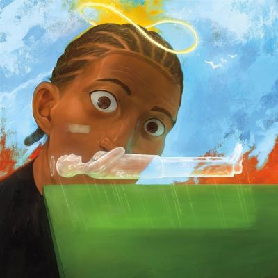

import { Slider, Button } from "@carbon/react";
import { ArrowUpRight } from "@carbon/icons-react";

import SliderJS1 from "../review/slider1";
import SliderJS2 from "../review/slider2";
import SliderJS3 from "../review/slider3";
import SliderJS4 from "../review/slider4";
import AdvJS2 from "../review/adv2";
import AdvJS3 from "../review/adv3";

import { Link } from "gatsby";

Album review

<h1 className="h1--no--margin">{props.pageContext.frontmatter.title}</h1>

  <Link to="/best50/2025/">2025 Black Music Best No.15</Link>

<Row  className="image-card-group">
	<Column colMd={3} colLg={4} noGutterMdLeft="">
       <ImageCard>

</ImageCard>
	</Column>
	<Column colMd={4} colLg={8} noGutterMdLeft="">
		

			Maryland州生まれで、Virginiaをベースに活動するRapper, McKinley Dixonの5th アルバム。黒人作家Toni Morissonの作品にインスパイアされた3部作の締めくくりとなり、少年が失踪した友人を探すというコンセプトに基づいている。
			 サウンドはホーンやストリングスまではいった本格的な生音Jazz Bandをベースにしており、その重厚さに最初から最後まで圧倒される。しかも、小洒落たJazzではなく、躍動感のあるカッコいいJazzである。Hip-Hopっぽい曲やRockっぽい曲もあり、最後まで一気に聴きとおすことができる。
			 McKinleyのRapもいろいろなスタイルを駆使して、ストーリーテラーっぶりを発揮している。
		

		

		  <Button className="button-right-mergin"  href="https://amzn.to/4ntYXGK" renderIcon={ArrowUpRight} size='sm' kind='primary'>
  	    amazon.com
  	  </Button>
  	  <Button className="button-right-mergin"  href="https://amzn.to/3K4MBq1" renderIcon={ArrowUpRight} size='sm' kind='secondary'>
  	    amazon.co.jp
  	  </Button>
			<Button className="button-right-mergin"  href="https://apple.co/4nz6VhX" renderIcon={ArrowUpRight} size='sm' kind='tertiary'>
  	   	apple music
  	  </Button>
			<AdvJS2/>
		

	</Column>
</Row>
<Row >
	<Column colMd={4} colLg={4} noGutterMdLeft="">
		

		  <h3>Score card</h3>
			<SliderJS1 value="1" />
		  <SliderJS2 value="2" />
			<SliderJS3 value="1" />
		  <SliderJS4 value="9" />
		

	</Column>
	<Column colMd={8} colLg={8} noGutterMdLeft="">
		

			<h3>Producers</h3>
			

				Sam E. Yamaha(1,2,3,4,7,8,10,11)
				 Sam Koff(5,6,9)
			

			<h3>Guests</h3>
			

				Quelle Chris, Anjimile, Ghais Guevara, Alfred, Teller Bank$, ICECOLDBISHOP, Pink Shifu, Blu, Shamir
			

		

	</Column>
</Row>

<h3>Tracks</h3>

| No. | Title                                    | Composers                                                | Performer                                      | Time  |
| --- | ---------------------------------------- | -------------------------------------------------------- | ---------------------------------------------- | ----- |
| 1   | Watch My Hands                           | McKinley Dixon / Sam E. Yamaha                           | McKinley Dixon                                 | 01:45 |
| 2   | Sugar Water                              | Anjimile / Quelle Chris / McKinley Dixon / Sam E. Yamaha | McKinley Dixon feat. Quelle Chris, Anjimile    | 02:01 |
| 3   | A Crooked Stick                          | Alfred / McKinley Dixon / Ghais Guevara / Sam E. Yamaha  | McKinley Dixon feat. Ghais Guevara, Alfred     | 02:30 |
| 4   | Recitatif                                | Teller Banks / McKinley Dixon / Sam E. Yamaha            | McKinley Dixon feat. Teller Bank$              | 04:02 |
| 5   | Run, Run, Run, Pt. II                    | McKinley Dixon                                           | McKinley Dixon                                 | 03:07 |
| 6   | We’re Outside, Rejoice!                  | McKinley Dixon                                           | McKinley Dixon                                 | 04:12 |
| 7   | All the Loved Ones (What Would We Do???) | McKinley Dixon / ICECOLDBISHOP / Sam E. Yamaha           | McKinley Dixon feat. ICECOLDBISHOP, Pink Shifu | 04:45 |
| 8   | F.F.O.L                                  | Teller Banks / McKinley Dixon / Sam E. Yamaha            | McKinley Dixon feat. Teller Bank$              | 02:50 |
| 9   | Listen Gentle                            | McKinley Dixon                                           | McKinley Dixon                                 | 04:15 |
| 10  | Magic, Alive!                            | McKinley Dixon / Sam E. Yamaha                           | McKinley Dixon                                 | 02:41 |
| 11  | Could've Been Different                  | Blu / McKinley Dixon / Sam E. Yamaha                     | McKinley Dixon feat. Blu, Shamir               | 02:50 |

<AdvJS3 />
