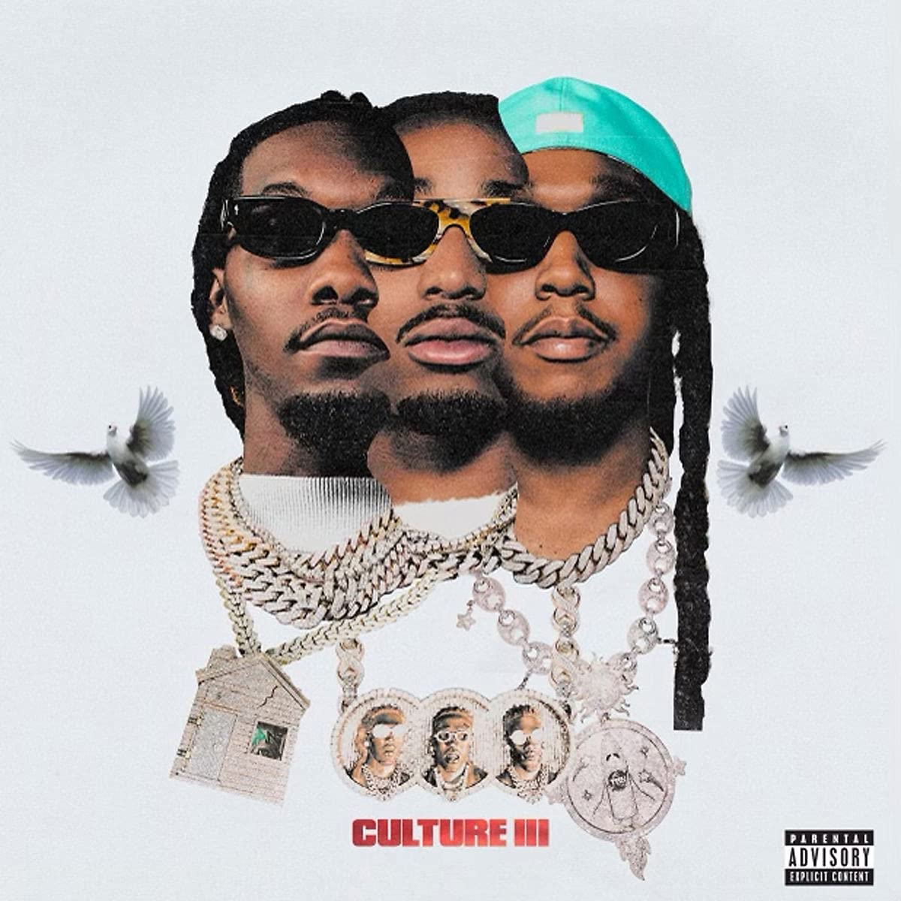

import { Slider, Button } from "carbon-components-react";
import { ArrowUpRight24 } from "@carbon/icons-react";

import SliderJS1 from "../review/slider1";
import SliderJS2 from "../review/slider2";
import SliderJS3 from "../review/slider3";
import SliderJS4 from "../review/slider4";
import AdvJS2 from "../review/adv2";
import AdvJS3 from "../review/adv3";

import { Link } from "gatsby";

import Review1 from "../review/migos2.mdx";
import Review2 from "../review/migos1.mdx";

Album review

<h1 className="h1--no--margin">{props.pageContext.frontmatter.title}</h1>

<Row  className="image-card-group">
	<Column colMd={"3"} colLg={"4"} noGutterMdLeft="">
       <ImageCard>

</ImageCard>
	</Column>
	<Column colMd={"4"} colLg={"8"} noGutterMdLeft="">
		

			Migosの3年ぶりの4作目はCulture3部作の締めくくり。前作の２枚組ほどではないが、今回も19曲75分の長尺アルバムとなっている。また、2年リリースが遅れたらしく、故人となってしまったJuice WRLDやPop Smokeのゲスト作も含まれている。
			 印象的には過去2作の継続で、3連RapとMC3人による掛け合いが核となっていて、安定感やまとまりの良さは流石。哀愁漂うTrackも相変わらずではあるが、かえって、全体としてはやや単調気味であり、Juice WRLD参加(⑬)のEmo Rap、Pop Smoke参加(⑱)のBrooklyn DryllやなんとJustin BieberがVocal参加した⑪などがちょっとしたアクセントになっている。
		

		

		  <Button className="button-right-mergin"  href="https://amzn.to/3riXglz" kind="primary" size="small" renderIcon={ArrowUpRight24}>
  	    amazon.com
  	  </Button>
  	  <Button className="button-right-mergin"  href="https://amzn.to/3D3WU4v" kind="secondary" size="small" renderIcon={ArrowUpRight24}>
  	    amazon.co.jp
  	  </Button>
			<Button className="button-right-mergin"  href="https://apple.co/32HVxw2" kind="tertiary" size="small" renderIcon={ArrowUpRight24}>
  	   	apple music
  	  </Button>
			<AdvJS2/>
		

	</Column>
</Row>
<Row >
	<Column colMd={"4"} colLg={"4"} noGutterMdLeft="">
		

		  <h3>Score card</h3>
			<SliderJS1 value="1" />
		  <SliderJS2 value="2" />
			<SliderJS3 value="2" />
		  <SliderJS4 value="8" />
		

	</Column>
	<Column colMd={"8"} colLg={"8"} noGutterMdLeft="">
		

			<h3>Producers</h3>
			

				DJ Durel and Quavo(1,14)
				 Azul, Jack Lomastro, Preme and  Wallis Lane(2)
				 Atake, DJ Durel, Nuki, Osiris, Slime Castro and  Sluzyyy(3)
				 Ciaga, Murda Beatz, Pooh Beatz, Rvnes, Section 8 and  Tay Keith(4)
				 Abaz, Nas Moore, Pooh Beatz, Sool Got Hits and  X-Plosive(5)
				 GT, Jack Lomastro, OG Parker, Smash David and  Wallis Lane(6)
				 Jordan Fox and  Murda Beatz(7)
				 Buddah Bless and  JabzJabz(8)
				 DJ Durel, Gunboi and  PVLACE(9)
				 Trauma Tone and  Zaytoven(10)
				 DJ Durel, Danny Wolf and  Fraxille(11)
				 Carnage, CuBeatz, Nils and  Tay Keith(12)
				 Murda Beatz and  Sool Got Hits(13)
				 BGudini and  DJ Durel(15)
				 OZ(16)
				 Marcel Korkutata, Murda Beatz and  Sonic(17)
				 808Melo, Fabio Aguillarr, Swirv and  Keanu Beats(18)
				 Buddah Bless(19)
			

			<h3>Guests</h3>
			

				Drake, Cardi B, Polo G, Future, Justin Bieber, Juice WRLD, Pop Smoke, YoungBoy Never Broke Again
			

		

	</Column>
</Row>

<h3>Tracks</h3>

| No. | Title              | Composers                                                                                                                                                                                         | Performer                              | Time  |
| --- | ------------------ | ------------------------------------------------------------------------------------------------------------------------------------------------------------------------------------------------- | -------------------------------------- | ----- |
| 1   | Avalanche          | Kirsnick Ball / Daryl McPherson / Offset / Quavo / Barrett Strong / Norman Whitfield                                                                                                              | Migos                                  | 03:30 |
| 2   | Having Our Way     | Amir Stivie B / Kirsnick Ball / Drake / Nima Jahanbin / Paimon Jahanbin / Jack Lomastro / Offset / Quavo / Tyshane Thompson                                                                       | Migos feat: Drake                      | 04:43 |
| 3   | Straightenin       | Kirsnick Ball / Tom Dettinger / Latos Konstantinos / Kilian Mbelo / Daryl McPherson / Offset / Quavo / Anh-Tuan Antoine Tran / Chi Nhan Trieu                                                     | Migos                                  | 04:16 |
| 4   | Type Shit          | Belcalis Almanzar / Kirsnick Ball / Quentin Leo Boehnke / Torae Carr / Darryl Clemons / Jacob Michael Deimler / Tay Keith / Shane Lindstrom / Offset / Quavo / Jordan Thorpe / Rai'Shaun Williams | Migos feat: Cardi B                    | 03:09 |
| 5   | Malibu             | Kirsnick Ball / Darryl Clemons / Rasool Diaz / Polo G / Nasir Moore / Offset / Quavo                                                                                                              | Migos feat: Polo G                     | 04:08 |
| 6   | Birthday           | Kirsnick Ball / Nima Jahanbin / Paimon Jahanbin / Samuel Jimenez / Offset / Joshua Parker / Quavo                                                                                                 | Migos                                  | 03:50 |
| 7   | Modern Day         | Kirsnick Ball / Jordan Fox / Shane Lindstrom / Offset / Quavo                                                                                                                                     | Migos                                  | 04:02 |
| 8   | Vaccine            | Kirsnick Ball / Tyron Douglas / Offset / Quavo                                                                                                                                                    | Migos                                  | 03:41 |
| 9   | Picasso            | Kirsnick Ball / Denis Berger / Daryl McPherson / Offset / Quavo / Nayvadius Wilburn                                                                                                               | Migos feat: Future                     | 03:33 |
| 10  | Roadrunner         | Kirsnick Ball / Xavier Dotson / John Antonio Carrington, Jr. / Offset / Quavo                                                                                                                     | Migos                                  | 04:16 |
| 11  | What You See       | Kirsnick Ball / Justin Bieber / Miguel Curtidor / Daryl McPherson / Jerel Nance / Offset / Quavo                                                                                                  | Migos feat: Justin Bieber              | 03:00 |
| 12  | Jane               | Kirsnick Ball / Diamante Blackmon / Kevin Gomringer / Tim Gomringer / Tay Keith / Nils Nohden / Offset / Quavo                                                                                    | Migos                                  | 03:21 |
| 13  | Antisocial         | Kirsnick Ball / Rasool Diaz / Jarad Higgins / Shane Lindstrom / Offset / Quavo                                                                                                                    | Migos feat: Juice WRLD                 | 04:25 |
| 14  | Why Not            | Kirsnick Ball / Daryl McPherson / Jerel Nance / Offset / Quavo                                                                                                                                    | Migos                                  | 03:49 |
| 15  | Mahomes            | Kirsnick Ball / Daryl McPherson / Offset / Gleb Protasov / Quavo                                                                                                                                  | Migos                                  | 05:07 |
| 16  | Handle My Business | Kirsnick Ball / Offset / Quavo / Ozan Yildirim                                                                                                                                                    | Migos                                  | 04:38 |
| 17  | Time for Me        | Kirsnick Ball / Marcel Korkutata / Shane Lindstrom / Offset / Quavo                                                                                                                               | Migos                                  | 03:59 |
| 18  | Light It Up        | Fabio Aguilar / Kirsnick Ball / Patrick Ellis / Andre Loblack / Ellis Newton / Offset / Quavo / Pop Smoke / Keanu Torres                                                                          | Migos feat: Pop Smoke                  | 04:29 |
| 19  | Need It            | Kirsnick Ball / Tony Cottrell / Tyron Douglas / Kentrell Gaulden / Curtis Jackson / Offset / Quavo                                                                                                | Migos feat: YoungBoy Never Broke Again | 03:16 |

<Row>
  <Column colMd={3} colLg={3} noGutterMdLeft>
    <Review1 />
  </Column>
	<Column colMd={3} colLg={3} noGutterMdLeft>
    <Review2 />
  </Column>
</Row>