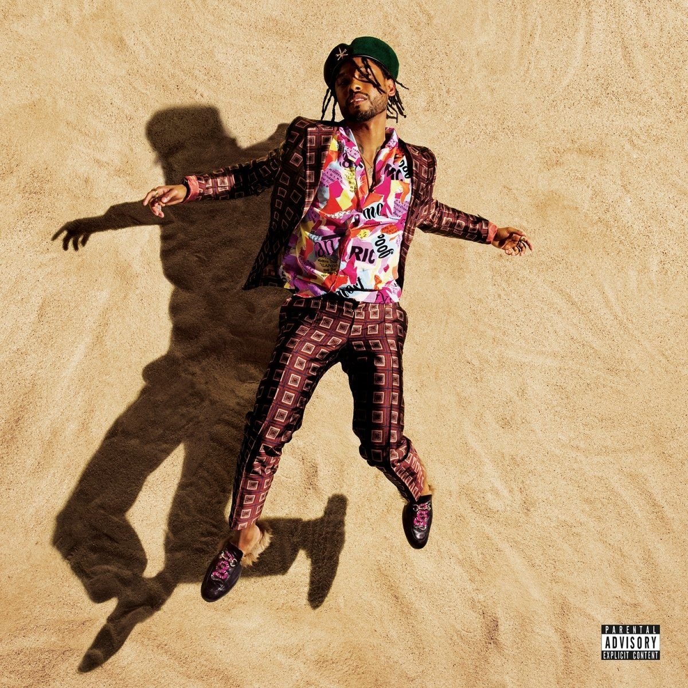

import { Slider, Button } from 'carbon-components-react';
import { ArrowUpRight24  } from '@carbon/icons-react';

import SliderJS1 from "../review/slider1"
import SliderJS2 from "../review/slider2"
import SliderJS3 from "../review/slider3"
import SliderJS4 from "../review/slider4"

import { Link } from "gatsby"

CD review

<h1 className="h1--no--margin">{props.pageContext.frontmatter.title}</h1>

<Link to="/best50/2017/">2017 Black Music Best No.26</Link>

<Row  className="image-card-group">
	<Column colMd={"4"} colLg={"4"} noGutterMdLeft="">
       <ImageCard>

 

</ImageCard>6
	</Column>
	<Column colMd={"8"} colLg={"8"} noGutterMdLeft="">
	

	前作が高評価を得たMiguelの2年ぶりの4作目。最近は映画にも進出している。ロック寄りだったその前作に比べるとR&Bへの揺り戻しを感じる。また、明るい曲やラテンっぽい曲もあって、逆に今までの捻じれた感触はやや薄まり、結果、一層聴きやすくなった。また、メロディやMiguelのVocalに比重が置かれている気がするし、官能的なところが特徴だったMiguelの唄も力強くシャウトするものなど、表現の幅が広がってると思う。前作引き続きのProducerがメインだが、Happy Perezが多くを担当し、Trackにも工夫があって面白い。RapperのGuestが要所要所に参加し、華を添えている。
	

    

	  <Button href="https://amzn.to/32zUP1x" kind="primary" size="small" renderIcon={ArrowUpRight24}>
      amazon.com
      </Button>
      <Button href="https://amzn.to/2Wy71fw" kind="secondary" size="small" renderIcon={ArrowUpRight24}>
      amazon.co.jp
      </Button>
	

	
	
	</Column>
</Row>
<Row >
	<Column colMd={"4"} colLg={"4"} noGutterMdLeft="">

    <h3>Score card</h3>
	<SliderJS1 value="4" />
    <SliderJS2 value="1" />
	<SliderJS3 value="1" />
    <SliderJS4 value="9" />

</Column>
<Column colMd={"8"} colLg={"8"} noGutterMdLeft="">

<h3>Producers</h3>

David Andrew Sitek and Miguel(1)
 Detail(2)
 Happy Perez and Miguel(3,6,8,12)
 Miguel and Steve Mostyn(4,9)
 Raphael Saasiq(5)
 Miguel, Happy Perez and Jeff Bhasker(7)
 Salaamremi.com(10)
 Jerry "Wonda" Duplessis and Miguel(11)

<h3>Guests</h3>

Rick Ross, Travis Scott, Quin, J. Cole, Salaam Remi, Kali Uchis

</Column>
</Row>

<h3>Tracks</h3>

| No. |	 Title                 |	 Composers                                                                                                           |	 Performer                       | Time	 |
| --- |	---------------------- | ----------------------------------------------------------------------------------------------------------------------- | --------------------------------- | ----- |
| 1	  |	Criminal               | Miguel Pimentel / William Roberts / David Andrew Sitek                                                                  | Miguel feat. Rick Ross            | 04:34 |
| 2	  |	Pineapple Skies        | Eyal Federman / Noel Fisher / Marvin Gaye / Odell Brown Jr. / Miguel Pimentel / Salaam Remi / David Ritz / Sidney Swift | Miguel feat, Travis Scott         | 04:41 |
| 3	  |	Sky Walker             | Roget Chahayed / Nathan Perez / Miguel Pimentel / Jacques Webster                                                       | Miguel                            | 04:19 |
| 4	  |	Banana Clip            | Steve Mostyn / Miguel Pimentel                                                                                          | Miguel                            | 03:21 |
| 5	  |	Wolf                   | Miguel Pimentel / Raphael Saadiq / Dylan Wiggins                                                                        | Miguel feat. Quin                 | 03:29 |
| 6	  |	Harem                  | Nathan Perez / Miguel Pimentel                                                                                          | Miguel                            | 03:13 |
| 7	  |	Told You So            | Jeff Bhasker / Nathan Perez / Miguel Pimentel                                                                           | Miguel                            | 03:10 |
| 8	  |	City of Angels         | Nathan Perez / Miguel Pimentel                                                                                          | Miguel                            | 04:18 |
| 9	  |	Caramelo Duro          | Steve Mostyn / Miguel Pimentel                                                                                          | Miguel feat/ Kali Uchis           | 03:33 |
| 10  |	Come Through and Chill | Jermaine Cole / Miguel Pimentel / Salaam Remi / James Yancey                                                            | Miguel feat. J. Cole, Salaam Remi | 05:21 |
| 11  |	Anointed               | Arden Altino / Jerry "Wonda" Duplessis / Bernard Grobman / Miguel Pimentel                                              | Miguel                            | 03:53 |
| 12  |	Now                    | Nathan Perez / Miguel Pimentel / Charles Thompson                                                                       | Miguel                            | 04:09 |
