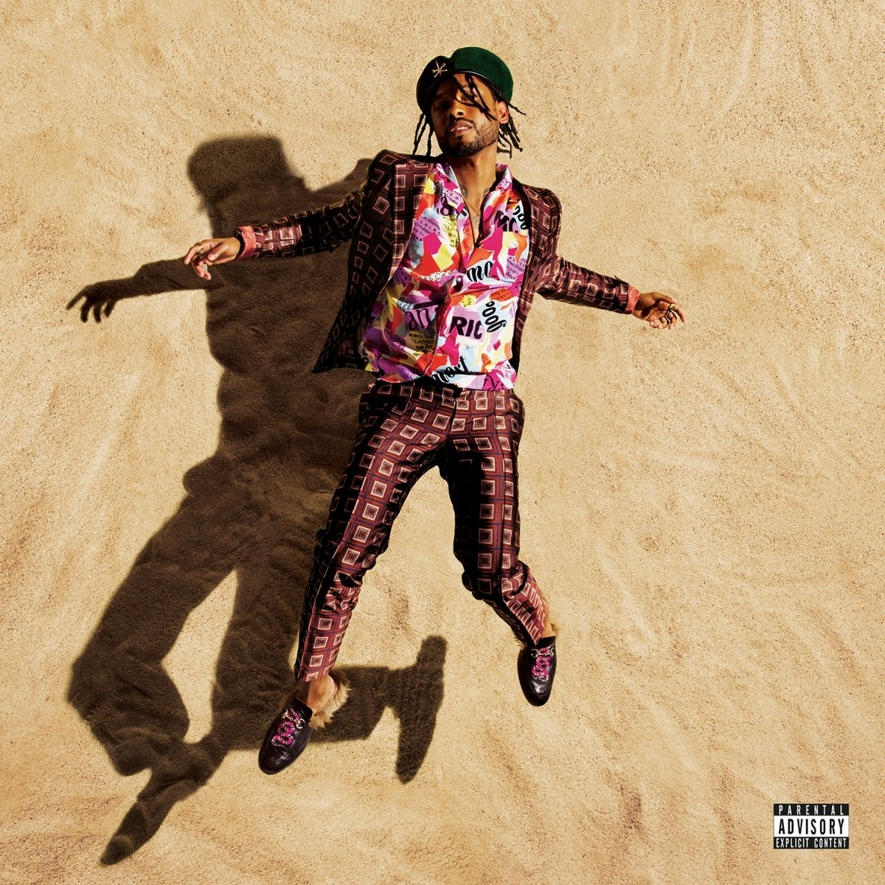

import { Slider, Button } from "@carbon/react";
import { ArrowUpRight } from "@carbon/icons-react";

import SliderJS1 from "../review/slider1";
import SliderJS2 from "../review/slider2";
import SliderJS3 from "../review/slider3";
import SliderJS4 from "../review/slider4";
import AdvJS2 from "../review/adv2";
import AdvJS3 from "../review/adv3";

import { Link } from "gatsby";

Album review

<h1 className="h1--no--margin">{props.pageContext.frontmatter.title}</h1>

  <Link to="/best50/2017/">2017 Black Music Best No.26</Link>

<Row  className="image-card-group">
	<Column colMd={3} colLg={4} noGutterMdLeft="">
       <ImageCard>

</ImageCard>
	</Column>
	<Column colMd={4} colLg={8} noGutterMdLeft="">
		

			前作が高評価を得たMiguelの2年ぶりの4作目。最近は映画にも進出している。ロック寄りだったその前作に比べるとR&Bへの揺り戻しを感じる。また、明るい曲やラテンっぽい曲もあって、逆に今までの捻じれた感触はやや薄まり、結果、一層聴きやすくなった。
			 メロディやMiguelのVocalに比重が置かれている気がするし、官能的なところが特徴だったMiguelの唄も力強くシャウトするものなど、表現の幅が広がってると思う。
			 前作引き続きのProducerがメインだが、Happy Perezが多くを担当し、Trackにも工夫があって面白い。RapperのGuestが要所要所に参加し、華を添えている。
		

  	  

		  <Button className="button-right-mergin"  href="https://amzn.to/32zUP1x" renderIcon={ArrowUpRight} size='sm' kind='primary'>
  	    amazon.com
  	  </Button>
  	  <Button className="button-right-mergin"  href="https://amzn.to/2Wy71fw" renderIcon={ArrowUpRight} size='sm' kind='secondary'>
  	    amazon.co.jp
  	  </Button>
			<Button className="button-right-mergin"  href="https://apple.co/3Vg1BVt" renderIcon={ArrowUpRight} size='sm' kind='tertiary'>
				apple music
			</Button>
		<AdvJS2/>
		

	</Column>
</Row>
<Row >
	<Column colMd={4} colLg={4} noGutterMdLeft="">

  <h3>Score card</h3>
	<SliderJS1 value="4" />
  <SliderJS2 value="1" />
	<SliderJS3 value="1" />
  <SliderJS4 value="9" />

</Column>
<Column colMd={8} colLg={8} noGutterMdLeft="">

<h3>Producers</h3>

	David Andrew Sitek and Miguel(1)
	 Detail(2)
	 Happy Perez and Miguel(3,6,8,12)
	 Miguel and Steve Mostyn(4,9)
	 Raphael Saasiq(5)
	 Miguel, Happy Perez and Jeff Bhasker(7)
	 Salaamremi.com(10)
	 Jerry "Wonda" Duplessis and Miguel(11)

<h3>Guests</h3>

	Rick Ross, Travis Scott, Quin, J. Cole, Salaam Remi, Kali Uchis

</Column>
</Row>

<h3>Tracks</h3>

| No. | Title                  | Composers                                                                                                               | Performer                         | Time  |
| --- | ---------------------- | ----------------------------------------------------------------------------------------------------------------------- | --------------------------------- | ----- |
| 1   | Criminal               | Miguel Pimentel / William Roberts / David Andrew Sitek                                                                  | Miguel feat. Rick Ross            | 04:34 |
| 2   | Pineapple Skies        | Eyal Federman / Noel Fisher / Marvin Gaye / Odell Brown Jr. / Miguel Pimentel / Salaam Remi / David Ritz / Sidney Swift | Miguel feat, Travis Scott         | 04:41 |
| 3   | Sky Walker             | Roget Chahayed / Nathan Perez / Miguel Pimentel / Jacques Webster                                                       | Miguel                            | 04:19 |
| 4   | Banana Clip            | Steve Mostyn / Miguel Pimentel                                                                                          | Miguel                            | 03:21 |
| 5   | Wolf                   | Miguel Pimentel / Raphael Saadiq / Dylan Wiggins                                                                        | Miguel feat. Quin                 | 03:29 |
| 6   | Harem                  | Nathan Perez / Miguel Pimentel                                                                                          | Miguel                            | 03:13 |
| 7   | Told You So            | Jeff Bhasker / Nathan Perez / Miguel Pimentel                                                                           | Miguel                            | 03:10 |
| 8   | City of Angels         | Nathan Perez / Miguel Pimentel                                                                                          | Miguel                            | 04:18 |
| 9   | Caramelo Duro          | Steve Mostyn / Miguel Pimentel                                                                                          | Miguel feat/ Kali Uchis           | 03:33 |
| 10  | Come Through and Chill | Jermaine Cole / Miguel Pimentel / Salaam Remi / James Yancey                                                            | Miguel feat. J. Cole, Salaam Remi | 05:21 |
| 11  | Anointed               | Arden Altino / Jerry "Wonda" Duplessis / Bernard Grobman / Miguel Pimentel                                              | Miguel                            | 03:53 |
| 12  | Now                    | Nathan Perez / Miguel Pimentel / Charles Thompson                                                                       | Miguel                            | 04:09 |

<AdvJS3 />
