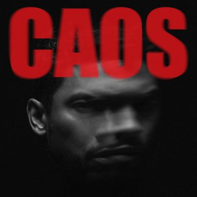

import { Slider, Button } from "@carbon/react";
import { ArrowUpRight } from "@carbon/icons-react";

import SliderJS1 from "../review/slider1";
import SliderJS2 from "../review/slider2";
import SliderJS3 from "../review/slider3";
import SliderJS4 from "../review/slider4";
import AdvJS2 from "../review/adv2";
import AdvJS3 from "../review/adv3";

import { Link } from "gatsby";
import Review1 from "../review/miguel3.mdx";

Album Review

<h1 className="h1--no--margin">{props.pageContext.frontmatter.title}</h1>

<Row  className="image-card-group">
	<Column colMd={3} colLg={4} noGutterMdLeft="">
       <ImageCard>

</ImageCard>
	</Column>
	<Column colMd={4} colLg={8} noGutterMdLeft="">
		

			Miguelのなんと8年ぶりとなる5枚目のスタジオアルバム。彼自身の40歳の誕生日である2025年10月23日にリリースされた。
			 タイトルが示す通り、離婚や父性の芽生えといった私生活の激動と、現代社会の混乱が色濃く反映された極めてパーソナルな作品で、本人が語るように、自己を再構築するためには一度自身を破壊しなければならず、怒りと愛、破壊と創造という相反する感情が渦巻き、新たなアイデンティティを獲得するまでの精神的な変容のプロセスが克明に描かれている。
			サウンドはロック色強めで、前半は歪んだギターノイズやアグレッシブなビートが際立つ、攻撃的でサイケデリックなオルタナティヴ・ロックサウンドが支配している。
			しかし中盤以降は、温かみのあるアコースティックなバラードや、彼特有のドリーミーで甘美なスロウジャムへとシームレスに移行し、最後は壮大で妖艶なファンクで幕を閉じる。自身も制作に多くかかわり、多彩で実験的な音響を構築している。
			 甘美で官能的な歌声は健在で、感情を爆発させるような荒々しい咆哮から、エフェクトを通したロボットのような冷ややかなボーカル、そして我が子へ向けた優しく静謐な歌唱まで、楽曲が持つ多様な感情の振幅を見事に表現している。
      自身のルーツであるメキシコ系の背景と深く向き合い、スペイン語と英語を織り交ぜて歌っている点も特徴と言えそうだ。
		

		

		  <Button className="button-right-mergin"  href="https://amzn.to/4p77d1s" renderIcon={ArrowUpRight} size='sm' kind='primary'>
  	    amazon.com
  	  </Button>
  	  <Button className="button-right-mergin"  href="https://amzn.to/4bowrm8" renderIcon={ArrowUpRight} size='sm' kind='secondary'>
  	    amazon.co.jp
  	  </Button>
			<Button className="button-right-mergin"  href="https://apple.co/4eXsEgz" renderIcon={ArrowUpRight} size='sm' kind='tertiary'>
  	    apple music
  	  </Button>
		<AdvJS2/>
		

	</Column>
</Row>
<Row >
	<Column colMd={4} colLg={4} noGutterMdLeft="">
		

		  <h3>Score card</h3>
			<SliderJS1 value="5" />
		  <SliderJS2 value="2" />
			<SliderJS3 value="1" />
		  <SliderJS4 value="9" />
		

	</Column>
	<Column colMd={4} colLg={8} noGutterMdLeft="">
		

			<h3>Producers</h3>
			

				Miguel and Ray Brady(1,3)
				 Miguel, Jimmy Edgar, Ray Brady and Nonchalant Savant(2)
				 Miguel(4,7,8)
				 Miguel, Dion Lee and MAJOR.(5)
				 Dahi and Ely Rise(6)
				 Miguel, Rob Bisel and Carter Lang(9)
				 Miguel and Ben &quot;Bengineer&quot; Chang(10)
				 Miguel, Jeff Bhasker, David Andrew Sitek, Ray Brady and Jerry Duplessis(11)
				 Miguel, Steve Mostyn and David Andrew Sitek(12)
			

			<h3>Guests</h3>
			

				George Clinton
			

		

	</Column>
</Row>

<h3>Tracks</h3>

| No. | Title                  | Composers                                                                     | Performer                   | Time |
| --- | ---------------------- | ----------------------------------------------------------------------------- | --------------------------- | ---- |
| 1   | Caos                   | Miguel Pimentel, Ray Brady                                                    | Miguel                      | 3:17 |
| 2   | The Killing            | Miguel Pimentel, Ray Brady, Jimmy Edgar, Nicholas Pimentel                    | Miguel                      | 3:35 |
| 3   | RIP                    | Miguel Pimentel, Ray Brady                                                    | Miguel                      | 2:44 |
| 4   | New Martyrs (Ride 4 U) | Miguel Pimentel                                                               | Miguel                      | 3:30 |
| 5   | Triggered              | Miguel Pimentel, Dion Lee, Major                                              | Miguel                      | 1:59 |
| 6   | El Pleito              | Miguel Pimentel, Dacoury Natche, Ely Rise, Victor Salines                     | Miguel                      | 2:34 |
| 7   | Perderme               | Miguel Pimentel                                                               | Miguel                      | 2:10 |
| 8   | Oscillate              | Miguel Pimentel                                                               | Miguel                      | 2:13 |
| 9   | Nearsight [SID]        | Miguel Pimentel, Rob Bisel, Carter Lang                                       | Miguel                      | 4:18 |
| 10  | Angel&#39;s Song       | Miguel Pimentel                                                               | Miguel                      | 3:25 |
| 11  | Always Time            | Miguel Pimentel, Jeff Bhasker, Ray Brady, Jerry Duplessis, David Andrew Sitek | Miguel                      | 3:24 |
| 12  | Comma / Karma          | Miguel Pimentel, George Clinton, Steve Mostyn, David Andrew Sitek             | Miguel feat. George Clinton | 3:40 |

<h3>Other Reviews</h3>

<Row>
  <Column colMd={3} colLg={3} noGutterMdLeft>
    <Review1 />
  </Column>
</Row>

<AdvJS3 />
