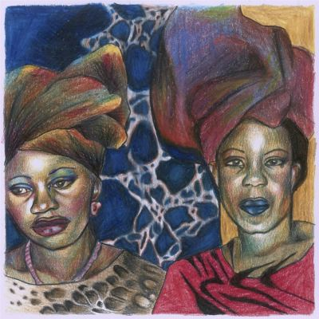

import { Slider, Button } from "@carbon/react";
import { ArrowUpRight } from "@carbon/icons-react";

import SliderJS1 from "../review/slider1";
import SliderJS2 from "../review/slider2";
import SliderJS3 from "../review/slider3";
import SliderJS4 from "../review/slider4";
import AdvJS2 from "../review/adv2";
import AdvJS3 from "../review/adv3";

import { Link } from "gatsby";

Album review

<h1 className="h1--no--margin">{props.pageContext.frontmatter.title}</h1>

<Row  className="image-card-group">
	<Column colMd={3} colLg={4} noGutterMdLeft="">
       <ImageCard>

</ImageCard>
	</Column>
	<Column colMd={4} colLg={8} noGutterMdLeft="">
		

			New Jersey生まれで、NYをベースに活躍するRapper, ProducerであるMIKEの2025年初頭にリリースされたアルバム。近年、立て続きにアルバムをドロップし、この後も既に一枚リリースしているほどの多作家であり、NYアンダーグラウンドをリードしている人でもある。
			 ほとんどの曲のProduceを別名のdj blackpowerにて担い、短めの曲が多いので、アイデアから完成までを短サイクルでこなしてそう。サンプリングが主体なのも特徴で、R&B, Jazz、Fusionなどからの落ち着いた曲からの引用が多く、結果、Trackもゆったりとした流麗なものが多くなっている。
			 これにMIKEの太目なバリトンボイスが加わり、独特な全体感となっている。
		

    

	  	<Button className="button-right-mergin"  href="https://amzn.to/4oQEqwm" renderIcon={ArrowUpRight} size='sm' kind='primary'>
    	  amazon.com
    	</Button>
    	<Button className="button-right-mergin"  href="https://amzn.to/4pzacyY" renderIcon={ArrowUpRight} size='sm' kind='secondary'>
    	  amazon.co.jp
    	</Button>
    	<Button className="button-right-mergin"  href="https://apple.co/3KXZ3bY" renderIcon={ArrowUpRight} size='sm' kind='tertiary'>
    	  apple music
			</Button>
			<AdvJS2/>
		

	</Column>
</Row>
<Row >
	<Column colMd={4} colLg={4} noGutterMdLeft="">
		

    	<h3>Score card</h3>
			<SliderJS1 value="1" />
    	<SliderJS2 value="2" />
			<SliderJS3 value="2" />
    	<SliderJS4 value="9" />
		

	</Column>
	<Column colMd={8} colLg={8} noGutterMdLeft="">
		

			<h3>Producers</h3>
			

				DJ Paradise and dj blackpower(1,6)
				 Jacob Rochester(2)
				 dj blackpower(3,4,,5,9,10,12,13,14,15,16,17,20,21,22,23,24)
				 dj blackpower, Anysia Kym and 454('7)
				 Harrison and dj blackpower(8)
				 ShunGu(11)
				 Lindsay Olson(18)
				 Thelonious Martin and Jacob Rochester(19)
			

			<h3>Guests</h3>
			

				Venna, 454, Surf Gang, duendita
			

		

	</Column>
</Row>

<h3>Tracks</h3>

| No. | Title                            | Composers                                                       | Performer            | Time  |
| --- | -------------------------------- | --------------------------------------------------------------- | -------------------- | ----- |
| 1   | Bear Trap                        | Michael Jordan Bonema                                           | MIKE                 | 02:50 |
| 2   | Clown of the Class (Work Harder) | Michael Jordan Bonema, Jacob Rochester                          | MIKE                 | 01:16 |
| 3   | Then we could be free..          | Michael Jordan Bonema                                           | MIKE                 | 01:28 |
| 4   | Watered down                     | Michael Jordan Bonema                                           | MIKE                 | 01:52 |
| 5   | man in the mirror                | Michael Jordan Bonema                                           | MIKE                 | 01:51 |
| 6   | Artist of the Century            | Michael Jordan Bonema, DJ Paradise                              | MIKE feat. Venna     | 02:53 |
| 7   | What U Bouta Do?/A Star was Born | Michael Jordan Bonema, Willie Wilson, Anysia Kym                | MIKE feat. 454       | 02:30 |
| 8   | Belly 1                          | Michael Jordan Bonema, Harrison                                 | MIKE feat. Surf Gang | 01:37 |
| 9   | Da Roc                           | Michael Jordan Bonema                                           | MIKE                 | 01:20 |
| 10  | The Weight (2k20)                | Michael Jordan Bonema                                           | MIKE                 | 01:16 |
| 11  | Lost Scribe                      | Michael Jordan Bonema, ShunGu                                   | MIKE                 | 01:36 |
| 12  | You're the Only One Watching     | Michael Jordan Bonema                                           | MIKE                 | 02:05 |
| 13  | Lucky                            | Michael Jordan Bonema                                           | MIKE                 | 02:15 |
| 14  | #82                              | Michael Jordan Bonema                                           | MIKE                 | 01:56 |
| 15  | Too Hot (Interlude)              | Michael Jordan Bonema                                           | MIKE                 | 00:53 |
| 16  | Pieces of a Dream                | Michael Jordan Bonema                                           | MIKE                 | 02:38 |
| 17  | Strange Feeling                  | Michael Jordan Bonema                                           | MIKE                 | 02:01 |
| 18  | Zombie, Pt. 2                    | Michael Jordan Bonema, Lindsay Olson                            | MIKE                 | 01:37 |
| 19  | Burning House                    | Michael Jordan Bonema, Thelonious Martin and Jacob Rochester    | MIKE                 | 03:00 |
| 20  | Showbiz (Intro)                  | Michael Jordan Bonema, Laron Wages                              | MIKE                 | 02:02 |
| 21  | Spun Out                         | Michael Jordan Bonema                                           | MIKE                 | 02:32 |
| 22  | Miss U                           | Michael Jordan Bonema, duendita, Jeremy McCoulsky, Malik Venner | MIKE feat. duendita  | 01:31 |
| 23  | When It Rains                    | Michael Jordan Bonema, Laron Wages                              | MIKE                 | 01:58 |
| 24  | Diamond Dancing (Broke)          | Michael Jordan Bonema, Malik Venner                             | MIKE                 | 02:35 |

<AdvJS3 />
