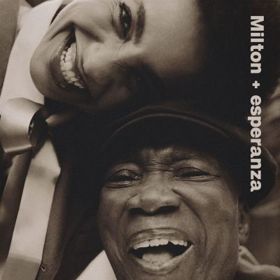

import { Slider, Button } from "@carbon/react";
import { ArrowUpRight } from "@carbon/icons-react";

import SliderJS1 from "../review/slider1";
import SliderJS2 from "../review/slider2";
import SliderJS3 from "../review/slider3";
import SliderJS4 from "../review/slider4";
import AdvJS2 from "../review/adv2";
import AdvJS3 from "../review/adv3";

import { Link } from "gatsby";
import Review1 from "../review/espalding3.mdx";

Album Review

<h1 className="h1--no--margin">{props.pageContext.frontmatter.title}</h1>

<Row  className="image-card-group">
	<Column colMd={3} colLg={4} noGutterMdLeft="">
       <ImageCard>

</ImageCard>
	</Column>
	<Column colMd={4} colLg={8} noGutterMdLeft="">
		

			Esperanza Spaldingがブラジルの至宝Milton Nascimentoと組んだ年齢差40歳オーバーのDuo作。Esperanzaが全曲Produceし、フォームとしてはJazzがベースではあるが、Miltonの楽曲数曲含めて半数近くはポルトガル語の唄になる。
			 全体的には静謐なトーンとなっているが、ところどころアバンギャルドなところもあって、Espelanzaの趣向が現れている。
			 渋さマックスのMiltonの声と可憐なEsperanzaの声は絶妙な親密感があって染みてくる。ゲストはDianne Reeves, Lianne La Havasといった女性Vocalに加え、Miltonの旧友、Paul Simonに、Wayne Shorterの⑯ではWayneの元妻のCarolinaと後半にかけて聴きどころも増えてくる。
			 80歳を越えて衰えが隠せないMiltonではあるが、Esperanzaの敬愛の念がそれを上回って、心暖まる作品になっている。
		

		

		  <Button className="button-right-mergin"  href="https://amzn.to/3M1BQGx" renderIcon={ArrowUpRight} size='sm' kind='primary'>
  	    amazon.com
  	  </Button>
  	  <Button className="button-right-mergin"  href="https://amzn.to/4qX0G9D" renderIcon={ArrowUpRight} size='sm' kind='secondary'>
  	    amazon.co.jp
  	  </Button>
			<Button className="button-right-mergin"  href="https://apple.co/3ZgSvcc" renderIcon={ArrowUpRight} size='sm' kind='tertiary'>
  	    apple music
  	  </Button>
		<AdvJS2/>
		

	</Column>
</Row>
<Row >
	<Column colMd={4} colLg={4} noGutterMdLeft="">
		

		  <h3>Score card</h3>
			<SliderJS1 value="5" />
		  <SliderJS2 value="2" />
			<SliderJS3 value="2" />
		  <SliderJS4 value="8" />
		

	</Column>
	<Column colMd={4} colLg={8} noGutterMdLeft="">
		

			<h3>Producers</h3>
			

				Esperanza Spalding(all)
			

			<h3>Guests</h3>
			

				Guinga, Elena,Pinderhughes, Orquestra Ouro Preto, Dianne Reeves, Lianne La Havas, Maria Gadú, Tim Bernardes, Lula Galvão, Paul Simon, Carolina Shorter, Shabaka Hutchings
			

		

	</Column>
</Row>

<h3>Tracks</h3>

| No. | Title                                             | Composers                         | Performer                                                                                            | Time |
| --- | ------------------------------------------------- | --------------------------------- | ---------------------------------------------------------------------------------------------------- | ---- |
| 1   | The Music was there                               | Justin Tyson                      | Milton Nascimento / Esperanza Spalding                                                               | 0:57 |
| 2   | Cais                                              | Milton Nascimento, Ronaldo Bastos | Milton Nascimento / Esperanza Spalding                                                               | 3:41 |
| 3   | Late September                                    | Esperanza Spalding                | Milton Nascimento / Esperanza Spalding                                                               | 1:26 |
| 4   | Outubro                                           | Milton Nascimento                 | Milton Nascimento / Esperanza Spalding                                                               | 5:17 |
| 5   | A Day in the Life                                 | John Lennon, Paul McCartney       | Milton Nascimento / Esperanza Spalding                                                               | 4:36 |
| 6   | Interlude for Saci                                | Corey King                        | Milton Nascimento / Esperanza Spalding                                                               | 1:41 |
| 7   | Saci                                              | Guinga, Paulo César Pinheiro      | Milton Nascimento / Esperanza Spalding feat. Guinga                                                  | 3:29 |
| 8   | Wings for the Thought Bird                        | Esperanza Spalding                | Milton Nascimento / Esperanza Spalding feat. Elena,Pinderhughes, Orquestra Ouro Preto                | 3:06 |
| 9   | The Way You Are                                   | Esperanza Spalding                | Milton Nascimento / Esperanza Spalding                                                               | 0:43 |
| 10  | Earth Song                                        | Michael Jackson                   | Milton Nascimento / Esperanza Spalding feat. Dianne Reeves                                           | 6:42 |
| 11  | Morro Velho                                       | Milton Nascimento                 | Milton Nascimento / Esperanza Spalding feat. Orquestra Ouro Preto                                    | 5:15 |
| 12  | Saudade Dos Aviões Da Panair (Conversando No Bar) | Milton Nascimento, Fernando Brant | Milton Nascimento / Esperanza Spalding feat. Lianne La Havas, Maria Gadú, Tim Bernardes, Lula Galvão | 5:24 |
| 13  | Um Vento Passou (Para Paul Simon)                 | Márcio Borges, Milton Nascimento  | Milton Nascimento / Esperanza Spalding feat. Paul Simon                                              | 4:36 |
| 14  | Get It by Now                                     | Esperanza Spalding                | Milton Nascimento / Esperanza Spalding                                                               | 2:24 |
| 15  | outro planeta                                     | Justin Tyson                      | Milton Nascimento / Esperanza Spalding                                                               | 2:06 |
| 16  | When You Dream                                    | Wayne Shorter, Eddy Lee           | Milton Nascimento / Esperanza Spalding feat. Carolina Shorter                                        | 9:26 |

<h3>Other Reviews</h3>

<Row>
  <Column colMd={3} colLg={3} noGutterMdLeft>
    <Review1 />
  </Column>
</Row>

<AdvJS3 />
