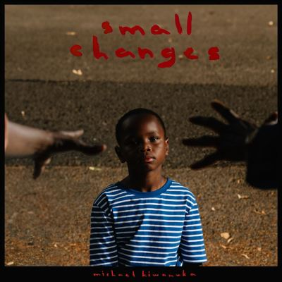

import { Slider, Button } from "@carbon/react";
import { ArrowUpRight } from "@carbon/icons-react";

import SliderJS1 from "../review/slider1";
import SliderJS2 from "../review/slider2";
import SliderJS3 from "../review/slider3";
import SliderJS4 from "../review/slider4";
import AdvJS2 from "../review/adv2";
import AdvJS3 from "../review/adv3";

import { Link } from "gatsby";

import Review1 from "../review/mkiwanuka3.mdx";
import Review2 from "../review/mkiwanuka2.mdx";

Album review

<h1 className="h1--no--margin">{props.pageContext.frontmatter.title}</h1>

  <Link to="/best50/2024/">2024 Black Music Album Best No.43</Link>

 
<Row  className="image-card-group">
	<Column colMd={3} colLg={4} noGutterMdLeft="">
       <ImageCard>

</ImageCard>
	</Column>
	<Column colMd={4} colLg={8} noGutterMdLeft="">
		

			Michael Kiwanukaの5年振り、4作目。引き続き、全曲、Danger MouseとInfloによるプロデュースとなり、ミディアム～スローのフォーキーなソウル、ロックが展開されている。
			 懐かしい感じのメロディに、アラファーになったMichaelの落ち着いて滋味を増したVocalが、とても馴染んでいる。
			 Trackはシンプルなバンド構成でありながら、丹念に作られており、特にギターが主張しすぎず、存在感を示しており、⑧などはインスト曲になっている。
		

		

		  <Button className="button-right-mergin"  href="https://amzn.to/3SQQErd" renderIcon={ArrowUpRight} size='sm' kind='primary'>
  	    amazon.com
  	  </Button>
  	  <Button className="button-right-mergin"  href="https://amzn.to/4l3CwqD" renderIcon={ArrowUpRight} size='sm' kind='secondary'>
  	    amazon.co.jp
  	  </Button>
			<Button className="button-right-mergin"  href="https://apple.co/45GFtt1" renderIcon={ArrowUpRight} size='sm' kind='tertiary'>
				apple music
			</Button>
		<AdvJS2/>
		

	</Column>
</Row>
<Row >
	<Column colMd={4} colLg={4} noGutterMdLeft="">
		

    	<h3>Score card</h3>
			<SliderJS1 value="5" />
    	<SliderJS2 value="4" />
			<SliderJS3 value="1" />
    	<SliderJS4 value="8" />
		

	</Column>
	<Column colMd={8} colLg={8} noGutterMdLeft="">
		

			<h3>Producers</h3>
			

				Danger Mouse and Inflo(all)
			

			<h3>Guests</h3>
			

		

	</Column>
</Row>

<h3>Tracks</h3>

| No. | Title              | Composers                                           | Performer        | Time  |
| --- | ------------------ | --------------------------------------------------- | ---------------- | ----- |
| 1   | Floating Parade    | Brian Burton / Dean Josiah Cover / Michael Kiwanuka | Michael Kiwanuka | 03:50 |
| 2   | Small Changes      | Brian Burton / Dean Josiah Cover / Michael Kiwanuka | Michael Kiwanuka | 04:05 |
| 3   | One and Only       | Brian Burton / Dean Josiah Cover / Michael Kiwanuka | Michael Kiwanuka | 04:31 |
| 4   | Rebel Soul         | Brian Burton / Dean Josiah Cover / Michael Kiwanuka | Michael Kiwanuka | 03:27 |
| 5   | Lowdown, Pt. 1     | Brian Burton / Dean Josiah Cover / Michael Kiwanuka | Michael Kiwanuka | 03:15 |
| 6   | Lowdown, Pt. 2     | Brian Burton / Dean Josiah Cover / Michael Kiwanuka | Michael Kiwanuka | 02:39 |
| 7   | Follow Your Dreams | Brian Burton / Dean Josiah Cover / Michael Kiwanuka | Michael Kiwanuka | 03:40 |
| 8   | Live for Your Love | Brian Burton / Dean Josiah Cover / Michael Kiwanuka | Michael Kiwanuka | 02:28 |
| 9   | Stay by My Side    | Brian Burton / Dean Josiah Cover / Michael Kiwanuka | Michael Kiwanuka | 03:43 |
| 10  | The Rest of Me     | Brian Burton / Dean Josiah Cover / Michael Kiwanuka | Michael Kiwanuka | 03:50 |
| 11  | Four Long Years    | Brian Burton / Michael Kiwanuka                     | Michael Kiwanuka | 04:42 |

<h3>Other Reviews</h3>

<Row>
  <Column colMd={3} colLg={3} noGutterMdLeft>
    <Review1 />
  </Column>
	<Column colMd={3} colLg={3} noGutterMdLeft>
    <Review2 />
  </Column>
</Row>

<AdvJS3 />
