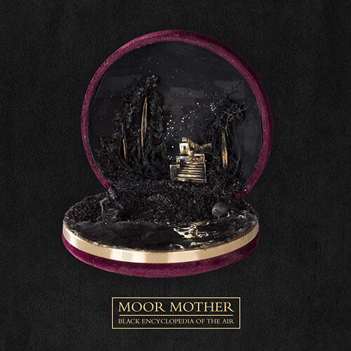

import { Slider, Button } from "@carbon/react";
import { ArrowUpRight } from "@carbon/icons-react";

import SliderJS1 from "../review/slider1";
import SliderJS2 from "../review/slider2";
import SliderJS3 from "../review/slider3";
import SliderJS4 from "../review/slider4";
import AdvJS2 from "../review/adv2";
import AdvJS3 from "../review/adv3";

import { Link } from "gatsby";

Album review

<h1 className="h1--no--margin">{props.pageContext.frontmatter.title}</h1>

  <Link to="/best50/2021/">2021 Black Music Album Best No.43</Link>

<Row  className="image-card-group">
	<Column colMd={3} colLg={4} noGutterMdLeft="">
       <ImageCard>

</ImageCard>
	</Column>
	<Column colMd={4} colLg={8} noGutterMdLeft="">
		

			Philadelphiaを拠点とし、詩人やアクティビストとしても知られるMoor Motherの2021年秋リリースのアルバム。Rapというより、Spoken Wordといったほうが良さそうな作品で、様々な暴力についてのメッセージを、声を荒げずに、抑えた調子で伝えている。
			 Guestも知ったところではArmand HammerのELUCIDやPink Siifuなど、多数参加しているが、みな、同じトーンで統一している。
			 Trackは、Free Jazz, Electronicaなどをベースにしており、上物と合わせて、ExperimentalでAbstractな印象を感じる。30分強と短めであるが、しっかりと主張が込められた作品に仕上がっている。
		

  		

			<Button className="button-right-mergin"  href="https://amzn.to/3F3ief6" renderIcon={ArrowUpRight} size='sm' kind='primary'>
  	  	amazon.com
  		</Button>
  		<Button className="button-right-mergin"  href="https://amzn.to/3TLNCDg" renderIcon={ArrowUpRight} size='sm' kind='secondary'>
  	  	amazon.co.jp
  		</Button>
			<Button className="button-right-mergin"  href="https://apple.co/3MVmLlL" renderIcon={ArrowUpRight} size='sm' kind='tertiary'>
  	  		amazon.co.jp
  		</Button>
			<AdvJS2/>
		

	</Column>
</Row>
<Row >
	<Column colMd={4} colLg={4} noGutterMdLeft="">

  <h3>Score card</h3>
	<SliderJS1 value="1" />
  <SliderJS2 value="2" />
	<SliderJS3 value="3" />
  <SliderJS4 value="8" />

</Column>
<Column colMd={8} colLg={8} noGutterMdLeft="">

	<h3>Producers</h3>
	

		Olof Melander(1,2,3,4,5,6,7,8,9,10,11)
		 Madam Data(12
		 Dudù Kouate(13)Bongo ByTheWay(1,3)
	

	<h3>Guests</h3>
	

		LUCID, Antonia Gabriera, Brother May, Lojii, Bfly, Orion Sun, Pink Siifu, Nappy Ninsa, Maassai, Yatta, Dudù Kouate, Black Quantum Futurism, Elaine Mitchener
	

</Column>
</Row>

<h3>Tracks</h3>

| No. | Title                            | Composer     | Performer                                                           | Time  |
| --- | -------------------------------- | ------------ | ------------------------------------------------------------------- | ----- |
| 1   | Temporal Control of Light Echoes | Camae Dennis | Moor Mother                                                         | 02:59 |
| 2   | Mangrove                         | Camae Dennis | Moor Mother feat. ELUCID, Antonia Gabriera                          | 02:09 |
| 3   | Race Function Limited            | Camae Dennis | Moor Mother feat. Brother May                                       | 02:37 |
| 4   | Shekere                          | Camae Dennis | Moor Mother feat. Lojii                                             | 02:10 |
| 5   | Vera Hall                        | Camae Dennis | Moor Mother feat. Bfly, Orion Sun                                   | 02:28 |
| 6   | Obsidian                         | Camae Dennis | Moor Mother feat. Pink Siifu                                        | 01:33 |
| 7   | Iso Fonk                         | Camae Dennis | Moor Mother                                                         | 01:37 |
| 8   | Rogue Waves                      | Camae Dennis | Moor Mother                                                         | 02:23 |
| 9   | Made a Circle                    | Camae Dennis | Moor Mother feat. Nappy Ninsa, Maassai, Antonia Gabriera, Orion Sun | 02:47 |
| 10  | Tarot                            | Camae Dennis | Moor Mother feat. Yatta, Dudù Kouate                                | 05:54 |
| 11  | Nighthawk of Time                | Camae Dennis | Moor Mother feat. Black Quantum Futurism                            | 01:13 |
| 12  | Zami                             | Camae Dennis | Moor Mother                                                         | 02:01 |
| 13  | Clock Fight                      | Camae Dennis | Moor Mother feat. Elaine Mitchener, Dudù Kouate                     | 02:09 |

<AdvJS3 />
