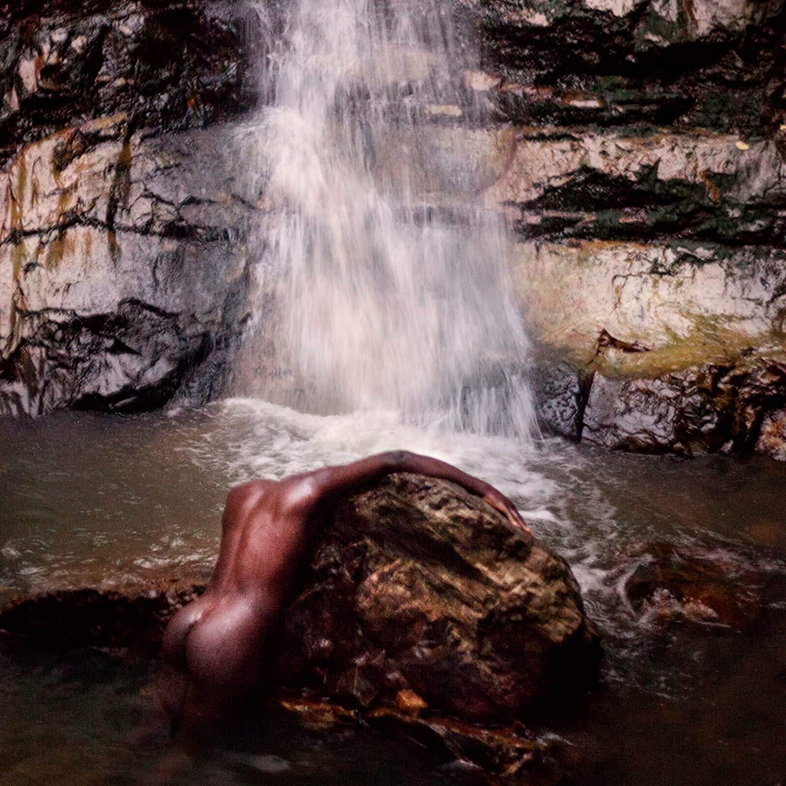

import { Slider, Button } from 'carbon-components-react';
import { ArrowUpRight24  } from '@carbon/icons-react';

import SliderJS1 from "../review/slider1"
import SliderJS2 from "../review/slider2"
import SliderJS3 from "../review/slider3"
import SliderJS4 from "../review/slider4"

import { Link } from "gatsby"

import Review1  from "../review/mosessumney1.mdx"

CD review

<h1 className="h1--no--margin">{props.pageContext.frontmatter.title}</h1>

<Row  className="image-card-group">
	<Column colMd={"4"} colLg={"4"} noGutterMdLeft="">
       <ImageCard>

 

</ImageCard>
	</Column>
	<Column colMd={"8"} colLg={"8"} noGutterMdLeft="">
	

	Moses Sumneyの3年ぶり2作目。外部の助けを得つつ、今回も自身がSong Writing, Produceを行っている。12曲まで配信でPart1として先行リリースされ、Part2の8曲足してフィジカルでのリリースとなった結果、20曲65分の大作になっている。Greynessをコンセプトにしており、アルバムとしての統一感は高く、前作同様、耽美的、官能的、内省的で静謐な印象を受ける。アップ、ミディアム少な目でスローが中心であり、癒されるような曲もあるが、特に前半は緊張感が伝わってくるような曲が多い。高音のファルセットは幻想的で、中間音は生身の人間ぽくと、Vocalもいろいろな表現をとっている。美意識過剰かなとも思うが、流石の説得力だとも思う。
	

    

	  <Button href="https://amzn.to/2FtZhWo" kind="primary" size="small" renderIcon={ArrowUpRight24}>
      amazon.com
    </Button>
    <Button href="https://amzn.to/3hhVWqA" kind="secondary" size="small" renderIcon={ArrowUpRight24}>
      amazon.co.jp
    </Button>
	

	
	
	</Column>
</Row>
<Row >
	<Column colMd={"4"} colLg={"4"} noGutterMdLeft="">

  <h3>Score card</h3>
	<SliderJS1 value="5" />
  <SliderJS2 value="1" />
	<SliderJS3 value="2" />
  <SliderJS4 value="9" />

</Column>
<Column colMd={"8"} colLg={"8"} noGutterMdLeft="">

<h3>Producers</h3>

Moses Smney(1,2,3,4,5,6,7,8,10,16,17,18,20)
 FKJ and Moses Sumney(9,10)
 Moses Sumney, Ben Baptic and John Congleton(11,12)
 Daniel Lopatin and Moses Sumney(13)
 Matthew Otto and Moses Sumney(14,15)
 Moses Sumney and John Congleton(19)

<h3>Guests</h3>

Rob Moose

</Column>
</Row>

<h3>Tracks</h3>

| No. |	 Title                     |	 Composers                                                                  |	 Performer                   | Time	 |
| --- |	-------------------------- | ---------------------------------------------------------------------------- | ---------------------------- | ----- |
|	1	  |	Insula                     | Ayesha K Faines / Taiye Selasi / Moses Sumney                               	|	Moses Sumney                 | 00:46 |
|	2	  |	Cut Me                     | Adult Jazz / Daniel Lopatin / Moses Sumney                                  	|	Moses Sumney                 | 04:10 |
|	3	  |	In Bloom                   | Moses Sumney                                                                	|	Moses Sumney feat: Rob Moose | 03:02 |
|	4	  |	Virile                     | Moses Sumney / Yvette                                                       	|	Moses Sumney feat: Rob Moose | 04:16 |
|	5	  |	Conveyor                   | Moses Sumney / Yvette                                                       	|	Moses Sumney                 | 03:23 |
|	6	  |	Boxes                      | Michael Chabon / Ayesha K Faines / Ezra Miller / Taiye Selasi / Moses Sumney	|	Moses Sumney                 | 01:22 |
|	7	  |	Gagarin                    | Dan Berglund / Moses Sumney / Esbjörn Svensson / Magnus Öström           	  |	Moses Sumney                 | 05:54 |
|	8	  |	Jill/Jack                  | Jill Scott / Moses Sumney                                                   	|	Moses Sumney                 | 01:33 |
|	9	  |	Colouour                   | FKJ / Moses Sumney                                                          	|	Moses Sumney                 | 03:07 |
|	10	|	Also Also Also and and And | FKJ / Ezra Miller / Taiye Selasi / Moses Sumney                             	|	Moses Sumney                 | 01:31 |
|	11	|	Neither/Nor                | Moses Sumney                                                                	|	Moses Sumney                 | 05:26 |
|	12	|	Polly                      | Tom Gallo / Moses Sumney                                                    	|	Moses Sumney                 | 03:38 |
|	13	|	Two Dogs                   | Daniel Lopatin / Moses Sumney                                               	|	Moses Sumney                 | 03:56 |
|	14	|	Bystanders                 | Daniel Lopatin / Matthew Otto / Moses Sumney                                	|	Moses Sumney                 | 04:14 |
|	15	|	Me in 20 Years             | Matthew Otto / Moses Sumney                                                 	|	Moses Sumney                 | 03:40 |
|	16	|	Keeps Me Alive             | Moses Sumney                                                                	|	Moses Sumney                 | 02:56 |
|	17	|	Lucky Me                   | James Blake / Moses Sumney                                                  	|	Moses Sumney feat: Rob Moose | 04:57 |
|	18	|	And So I Come to Isolation | Taiye Selasi / Moses Sumney                                                 	|	Moses Sumney                 | 00:49 |
|	19	|	Bless Me                   | Moses Sumney                                                                	|	Moses Sumney                 | 04:59 |
|	20	|	Before You Go              | Michaela Coel / Ezra Miller / Taiye Selasi / Moses Sumney                   	|	Moses Sumney                 | 02:05 |

<h3>Other Reviews</h3>

<Row>
<Column colMd={3} colLg={3} noGutterMdLeft>
<Review1 />
</Column>
</Row>