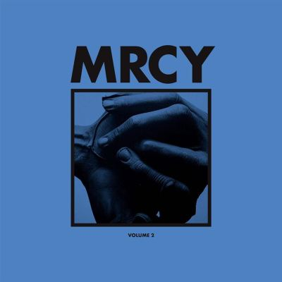

import { Slider, Button } from "@carbon/react";
import { ArrowUpRight } from "@carbon/icons-react";

import SliderJS1 from "../review/slider1";
import SliderJS2 from "../review/slider2";
import SliderJS3 from "../review/slider3";
import SliderJS4 from "../review/slider4";
import AdvJS2 from "../review/adv2";
import AdvJS3 from "../review/adv3";

import { Link } from "gatsby";

Album Review

<h1 className="h1--no--margin">{props.pageContext.frontmatter.title}</h1>

<Row  className="image-card-group">
	<Column colMd={3} colLg={4} noGutterMdLeft="">
       <ImageCard>

</ImageCard>
	</Column>
	<Column colMd={4} colLg={8} noGutterMdLeft="">
	  

	    ロンドンをベースに活動するデュオ, MRCYの1作目と2作目を併せたCD。Barney Lister(Produser), Kojo Degraft-Johnson(Vocal)より構成されるが、トラックはシンセ、ストリングス、ブラスを加えたゴージャスなバンド編成で組み立てられている。
       アフロな⑬を除けば、全体の印象はオーセンティックなソウルで、メロウなバラードが多く、一部アップな曲も。サム・クックのようなKojoのVocalもビンテージ感に溢れている。ただ、現代的アレンジも加わっているので、古臭さは感じない。
    

	  

	    <Button className="button-right-mergin"  href="https://amzn.to/45myZya" renderIcon={ArrowUpRight} size='sm' kind='primary'>
        amazon.com
      </Button>
      <Button className="button-right-mergin"  href="https://amzn.to/44CZyPx" renderIcon={ArrowUpRight} size='sm' kind='tertiary'>
        amazon.co.jp
      </Button>
      <Button className="button-right-mergin"  href="https://apple.co/3MNV8zd" renderIcon={ArrowUpRight} size='sm' kind='tertiary'>
        apple music
      </Button>
      <AdvJS2/>
	  

	</Column>
</Row>
<Row >
	<Column colMd={4} colLg={4} noGutterMdLeft="">
    

      <h3>Score card</h3>
    	<SliderJS1 value="5" />
      <SliderJS2 value="1" />
    	<SliderJS3 value="1" />
      <SliderJS4 value="8" />
    

  </Column>
  <Column colMd={8} colLg={8} noGutterMdLeft="">
    

      <h3>Producers</h3>
      

      	Barney Lister
      

      <h3>Guests</h3>
      

      

    

  </Column>
</Row>

<h3>Tracks</h3>

| No. | Title                 | Composers                                                                   | Performer | Time  |
| --- | --------------------- | --------------------------------------------------------------------------- | --------- | ----- |
| 1   | R.L..M                | Jonny Lattimer, Barney Lister and Kojo Degraft-Johnson                      | MRCY      | 03:45 |
| 2   | Lorele                | Jonny Lattimer, Barney Lister and Kojo Degraft-Johnson                      | MRCY      | 04:24 |
| 3   | Purple Canyon         | Barney Lister, Kojo Degraft-Johnson, Francis Anthony White and Joshua Jones | MRCY      | 03:13 |
| 4   | Days Like This        | Barney Lister, Kojo Degraft-Johnson and Joel Laslent Pott                   | MRCY      | 02:38 |
| 5   | California            | Jonny Lattimer, Barney Lister and Kojo Degraft-Johnson                      | MRCY      | 04:46 |
| 6   | Flowers in Mourning   | Barney Lister, Kojo Degraft-Johnson, Jonny latimer and Sam Vernon Beste     | MRCY      | 04:13 |
| 7   | Powerless             | Barney Lister, Kojo Degraft-Johnson and Francis Anthony White               | MRCY      | 03:41 |
| 8   | Seven Candles         | Barney Lister, Kojo Degraft-Johnson, Jonny Latimer and Sam Vernon Beste     | MRCY      | 03:33 |
| 9   | Angels                | Jonny Lattimer, Barney Lister and Kojo Degraft-Johnson                      | MRCY      | 03:49 |
| 10  | Wanna Know (Ontario)  | Jonny Lattimer, Barney Lister and Kojo Degraft-Johnson                      | MRCY      | 04:05 |
| 11  | Man                   | Jonny Lattimer, Barney Lister and Kojo Degraft-Johnson                      | MRCY      | 03:27 |
| 12  | Sierra                | Jonny Lattimer, Barney Lister and Kojo Degraft-Johnson                      | MRCY      | 03:55 |
| 13  | Flicker               | Jonny Lattimer, Barney Lister and Kojo Degraft-Johnson                      | MRCY      | 02:49 |
| 14  | Wandering Attention   | Barney Lister, Kojo Degraft-Johnson and Francis Anthony White               | MRCY      | 02:32 |
| 15  | Fear                  | Barney Lister, Kojo Degraft-Johnson and Francis Anthony White               | MRCY      | 02:59 |
| 16  | More Than You Are Now | Barney Lister, Kojo Degraft-Johnson and Francis Anthony White               | MRCY      | 03:52 |

<AdvJS3 />
