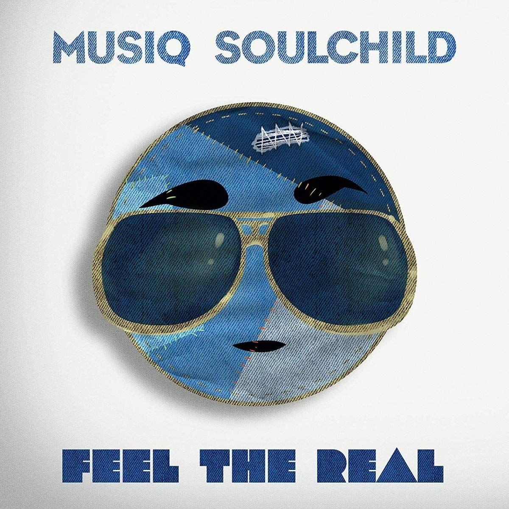

import { Slider, Button } from 'carbon-components-react';
import { ArrowUpRight24  } from '@carbon/icons-react';

import SliderJS1 from "../review/slider1"
import SliderJS2 from "../review/slider2"
import SliderJS3 from "../review/slider3"
import SliderJS4 from "../review/slider4"

import { Link } from "gatsby"

Album review

<h1 className="h1--no--margin">{props.pageContext.frontmatter.title}</h1>

<Row  className="image-card-group">
	<Column colMd={"4"} colLg={"4"} noGutterMdLeft="">
       <ImageCard>

 

</ImageCard>
	</Column>
	<Column colMd={"8"} colLg={"8"} noGutterMdLeft="">
	

	昨年から引き続きとなるMusiq Soulchildのたぶん9作目。Amazon JapanでMp3が10円だったので、目を疑いながら購入しました。前作からインディのeOneからのリリースとなり、ジャケットが似ていることから連作なのかと思われる。2枚組24曲の大作ではあるが、特にコンセプトのようなものは見当たらず、いつものディアム-スローを中心とした美メロの曲が続いている。全体的に茫洋とした柔らかい雰囲気があって、たまにアンビエントなTrackやRapを取り入れたりしているところが、変化点か。まんまStevieな曲もあるが。。気張らずにBGM 的に聴くと心地よいアルバムである。
	

    

	  <Button href="https://amzn.to/30Q5SkK" kind="primary" size="small" renderIcon={ArrowUpRight24}>
      amazon.com
      </Button>
      <Button href="https://amzn.to/3gcX1jT" kind="secondary" size="small" renderIcon={ArrowUpRight24}>
      amazon.co.jp
      </Button>
	

	
	
	</Column>
</Row>
<Row >
	<Column colMd={"4"} colLg={"4"} noGutterMdLeft="">

    <h3>Score card</h3>
	<SliderJS1 value="5" />
    <SliderJS2 value="2" />
	<SliderJS3 value="1" />
    <SliderJS4 value="8" />

</Column>
<Column colMd={"8"} colLg={"8"} noGutterMdLeft="">

<h3>Producers</h3>

Doobie Powell(1-1)
 J. Troy(1-2,1-4,1-8,1-11,2-12)
 Musiq Soulchild, J. Troy and Philip Cornish(1-3)
 GMJR(1-5)
 BLAQSMURPH(1-6,1-10,2-2
 J'rell(1-7,1-9,2-5,2-8)
 Needlz and BLAQSMURPH(1-12)
 J'rell and Musiq Soulchild(2-1)
 David Luke(2-3)
 Musiq Soulchild(2-4,2-7)
 Christopher "Chris Theory" Bradley(2-6,2-11)
 GMJR and Alexander Plummer(2-9)
 GMJR and Elijah Y, Whittingham(2-10)

<h3>Guests</h3>

Marsha Ambrosius, Willie Hyn, BLAQGxld, The Husel, BLAQGxld, Chris Theory

</Column>
</Row>

<h3>Tracks</h3>

 Disc 1

| No. |	 Title          |	 Composers                                              |	 Performer                           | Time	 |
| --- |	--------------- | --------------------------------------------------------- | -------------------------------------- | ----- |
| 1	  |	Feel the Real  	| Marsha Ambrosius                                         	| Musiq Soulchild feat. Marsha Ambrosius | 05:34 |
| 2	  |	Benefits       	| Musiq Soulchild                                          	| Musiq Soulchild                        | 03:52 |
| 3	  |	Serendipity    	| Willie Hyn / Musiq Soulchild                             	| Musiq Soulchild feat. Willie Hyn       | 03:44 |
| 4	  |	Sooner or Later	| Musiq Soulchild                                          	| Musiq Soulchild                        | 04:08 |
| 5	  |	My Bad         	| Willie Hyn / Musiq Soulchild                             	| Musiq Soulchild feat. Willie Hyn       | 05:05 |
| 6	  |	Start Over     	| Cyrus Deshield / Campbellson Shackleton / Musiq Soulchild	| Musiq Soulchild                        | 03:50 |
| 7	  |	Hard Liquor    	| J'rell / Musiq Soulchild / Julie Summers                 	| Musiq Soulchild                        | 03:33 |
| 8	  |	Shudawudacuda  	| Musiq Soulchild                                          	| Musiq Soulchild                        | 03:30 |
| 9	  |	Broken Hearts  	| J'rell / Lo Key / Musiq Soulchild / June Summers         	| Musiq Soulchild                        | 03:55 |
| 10  |	Love Me Back   	| Musiq Soulchild                                          	| Musiq Soulchild                        | 04:05 |
| 11  |	I'm Good       	| Musiq Soulchild                                          	| Musiq Soulchild                        | 03:26 |
| 12  |	Jussa Lil Bih  	| Willie Hyn                                               	| Musiq Soulchild feat. BLAQGxld         | 03:30 |

 Disc 2

| No. |	 Title             |	 Composers                                              |	 Performer                                 | Time  |
| --- |	------------------ | ---------------------------------------------------------- | -------------------------------------------- | ----- |
| 1	  |	Humble Pie         | Willie Hyn / Musiq Soulchild                              	| Musiq Soulchild                              | 03:41 |
| 2	  |	Party Life         | Cyrus Deshield / Campbellson Shackleton / Musiq Soulchild 	| Musiq Soulchild                              | 03:49 |
| 3	  |	One More Time      | The Husel / Willie Hyn / Alexander Lloyd / Musiq Soulchild	| Musiq Soulchild feat. The Husel, Willie Hyn  | 05:28 |
| 4	  |	Let Go             | Musiq Soulchild                                           	| Musiq Soulchild                              | 03:54 |
| 5	  |	Test Drive         | J'rell / Musiq Soulchild / June Summers                   	| Musiq Soulchild                              | 03:44 |
| 6	  |	Like the Weather   | Christopher Bradley / Musiq Soulchild                     	| Musiq Soulchild                              | 03:26 |
| 7	  |	Fact of Love       | Musiq Soulchild                                           	| Musiq Soulchild                              | 03:33 |
| 8	  |	Heaven Only Knows  | J'rell / Lo Key / Musiq Soulchild / June Summers          	| Musiq Soulchild                              | 04:10 |
| 9	  |	The Moon           | Musiq Soulchild /The Husel / Willie Hyn /                 	| Musiq Soulchild feat. The Husel , Willie Hyn | 04:10 |
| 10  |	We Go Together Now | Musiq Soulchild                                           	| Musiq Soulchild                              | 04:19 |
| 11  |	Sunrise Serenade   | Willie Hyn                                                	| Musiq Soulchild feat. BLAQGxld, Chris Theory | 05:09 |
| 12  |	Simple Things      | Musiq Soulchild                                           	| Musiq Soulchild                              | 03:43 |
