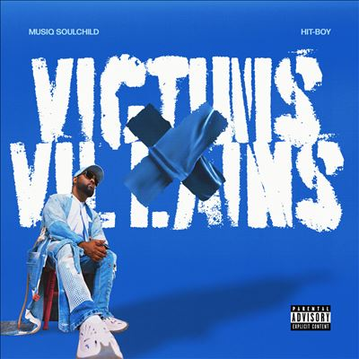

import { Slider, Button } from "@carbon/react";
import { ArrowUpRight } from "@carbon/icons-react";

import SliderJS1 from "../review/slider1";
import SliderJS2 from "../review/slider2";
import SliderJS3 from "../review/slider3";
import SliderJS4 from "../review/slider4";
import AdvJS2 from "../review/adv2";
import AdvJS3 from "../review/adv3";

import { Link } from "gatsby";

import Review1 from "../review/musiq71.mdx";

Album review

<h1 className="h1--no--margin">{props.pageContext.frontmatter.title}</h1>

<Row  className="image-card-group">
	<Column colMd={3} colLg={4} noGutterMdLeft="">
       <ImageCard>

</ImageCard>
	</Column>
	<Column colMd={4} colLg={8} noGutterMdLeft="">
		

			Musiq Soulchildとしては、6年ぶりとなるアルバム。全曲ProduceしているHit-Boyとの共作となる。Hip-BopやHip-HopよりのR&B曲の制作を主戦場とすると勝手に思っていたHit-Boyではあるが、意外と、Hip-Hop色は抑え気味。逆にMusiq側に寄せたつくりになっており、ゆったりとして、温かで懐かしい感じのする曲が続いている。
			 Musiqの唄もTrackに合わせたように穏やかであり、トータルとして耳馴染みの良いアルバムになっている。
			 次回があるなら、もう少し刺激が有ってもよいと思う。
		

    

	  	<Button className="button-right-mergin"  href="https://amzn.to/3XGNEze" renderIcon={ArrowUpRight} size='sm' kind='primary'>
    	  amazon.com
    	</Button>
    	<Button className="button-right-mergin"  href="https://amzn.to/3pFEdnc" renderIcon={ArrowUpRight} size='sm' kind='secondary'>
    	  amazon.co.jp
    	</Button>
    	<Button className="button-right-mergin"  href="https://apple.co/43gZxwQ" renderIcon={ArrowUpRight} size='sm' kind='tertiary'>
    	  apple music
			</Button>
			<AdvJS2/>
		

	</Column>
</Row>
<Row >
	<Column colMd={4} colLg={4} noGutterMdLeft="">
		

    	<h3>Score card</h3>
			<SliderJS1 value="5" />
    	<SliderJS2 value="2" />
			<SliderJS3 value="1" />
    	<SliderJS4 value="8" />
		

	</Column>
	<Column colMd={8} colLg={8} noGutterMdLeft="">
		

			<h3>Producers</h3>
			

				Hit-Boy(all)
			

			<h3>Guests</h3>
			

				The Hussel
			

		

	</Column>
</Row>

<h3>Tracks</h3>

| No. | Title                   | Composers                                             | Performer                                  | Time  |
| --- | ----------------------- | ----------------------------------------------------- | ------------------------------------------ | ----- |
| 1   | will i touch the sky    | Chauncey Alexander / Taalib Johnson / Alexander Lloyd | Hit-Boy / Musiq Soulchild                  | 04:06 |
| 2   | i remember you my ex    | Chauncey Alexander / Taalib Johnson / Alexander Lloyd | Hit-Boy / Musiq Soulchild                  | 03:01 |
| 3   | imreallytrynaf\*ckwichu | Chauncey Alexander / Taalib Johnson / Alexander Lloyd | Hit-Boy / Musiq Soulchild feat. The Hussel | 03:32 |
| 4   | beat of a slow dance    | Chauncey Alexander / Taalib Johnson / Alexander Lloyd | Hit-Boy / Musiq Soulchild                  | 03:54 |
| 5   | is it love, is it lies  | Chauncey Alexander / Taalib Johnson / Alexander Lloyd | Hit-Boy / Musiq Soulchild                  | 04:17 |
| 6   | victims and villains    | Chauncey Alexander / Taalib Johnson / Alexander Lloyd | Hit-Boy / Musiq Soulchild                  | 04:05 |
| 7   | white rice déjà vu      | Chauncey Alexander / Taalib Johnson / Alexander Lloyd | Hit-Boy / Musiq Soulchild                  | 03:50 |
| 8   | between love and war    | Chauncey Alexander / Taalib Johnson / Alexander Lloyd | Hit-Boy / Musiq Soulchild                  | 03:30 |
| 9   | your love is life       | Chauncey Alexander / Taalib Johnson / Alexander Lloyd | Hit-Boy / Musiq Soulchild                  | 03:33 |
| 10  | we were just binging    | Chauncey Alexander / Taalib Johnson / Alexander Lloyd | Hit-Boy / Musiq Soulchild                  | 03:42 |

<h3>Other Reviews</h3>

<Row>
  <Column colMd={3} colLg={3} noGutterMdLeft>
    <Review1 />
  </Column>
</Row>

<AdvJS3 />